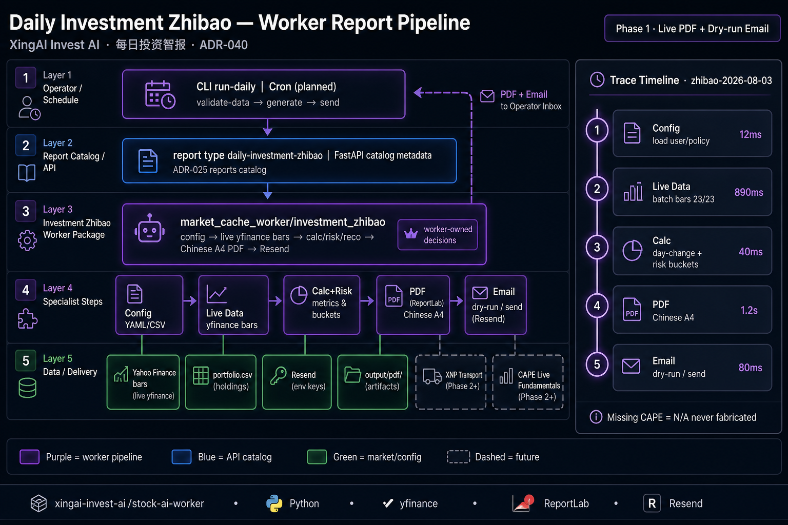

# Daily Investment Zhibao: Worker-Owned Chinese PDF Inside Invest AI

> *Should a dense Chinese A4 investment PDF become its own product — or ride the worker already sending Premium Daily Brief?*

**Short answer:** Extend Invest AI. ADR-032 already forbade greenfield daily-report stacks; ADR-040 applies the same rule to **每日投资智报**. Worker owns snapshot → calc → PDF → email; FastAPI only catalogs the report type.



---

## 5W Framework

### What (What is this about?)

| Layer / Component | Role | Orchestrates / Owns |
|---|---|---|
| **CLI / schedule** | `validate-data` → `generate` → `send` / `run-daily` | Operator entry |
| **Report catalog** | Type `daily-investment-zhibao` | FastAPI metadata (ADR-025) |
| **investment_zhibao package** | Config, live yfinance bars, calc/risk/reco, ReportLab A4, Resend | All decision + delivery compute |
| **Config** | `user.yaml`, `portfolio.csv`, `policy.yaml` | Holdings + policy — not invented weights |
| **Delivery** | PDF under `output/pdf/`; email dry-run/send | Same Resend keys as other Invest digests |

**Out of scope:** New `*.xingai.app` surface, XNP as current transport, fabricated CAPE / Forward P/E, autotrade.

### Who (Who should read this?)

- **Product / ops** — which daily email streams exist and which repo owns them
- **Architects** — why Plan A (extend) beat a sibling report repo
- **Worker engineers** — package layout and honesty rules for missing fundamentals
- **Security** — no secrets in repo; dry-run until Resend keys exist on host

### Why (Why does this matter?)

Without Plan A:

- Duplicate Resend + PDF stacks drift from Premium Brief semantics
- Fake CAPE numbers look "premium" and destroy trust
- XNP gets blamed for delivery before it can send anything

With Plan A:

- One monorepo boundary for all Invest reporting
- Live bars stamp real `market_as_of`; missing metrics stay `N/A`
- Future XNP swap stays a transport change, not a product rewrite

### When (When do you need this?)

| Stage | What you need |
|---|---|
| MVP | Mock snapshot + PDF structure + dry-run email |
| Live data | Batch Yahoo bars, day-change %, market cutoff honesty |
| Ops | Cron on `run-daily` + Resend keys on worker |
| Phase 2+ | Richer fundamentals, denser PDF, optional XNP |

**Rule:** Missing data is `N/A`. Never invent tradable precision.

### Where (Where in the architecture?)

```text
Operator / Cron
    → investment_zhibao CLI (worker)
        → config + yfinance
        → calc / risk / reco
        → Chinese A4 PDF
        → Resend (dry-run | send)
    → FastAPI reports catalog (metadata only)
```

---

## How It Works

### End-to-end flow

```text
load config → fetch bars → snapshot → PDF → email → artifacts
```

### Component responsibilities

| Component | Input | Output | Deps |
|---|---|---|---|
| `live_data.py` | Tickers | Bars + `market_as_of` | yfinance |
| `calc` / `risk` | Snapshot | Tables / buckets | policy YAML |
| `pdf_zhibao.py` | Snapshot | A4 PDF | ReportLab |
| `email_zhibao.py` | PDF path | Dry-run log or Resend id | env keys |

### Example

`run-daily` on 2026-08-03: live-yfinance, 23/23 priced, market cutoff often previous Yahoo session (e.g. 2026-07-31), CAPE shown as N/A, dry-run email exits 0 without secrets.

---

## Enterprise patterns

- **Worker / cache boundary** — worker computes; API does not recompute PDF
- **Phased honesty** — mock → live bars → fundamentals → transport swap
- **Extend over greenfield** — ADR-032 / ADR-040

---

## Anti-patterns

- New repo for one PDF layout
- Fabricating CAPE to fill a table cell
- Moving PDF generation into FastAPI "for convenience"
- Calling XNP "live" while Phase 2 still has no channel providers

---

## Related documents

- [ADR-040](https://github.com/xingaiapp/xingai-invest-ai/blob/main/docs/adr/040-daily-investment-zhibao-pdf.md)
- [ADR-032](https://github.com/xingaiapp/xingai-invest-ai/blob/main/docs/adr/032-daily-stock-market-intelligence-report.md)
- Tech blog: `xingai-tech-blog/posts/2026-08-04-invest-ai-daily-investment-zhibao-pdf.md`
