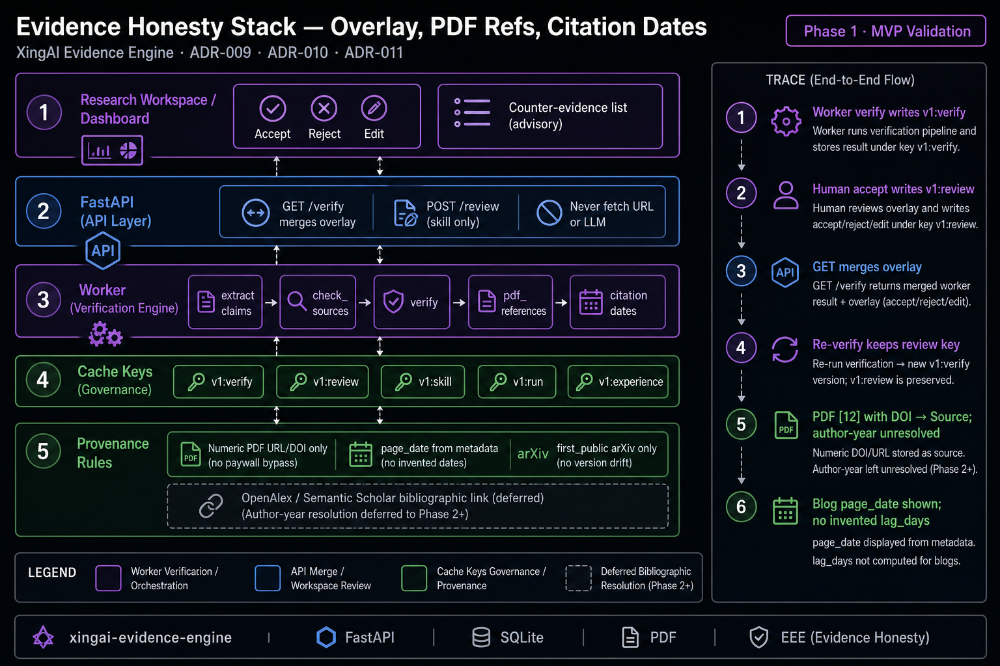

# Evidence Honesty Stack: Overlays, PDF Bibliography, Citation Dates

> *After citation verification works, what still makes a research product dishonest?*

**Short answer:** Mutating verify cache for human reviews, inventing PDF coverage or bibliography links, and reporting announcement→paper lag you cannot prove. ADR-009–011 fix those with separate overlay keys, URL/DOI-only numeric PDF refs, and page/arXiv dates without invented lag metrics.



---

## 5W Framework

### What (What is this about?)

| Decision | ADR | Owns |
|---|---|---|
| Human review / skill approve / regression schemas | 009 | Overlay keys `v1:review:`, `v1:skill:`, run/experience |
| Numeric PDF bibliography → Sources | 010 | URL/DOI only; author-year unresolved |
| Citation dates on reports | 011 | `page_date`; `first_public` for arXiv only |

Worker still owns verify compute. API merges overlays on read. Public demo stays static (ADR-002).

### Who

- Architects enforcing worker/cache Principle 1
- Research / product leads shipping Workspace Accept/Reject
- Eval / CI owners who must not treat review state as EEE denominators
- Security reviewers allergic to invented provenance

### Why

Without these ADRs:

- Re-verify wipes human Accept
- PDF coverage lies (0% or fabricated links)
- Radar overstates recency ("today" = blog crawl day)

With them:

- Overlay survives re-verify
- PDF refs enter fetch/verify only when bibliography is fetchable
- Dates are informational — citing older work is not a gate failure

### When

| Stage | Need |
|---|---|
| After basic verify | Overlay + counter-evidence advisory |
| PDF ingest | Numeric URL/DOI path |
| Radar dogfood | Dated column; no invented lag |
| Later | OpenAlex / Semantic Scholar bibliographic link |

**Rule:** Do not ship a confidently wrong number with a caveat footer.

### Where

```text
Workspace UI → FastAPI (overlay write / merge read)
                ↓
         SQLite keys: verify | review | skill | run
                ↑
         evidence-worker (extract, check, verify, pdf_references, dates)
```

---

## How It Works

### Example: Orchard radar (ADR-011 motivation)

Announcement blog dated 2026-08-03; arXiv `2605.15040` first public 2026-05-14. Engine reports page_date. It does **not** invent 81-day lag via title search (which returned a 2002 paper on real checks).

### Example: Review survive

1. Worker writes `v1:verify:proj`
2. Human Accept → `v1:review:proj`
3. Re-verify overwrites verify; GET still shows Accept

### Enterprise patterns

- Human-overlay-cache
- Reproducible gated denominators (ADR-004) — dates are not gated
- Fail closed on provenance invention

### Anti-patterns

- PATCH verify JSON with review fields
- Fuzzy author-year → bibliography links
- Auto-promote approved skills into extractors
- LLM-decided "first public" dates

---

## Related

- Evidence Engine ADR-009 / 010 / 011
- Pattern: `human-overlay-cache`
- Prior article: [Evidence Engine + Eval Registry](2026-07-26-evidence-engine-eval-registry.md)
- Tech blog: `2026-08-04-evidence-honesty-overlay-pdf-refs-citation-dates.md`
