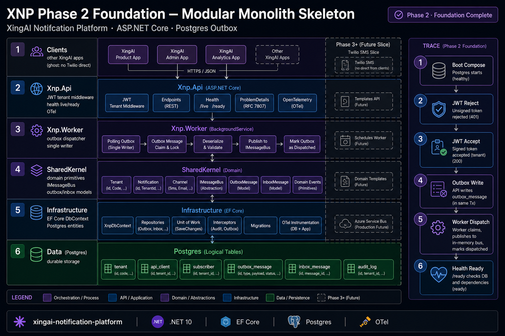

# XNP Phase 2 Foundation：空壳也能启动的模块化单体

> *Twilio 该在主机能拒绝坏 JWT 之后再接，还是之前？*

**短答：** 之后。XNP Phase 2 是可构建的模块化单体：健康检查 Postgres、强制 JWT 租户范围、进程内派发 outbox——**没有** SMS/邮件/推送提供商。通道竖切从 Phase 3+ 开始。

---

## 5W 要点

Phase 1 已接受 ADR 0001–0018。Phase 2 **落地**它们所暗示的骨架：`Xnp.Api` / `Xnp.Worker` / SharedKernel / Infrastructure、Compose Postgres、健康探针、内存 `IMessageBus` + 进程内 outbox。

**规则：** 先一条竖切，再横向铺开。

## 反模式

- JWT 租户中间件之前就接 Twilio
- 把 Phase 2 叫成「生产通知平台」
- 以「以后再加」跳过 outbox
- 允许应用继续「临时」双写提供商

## 相关

- `docs/architecture/system-design.md`
- ADR-0019 / ADR-0020
- Tech blog：`2026-08-04-xnp-phase-2-foundation-modular-monolith.md`
