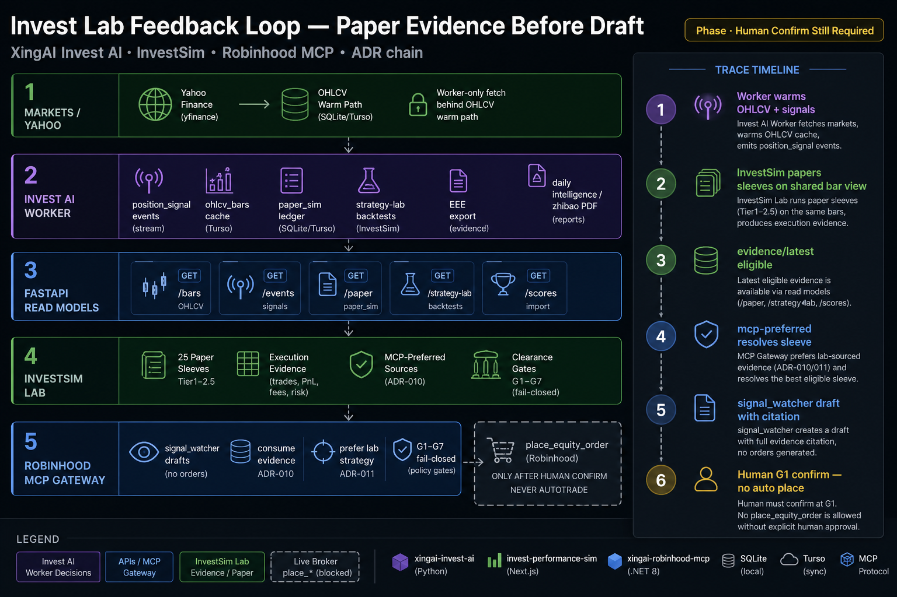

# Invest Lab Feedback Loop: Paper Evidence Before Any Draft

> *If Invest AI ranks names, InvestSim papers sleeves, and Robinhood MCP drafts orders — who owns the truth, and what still stops autotrade?*

**Short answer:** Invest AI worker owns market writes (bars, signals, paper ledger, strategy lab). InvestSim owns multi-sleeve paper evidence and `mcp-preferred`. Robinhood MCP consumes evidence fail-closed, then still requires human confirm (G1–G7). No repo calls `place_*` for the others.



---

## 5W Framework

### What

| Repo | Owns | Does not own |
|---|---|---|
| **xingai-invest-ai** | OHLCV cache (ADR-036), position-signal events (035), paper ledger (037), strategy-lab (038), EEE export (039), intelligence reports (032–034, 040) | Broker execution |
| **invest-performance-sim** | 25 paper sleeves (through Tier-2.5 / ADR 0031), execution evidence APIs, clearance / mcp-preferred (0024–0027) | Calling Robinhood `place_*` |
| **xingai-robinhood-mcp** | Fail-closed gateway, signal_watcher drafts, evidence consume (ADR-010), prefer lab strategy (011) | Softening G1 because evidence is green |

### Who

- Architects keeping three repos from inventing three Yahoo series
- Lab operators deciding which sleeve is Paper Winner
- Security reviewers of MCP execution gates
- Product leads who want "agentic trading" without silent fills

### Why

Without this loop:

- FastAPI becomes a Yahoo proxy; InvestSim pulls a divergent bar series
- MCP drafts from Top-1 alone with no lab evidence citation
- "Eligible evidence" gets mistaken for auto-approve

With this loop:

- One worker-owned bar view feeds charts, paper, and lab
- Drafts carry `invest_sim_evidence` + preferred sleeve source_ref
- Human confirm remains the only path to place

### When

| Stage | State |
|---|---|
| Shipped | Bars, events, paper, strategy-lab, Tier-2.5 sleeves, evidence + preferred wiring |
| Ops | Keys / Turso / Slack for live lab; Resend for digests |
| Not shipped | Live autotrade, InvestSim calling place_*, auto-approve on eligible |

**Rule:** Evidence eligibility gates drafting readiness — never replaces G1.

### Where

```text
Yahoo → Invest AI worker (bars/signals/paper/lab)
                 ↓ read APIs
            InvestSim sleeves + evidence/latest + mcp-preferred
                 ↓ fail-closed HTTP
            Robinhood MCP signal_watcher → draft
                 ↓ G1 human
            place_* (still gated)
```

---

## How It Works

### Example trace

1. Worker warms `ohlcv_bars` + position-signal events.
2. InvestSim evaluates sleeves; Paper Winner / preferred updates.
3. MCP `run_once()` fetches evidence; blocks if mode requires eligible/present and check fails.
4. Strategy slug: ops override → lab preferred → `ai-top-1`.
5. Symbol/side still from Invest AI Top-1 Buy; draft logs citations.
6. Human confirms; G2–G7 still apply.

### Anti-patterns

- Request-path Yahoo from FastAPI for programmatic consumers
- InvestSim calling `place_*`
- Auto-approve because `eligible: true`
- Treating Tier-2.5 inventory growth as matured evidence per sleeve

---

## Related ADRs

- Invest AI: 032–040 (esp. 035–039)
- InvestSim: 0020, 0024–0027, 0030–0031
- Robinhood MCP: 010, 011 (and G1–G7 family)
- Tech blogs dated 2026-08-05 in `xingai-tech-blog`
