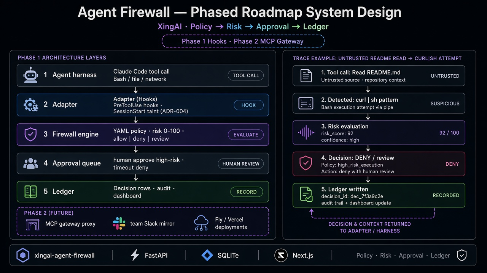

# Agent Firewall — 分阶段系统设计

> *“乐于助人”的编程 Agent，会不会本身变成攻击面？*

**一句话：** 会。修复在架构层：受控工具调用一律走 **策略 → 风险 → 批准 → 账本**。模型不能直通 shell。



---

## 5W 框架

### What

| 组件 | 作用 |
|---|---|
| Harness 适配器 | 拦截工具调用（v1：Claude Code PreToolUse） |
| 策略引擎 | YAML → allow \| deny \| review |
| 风险评分 | 确定性 0–100（LLM 仅建议） |
| 批准队列 | 高风险人工暂停 |
| Decision 账本 | 可审计裁决 |
| Dashboard | 队列 + 审计 + 趋势 |

### Who

- 本机跑 AI 编程 Agent 的工程师
- 审查 Agent 工具权限的安全方
- 规划 MCP 网关拦截的平台团队

### Why

没有防火墙：不信任 README / `curl | sh` 可能在人看见前执行。  
有了之后：引擎不可达则 **fail-closed**；读过不信任内容后的污点（ADR-004）抬高风险分。

### When

| 阶段 | 需要 |
|---|---|
| MVP | 本地 FastAPI + hooks + SQLite 账本 + Next 队列 |
| POC | 0din 类演示；延迟预算；策略命中统计 |
| 生产形态 | 团队 Dashboard；Slack 可见性镜像（ADR-006） |
| Phase 2+ | MCP 网关代理作为企业拦截路径 |

**铁律：** 先 hooks，后 MCP 网关（ADR-001）。默认 fail-closed。

### Where

```text
Agent 工具调用 → Adapter hook → 策略 → 风险 → 是否批准？
                              ↓
                         Decision 账本 → Dashboard
```

---

## 如何工作

### 示例：对 `curl | sh` 的 DENY / review

```text
读恶意 README → 污点 → 拦截 Bash → 高风险分
→ review/deny → 写账本 → harness 非零退出 → Completed
```

---

## 企业模式映射

| 模式 | 用法 |
|---|---|
| 人做决定 | 高风险执行等人 |
| Trace / 账本 | 与其他 XingAI 产品同一 Decision 叙事 |
| 分阶段 | Hooks MVP → 团队运维 → MCP 网关 |

---

## 反模式

| 反模式 | 为何失败 | 正确做法 |
|---|---|---|
| 相信模型会小心 | 助人即攻击面 | 拦截 + 策略 |
| 只用 LLM 打风险分 | 闸门不确定 | 规则优先（ADR-002） |
| 引擎挂了就放行 | 静默绕过 | Fail-closed |
| 不写账本 | 事后无真相 | 每条裁决落库 |

---

## POC vs Phase 2+

| v1 | Phase 2+ |
|---|---|
| Claude Code hooks | MCP 网关代理 |
| 本地 SQLite | 团队共享存储 / 托管 Dashboard |
| 手工 YAML | Deny+加规则工作流（ADR-005）规模化 |

---

## 相关文档

- 仓库：[xingai-agent-firewall](https://github.com/xingaiapp/xingai-agent-firewall)
- `docs/adr/` ADR-001–006
- English: [2026-09-25-agent-firewall-phased-roadmap.md](./2026-09-25-agent-firewall-phased-roadmap.md)
