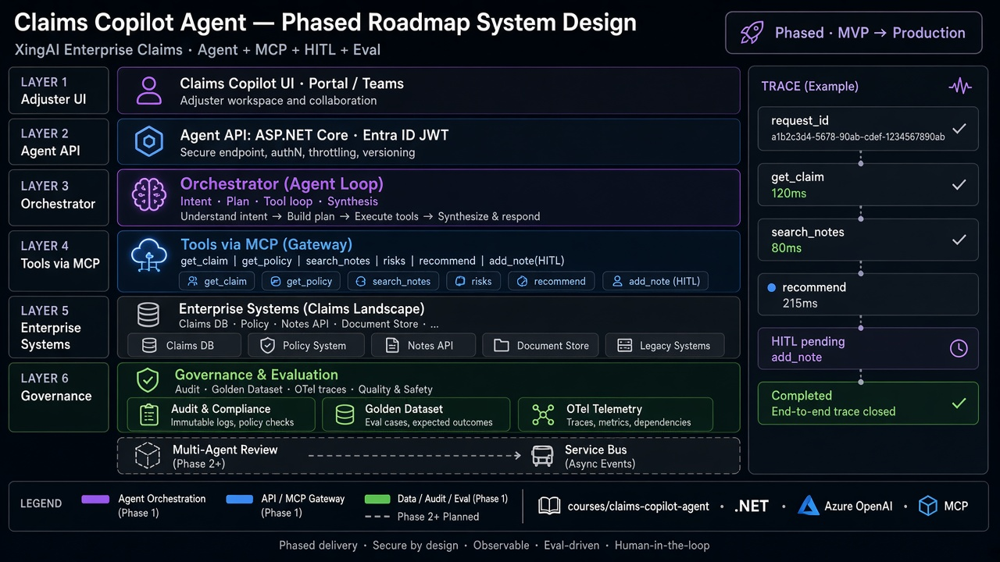

# Claims Copilot Agent — 分阶段系统设计

> *理赔聊天机器人，和企业级 Claims Copilot Agent，差在哪里？*

**一句话：** 差在有 Schema 的工具、委托身份、写操作人工批准、引用，以及 Golden Dataset——不是更漂亮的 Prompt。



---

## 5W 框架

### What（是什么）

| 层 / 组件 | 作用 | 负责 |
|---|---|---|
| Claims Copilot UI | Adjuster 界面 | 请求、预览、批准 |
| Agent API（.NET） | 认证边界 | JWT、request_id |
| Orchestrator | Agent 循环 | 规划 → 工具 → 观察 → 停止 |
| LLM | 推理 / 草稿 | **不是**鉴权权威 |
| MCP 工具层 | 企业适配 | Claim、Policy、Notes |
| Eval + Observability | 证据 | Golden Dataset、OTel |

**本文不写：** 承运人保密 SOP、生产库表、真实短信通道。

### Who（谁读）

- **解决方案架构师** — 阶段边界与模式
- **工程师** — 工具白名单、HITL、OBO
- **安全 / 合规** — 谁能写 Note、如何审计
- **招聘侧** — “企业 Agent”要什么证据

### Why（为何）

没有这套设计：

- 模型编造案情；写操作跳过批准
- Token 直通导致“谁在行动”不清
- Prompt 一改，质量静默退化

有了之后：

- 读可自动，敏感写等人
- 下游 API 看到 OBO Token 并再次鉴权
- Golden 回归先于 Demo 暴露问题

### When（何时）

| 阶段 | 需要什么 |
|---|---|
| MVP / Demo | 单 Agent、模拟 Claim/Policy、结构化摘要 |
| POC 验证 | MCP 桩、Citation、`add_claim_note` 走 HITL |
| 生产形态 | Entra ID + OBO、工具 RBAC、审计账本、日志脱敏 |
| Phase 2+ | 单 Agent 评测变绿后再考虑 Multi-Agent；可选 Service Bus |

**铁律：** 先把一个有硬边界的 Agent 做对，再谈 Multi-Agent。

### Where（放在哪）

```text
Adjuster → Copilot UI → Agent API → Orchestrator → LLM
                                      ↓
                                   MCP Client
                                      ↓
                         Claim | Policy | Notes APIs
                                      ↓
                         Audit / Golden Eval / OTel
```

---

## 如何工作

### 端到端

```text
请求 → 鉴权 → 装上下文 → 推理 → 白名单工具
→ 引用 → 建议 →（写）HITL → 审计 → 返回
```

### 示例：摘要 + 建议（Note 需批准）

```text
Step 1 · API · JWT 通过 · 12ms
Step 2 · get_claim(CLM-10023) · 120ms
Step 3 · search_claim_notes · 80ms
Step 4 · get_policy · 95ms
Step 5 · LLM 草稿 + 引用
Step 6 · UI 预览 add_claim_note · 待批
Step 7 · 人工 APPROVE · 写入 + 审计 · Completed
```

---

## 企业模式映射

| 模式 | 用法 |
|---|---|
| Orchestrator vs MCP Gateway | Orchestrator 决策；MCP 暴露工具 |
| Trace / 治理 | request_id、工具、耗时、接受/拒绝 |
| 分阶段路线图 | MVP 工具 → POC MCP/HITL → 生产身份 → 可选多 Agent |
| LLM 前优先事实 | 检索到的 Claim 事实优先于自由发挥 |

---

## 反模式

| 反模式 | 为何失败 | 正确做法 |
|---|---|---|
| “听起来对”的聊天 | 未核实事实进决策 | 必填事实 + Citation |
| 自动写 Note | 合规与审计空洞 | 写操作 HITL |
| Token Passthrough | Audience 错、边界糊 | OBO + 下游再鉴权 |
| 第一天就 Multi-Agent | 贵、慢、难排错 | 先证明单 Agent |
| 简历编造指标 | 信誉归零 | 标明 Prototype / 模拟 |

---

## POC vs Phase 2+

| 教学 POC 已验证 | Phase 2+ / 生产 |
|---|---|
| 工具循环 + 模拟数据 | 真实 Claim/Policy 系统 |
| HITL 草图 | 真实 Entra 角色 + 审计库 |
| Golden ≥20 案 | CI 持续回归 |
| 手工注入样例 | 自动化对抗集 |

---

## 相关文档

- 课程：[Claims Copilot Agent 工程实战](../courses/claims-copilot-agent/README.zh.md)
- 架构镜像：[docs/architecture/claims-copilot-agent.zh.md](../docs/architecture/claims-copilot-agent.zh.md)
- 理赔业务：[claim-business](../courses/claim-business/README.zh.md)
- 身份课：[Course 10](../courses/10-oauth-oidc-azure-identity/README.zh.md)
- English: [2026-09-25-claims-copilot-agent-phased-roadmap.md](./2026-09-25-claims-copilot-agent-phased-roadmap.md)
