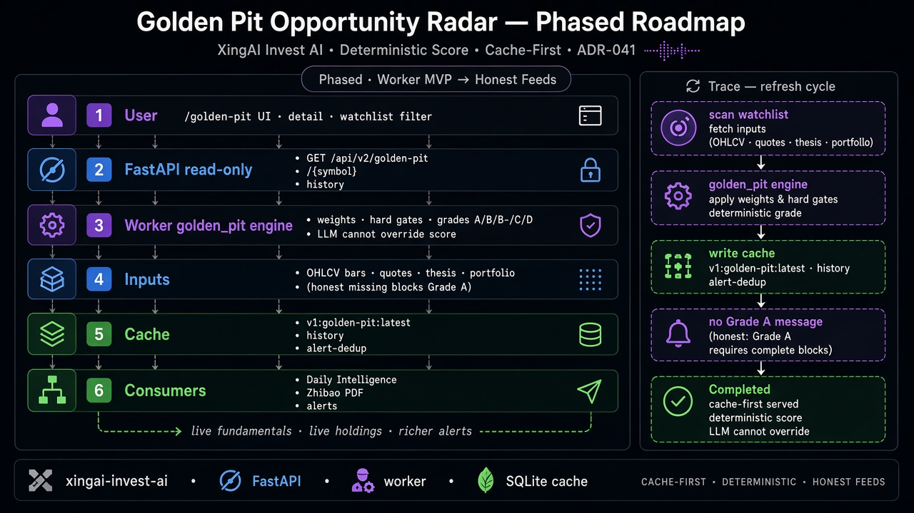

# 黄金坑机会雷达 — 分阶段系统设计

> *股票跌了 30%，算不算黄金坑？*

**一句话：** 只有硬门槛都过才算——论断未破、估值证据、数据够新、组合影响可接受。单靠深跌永远不是 Grade A。LLM **不能**改分。



---

## 5W 框架

### What

| 组件 | 作用 |
|---|---|
| `market_cache_worker/golden_pit/` | 确定性 `GoldenPitScore` + 评级 |
| SQLite KV | `v1:golden-pit:latest`、history、alert-dedup |
| FastAPI `/api/v2/golden-pit*` | 只读缓存面（ADR-012） |
| 前端 `/golden-pit` | 雷达、详情、本机观察过滤 |
| 日报 / 智报 | 同一缓存，不再算一套分 |

**不做：** 新开 `golden-pit.xingai.app`（ADR-032 已否）。

### Who

- 扩展 Invest AI 的工程师
- 要“抄底诚实性”的产品方
- ADR-041 与报告消费者

### Why

没有诚实门槛：会编 Grade A、编仓位、被 LLM 改分。  
有了之后：无 A 级是特性（“不交易优于勉强找机会”）；Attention Score 与坑质量分开。

### When

| 阶段 | 需要 |
|---|---|
| MVP | 引擎 + 缓存 + 只读 API + 前端 + 无 A 文案 |
| POC | 报告章节 + 告警去重骨架 + 单测 |
| 生产形态 | 刷新周期写实价；pit 失败不拖垮主刷新 |
| Phase 2+ | 诚实基本面/估值、真实持仓、更强告警 |

**铁律：** 缺失 / UNKNOWN / 过期 / BROKEN / 杠杆 / WeeklyPay → 封锁 Grade A。

### Where

```text
Worker 刷新 → golden_pit 引擎 → 缓存
前端 / 报告 / 告警 → FastAPI 只读 → 缓存
LLM 说明 = 仅由结构化字段模板生成
```

---

## 如何工作

```text
扫描观察列表 → 分量打分 → 硬门槛 → 评级
→ 写 latest + history → 可选 A 级告警去重
→ grade_a_count=0 时 UI 展示原则文案
```

### 示例：无 A 级日

```text
Worker 刷新 → 引擎（论断 UNKNOWN 失败）→ 缓存 grade_a_count=0
→ 前端「今日无 A 级黄金坑」→ Completed
```

---

## 企业模式映射

| 模式 | 用法 |
|---|---|
| Worker / 缓存边界 | Worker 算分；API 不算 |
| 诚实 / 治理 | 失败门槛与缺失证据显式写出 |
| 分阶段 | MVP 雷达 → 报告/告警 → 实况基本面 |

---

## 反模式

| 反模式 | 为何失败 | 正确做法 |
|---|---|---|
| 请求路径上算分 | 违反 ADR-012 | Worker 写缓存 |
| LLM 覆盖评级 | 诚实性崩塌 | 模板说明 |
| 深跌升 A | 逼交易 | 关键硬门槛 |
| 编造持仓权重 | 对用户说谎 | 「组合影响不可用」 |

---

## POC vs Phase 2+

| 已交付 | Phase 2+ |
|---|---|
| 确定性引擎 + 测试 | 权威基本面源 |
| 默认观察列表 | 持仓驱动组合限额 |
| 告警去重骨架 | 完整通知产品路径 |

---

## 相关文档

- ADR-041：[invest-ai](https://github.com/xingaiapp/xingai-invest-ai/blob/main/docs/adr/041-golden-pit-opportunity-radar.zh.md)
- 产品镜像：[architecture 笔记](https://github.com/xingaiapp/xingai-invest-ai/blob/main/docs/architecture/golden-pit-opportunity-radar.zh.md)
- English: [2026-09-25-golden-pit-opportunity-radar-phased-roadmap.md](./2026-09-25-golden-pit-opportunity-radar-phased-roadmap.md)
