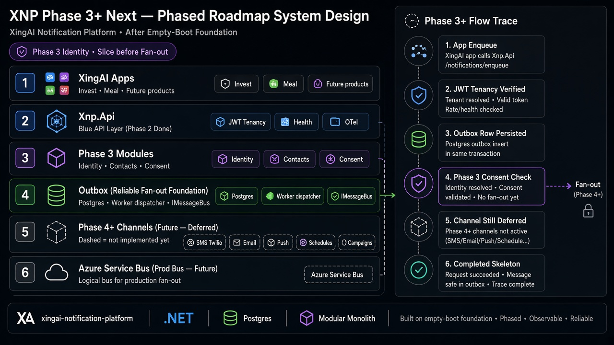

# XNP Phase 3+ 下一阶段 — 分阶段系统设计

> *Phase 2 一个通道 Provider 都没有。下一步怎么走，才不会变成“套了壳的 Twilio”？*

**一句话：** Phase 3 先做 **身份、联系人、同意**。Phase 4+ 再上**一条**通道垂直切片（先 SMS）。铺开前先跑通一条。



---

## 5W 框架

### What

| 阶段 | 范围 |
|---|---|
| Phase 2（已完成） | API + Worker + Postgres outbox + JWT 租户 — **无** Provider |
| Phase 3（下一步） | Identity、Contacts、Consent / 偏好 |
| Phase 4+ | SMS → Email/Push → 调度 → 活动 |
| 生产总线 | 就绪后用 Azure Service Bus 替换进程内总线 |

承接 ADR 0001–0020 与 2026-08-04 Phase 2 文章。

### Who

- 跨产品通知平台负责人
- 想“先发一条短信再说”的产品团队
- 审查多租户同意的安全方

### Why

跳过 Phase 3：应用直连 Provider；同意与联系人归属事后补；有 outbox 却没有合法可发内容。

### When

| 阶段 | 需要 |
|---|---|
| MVP（Phase 2） | 空启动、健康检查、坏 JWT 拒绝 |
| POC（Phase 3） | 联系人 + 同意模型；无同意则拒绝入队 |
| 生产形态 | Service Bus、重试/DLQ、密钥加密 |
| Phase 4+ | 抽象后的第一个 SMS Provider，再及其他 |

**铁律：** 先一条垂直切片，再水平铺开。Provider 在同意之后。

### Where

```text
XingAI 应用 → Xnp.Api (JWT) → 领域模块
                    ↓
              Postgres + outbox
                    ↓
              Worker → IMessageBus →（Phase 4+）通道 Provider
```

---

## 如何工作

### 示例：Phase 3 无同意则 DENY

```text
应用意图 → JWT 租户 OK → 解析联系人
→ Consent 未授权 SMS → 拒绝入队 → 审计 reason=consent_missing
→ 不调用任何 Provider → Completed
```

---

## 企业模式映射

| 模式 | 用法 |
|---|---|
| 模块化单体 | 宿主已就绪；切片以模块落地 |
| Outbox | 现进程内；后对齐 Service Bus 契约 |
| 分阶段 | 空启动 → 身份/同意 → 单通道 |

---

## 反模式

| 反模式 | 为何失败 | 正确做法 |
|---|---|---|
| JWT/同意前就接 Twilio | 租户与合规垫底 | 2 → 3 → Provider |
| 一次上全通道 | 半接线混乱 | 先 SMS 一条切片 |
| 应用直连 Provider | 违反 XNP 目标 | 一律经平台 |

---

## POC vs Phase 2+

| Phase 2 已验证 | 下一步 |
|---|---|
| 空启动、JWT、outbox | Phase 3 身份/联系人/同意 |
| 进程内总线 | 生产 Service Bus |
| 无 Provider | SMS → Email/Push |

---

## 相关文档

- [XNP Phase 2 Foundation](./2026-08-04-xnp-phase-2-foundation-system-design.zh.md)
- [xingai-notification-platform](https://github.com/xingaiapp/xingai-notification-platform)
- English: [2026-09-25-xnp-phase-3-next-phased-roadmap.md](./2026-09-25-xnp-phase-3-next-phased-roadmap.md)
