# Enterprise AI Architecture Diagrams

这个文件包含了文章中所有核心概念的高分辨率架构图表。

## Evidence Engine + Eval Registry (UX)

PNG diagram — worker/cache verification pipeline with EEE eval gate (not a product UI):

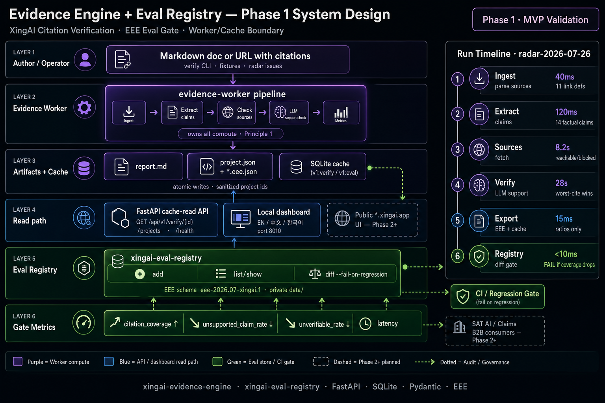

Used in:

- [Evidence Engine + Eval Registry (EN)](../articles/2026-07-26-evidence-engine-eval-registry.md)
- [Evidence Engine + Eval Registry (中文)](../articles/2026-07-26-evidence-engine-eval-registry.zh.md)
- [xingai-evidence-engine](https://github.com/xingaiapp/xingai-evidence-engine)
- [xingai-eval-registry](https://github.com/xingaiapp/xingai-eval-registry)

---

## Orchestrator vs MCP Gateway (UX)

PNG diagram for dev teams — **no separate Orchestration MCP**:

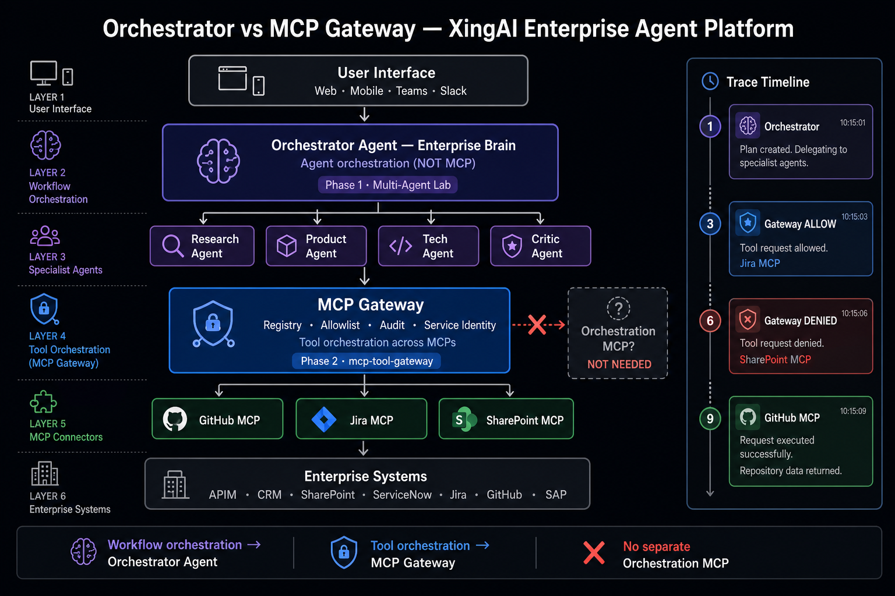

Used in:

- [Orchestrator vs MCP Gateway (EN)](../articles/2026-06-13-orchestrator-vs-mcp-gateway.md)
- [Orchestrator 与 MCP Gateway (中文)](../articles/2026-06-13-orchestrator-vs-mcp-gateway.zh.md)
- [XingAI Enterprise Agent Platform (POC repo)](https://github.com/xingaiapp/xingai-enterprise-ai-pocs/blob/main/docs/ENTERPRISE-AGENT-PLATFORM.md)

---

## Claims Settlement Workflow v2 (XingAI corrected design)

SVG diagram — nine-stage claims pipeline with the three structural fixes: a split **Fraud Triage / Fraud Scoring** pair around damage assessment, an explicit **Case Resolution Router** with labeled return paths (replacing a single generic escalation box), and a cross-cutting **Compliance & Audit Trail Agent** lane. XingAI-branded footer credits the author and links back to xingai.app.

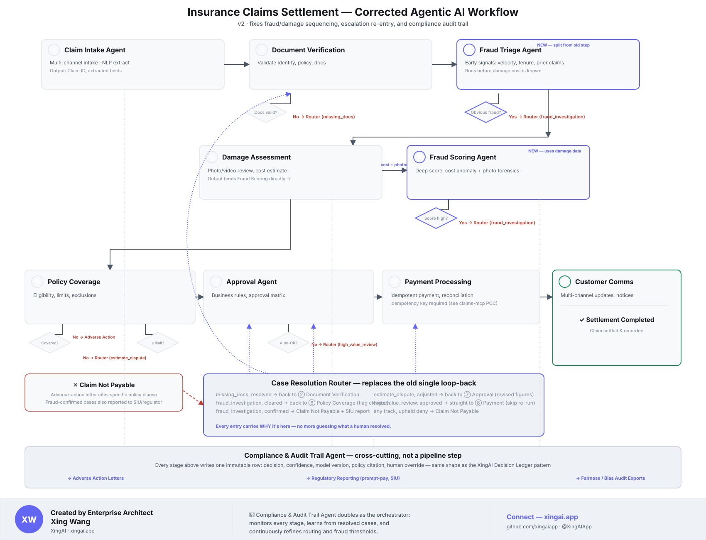

Used in:

- [Redesigning the Agentic Claims Workflow (EN)](../articles/2026-07-14-claims-workflow-redesign-fraud-routing-audit.md)
- [重新设计理赔工作流 (中文)](../articles/2026-07-14-claims-workflow-redesign-fraud-routing-audit.zh.md)
- [claims-workflow-v2-poc (runnable POC repo)](https://github.com/xingaiapp/xingai-enterprise-ai-pocs/tree/main/pocs/claims-workflow-v2-poc) — implements this exact design end to end

---

## 1. 企业 AI 决策系统完整架构

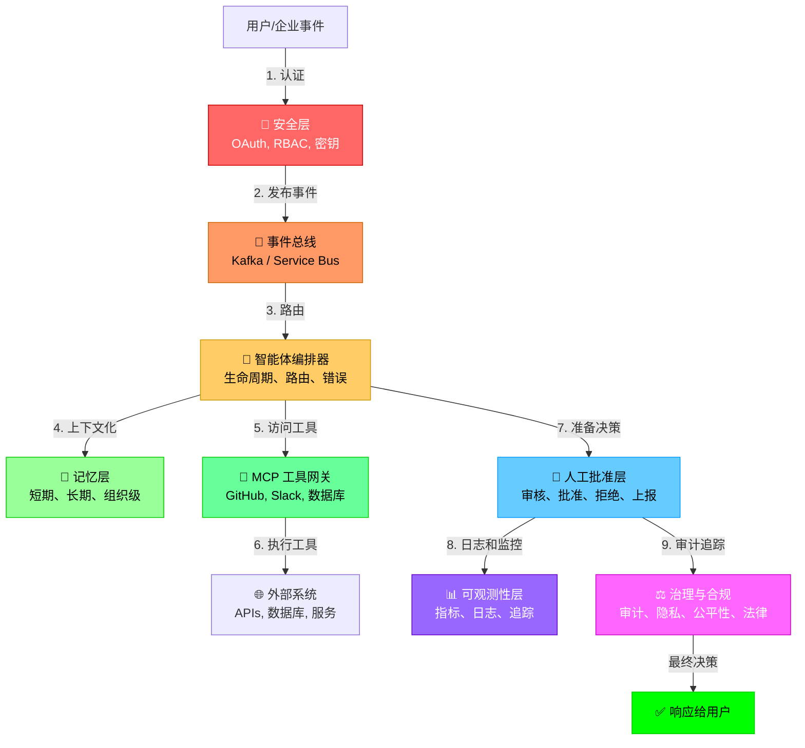

## 2. AI 系统成熟度演进

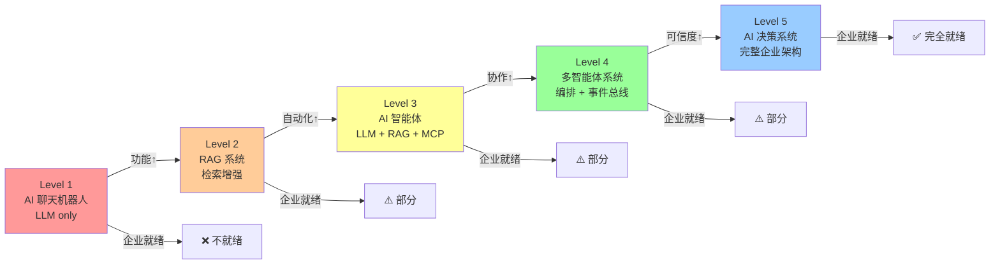

## 3. 演示栈 vs 企业栈

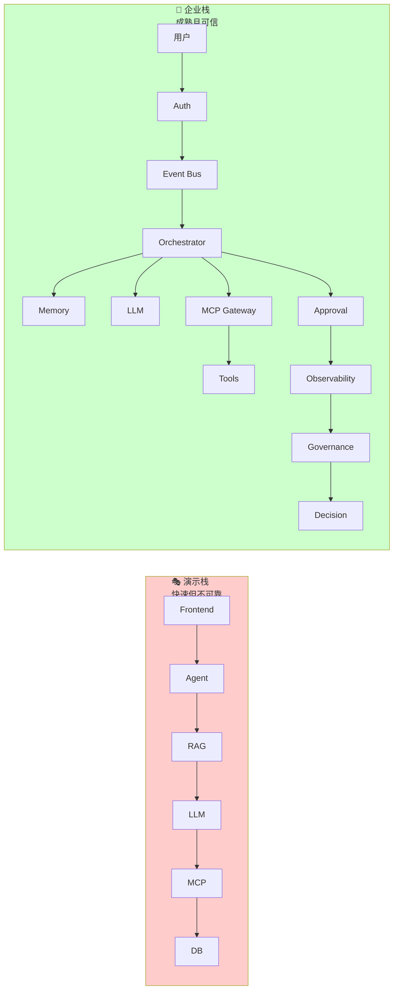

## 4. 事件总线的作用

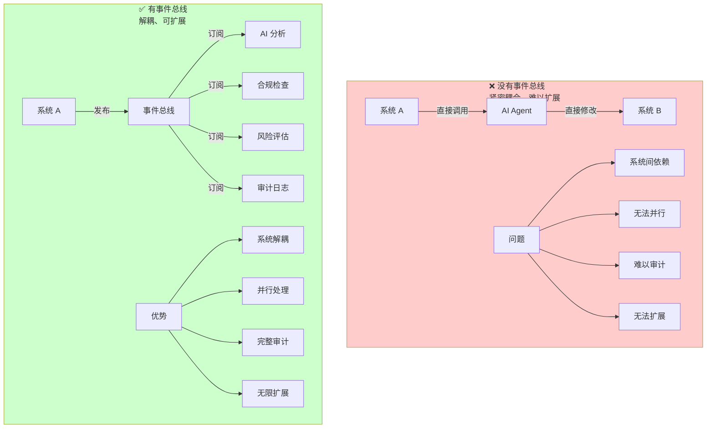

## 5. 记忆层架构

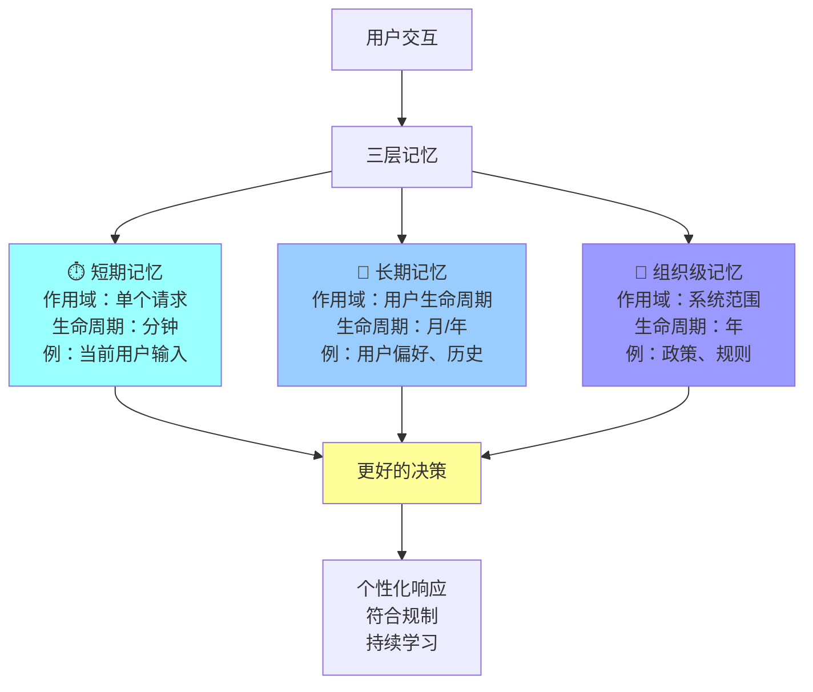

## 6. 人工批准层流程

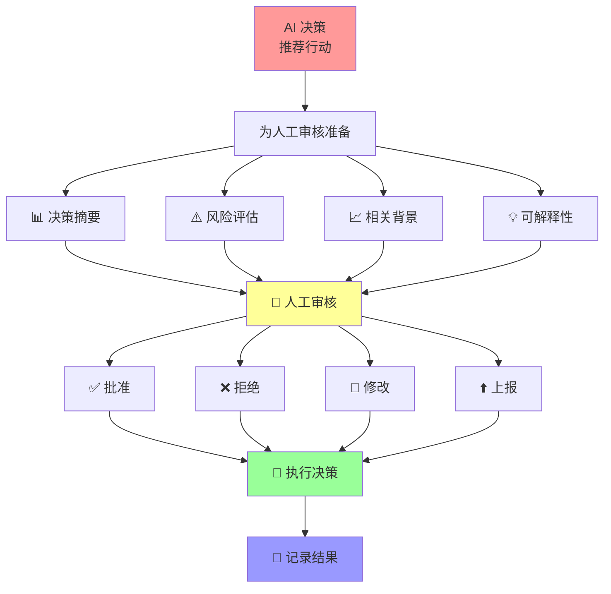

## 7. MCP 在企业 AI 中的角色

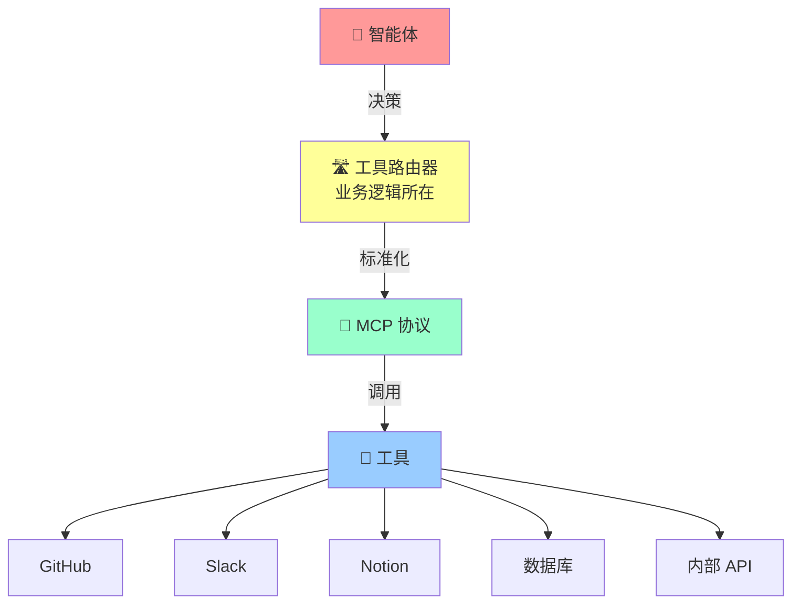

## 8. 可观测性三支柱

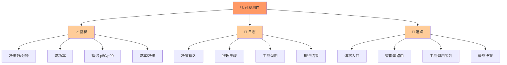

## 9. 案例：投资决策的完整流程

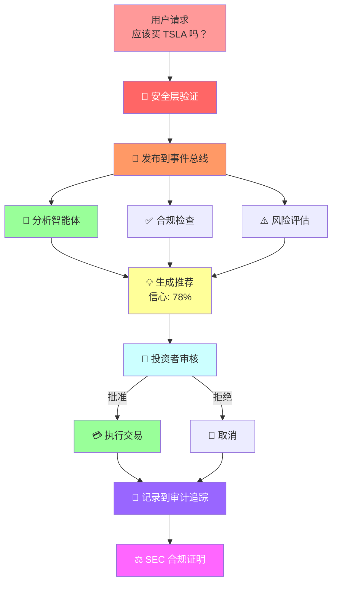

## 10. XingAI 产品架构示意

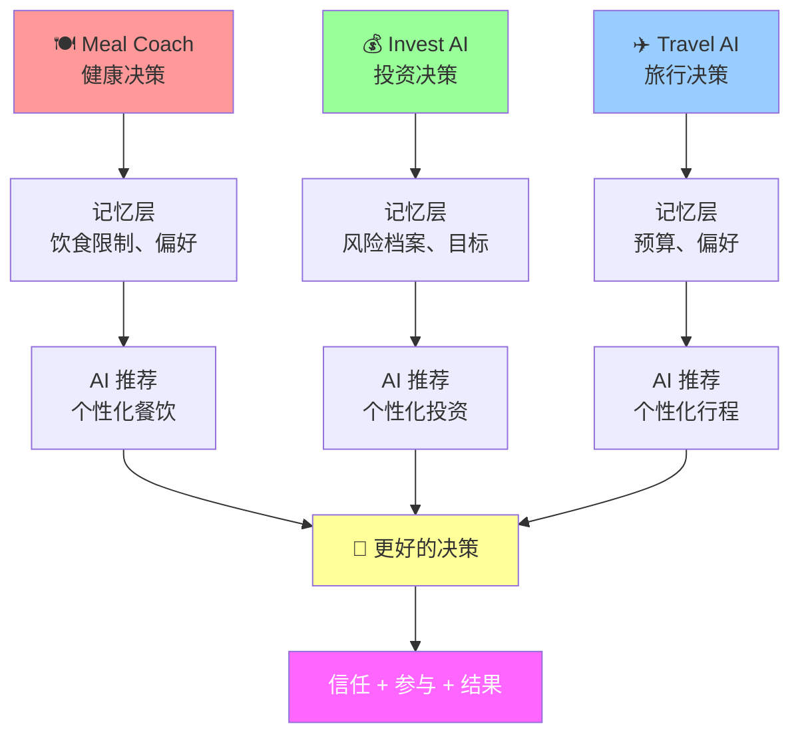

---

## 使用说明

这些图表可以：
1. 在文章中嵌入（Mermaid 原生支持）
2. 导出为 PNG/SVG 在演示中使用
3. 在 GitHub Wiki 中引用
4. 用于团队培训和讲座

## 图表质量标准

- ✅ 清晰的颜色编码
- ✅ 标准化的图标和符号
- ✅ 一致的流程方向
- ✅ 可读的文本标签
- ✅ 适合演示和印刷
