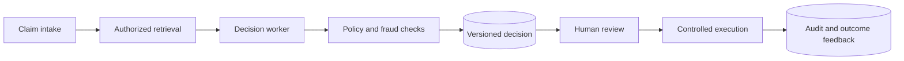

# XingAI Progressive Capstones

Chinese: [README.zh.md](README.zh.md)

Each capstone reuses evidence from earlier levels and adds a new responsibility. A learner may choose education, finance, insurance, healthcare, travel, or enterprise operations, but must use simulated or properly authorized data.

## Capstone Ladder

| Stage | Deliverable | Required additions |
|---|---|---|
| Beginner | Semantic classifier | Data card, baseline, tests, limitations |
| Application engineer | Typed LLM service | Schema, timeout, retry, eval set, safe UI state |
| Knowledge engineer | Governed RAG | Provenance, ACL, citations, retrieval/answer metrics |
| Agent engineer | Bounded tool workflow | Tool schemas, stop limits, approval, audit |
| Platform engineer | Secured MCP integration | OAuth/PKCE, resource binding, scopes, negative tests |
| Staff engineer | Durable runtime | State graph, checkpoint, idempotency, replay, SLOs |
| AI architect | Decision system | Policy, worker/core boundary, decision cache, execution gates |
| CTO | Enterprise portfolio | Strategy, economics, operating model, roadmap, board memo |

## Final Integrated Scenario

Design an enterprise claims decision system. It ingests authorized policy and claim evidence, retrieves grounded context, proposes a recommendation, routes suspicious cases for specialist review, requires approval before payment, and records provenance and outcomes.

## Required Package

Executive one-page 5W + How; architecture and trust diagrams; threat model; working reference path; test/evaluation report; operational runbook; cost model; accessibility and human-impact review; ADRs; live demo; interview-style defense; English and Chinese executive summaries.

## Completion Standard

Two reviewers score independently with the shared rubric. The learner resolves critical findings, responds to one surprise requirement change, and records what should remain deterministic, model-assisted, human-approved, or prohibited.

