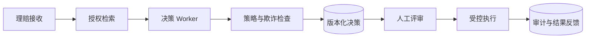

# XingAI 渐进式结业项目

English: [README.md](README.md)

每个结业项目复用早期阶段证据并增加新的责任。学习者可以选择教育、金融、保险、医疗、旅行或企业运营领域，但必须使用模拟数据或已正确授权的数据。

## 结业项目阶梯

| 阶段 | 交付物 | 必须新增 |
|---|---|---|
| 初学者 | 语义分类器 | Data Card、Baseline、测试、限制 |
| 应用工程师 | 类型化 LLM 服务 | Schema、超时、重试、评估集、安全 UI 状态 |
| 知识工程师 | 受治理 RAG | Provenance、ACL、引用、检索/答案指标 |
| Agent 工程师 | 受限工具工作流 | 工具 Schema、停止限制、审批、审计 |
| 平台工程师 | 受保护 MCP 集成 | OAuth/PKCE、Resource Binding、Scope、负向测试 |
| Staff 工程师 | Durable Runtime | 状态图、Checkpoint、幂等、Replay、SLO |
| AI 架构师 | 决策系统 | 策略、Worker/Core 边界、决策缓存、执行 Gate |
| CTO | 企业产品组合 | 战略、经济性、运营模型、路线图、董事会 Memo |

## 最终综合场景

设计企业理赔决策系统：摄取有权限的保单和理赔证据，检索有依据的上下文，提出建议，把可疑案件路由给专家评审，付款前要求审批，并记录 Provenance 与结果。

## 必交材料

高管一页版 5W + How；架构图与信任图；威胁模型；可运行参考路径；测试/评估报告；运营 Runbook；成本模型；可访问性与人类影响评审；ADR；现场演示；面试式答辩；英文和中文高管摘要。

## 完成标准

两位评审者使用共享量表独立评分。学习者需解决严重问题，响应一次突发需求变更，并记录哪些部分应保持确定性、模型辅助、人工审批或明确禁止。

