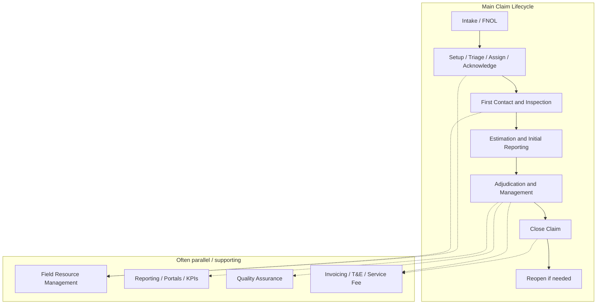
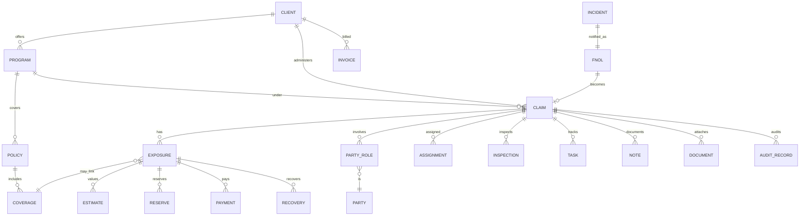
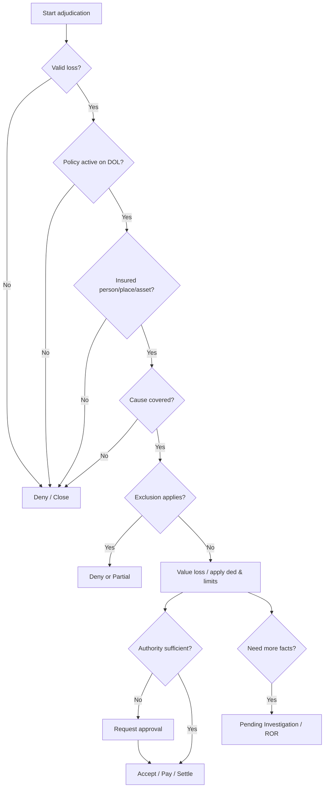
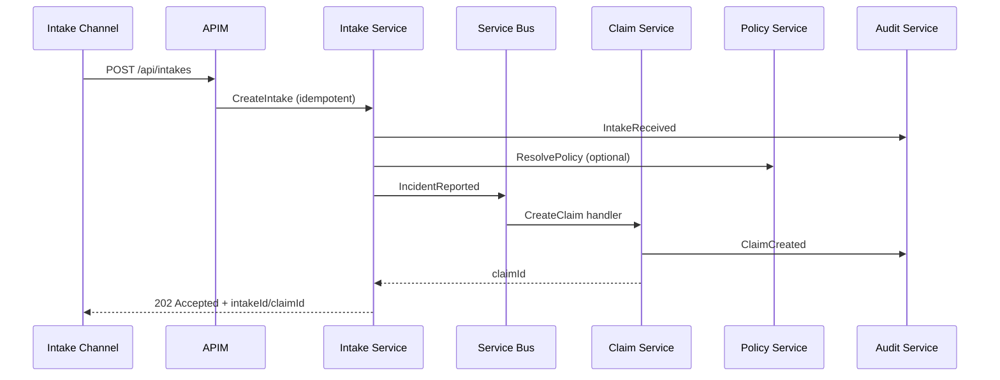
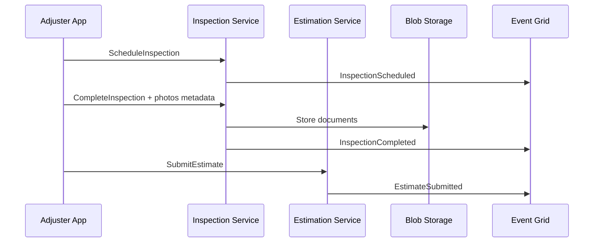
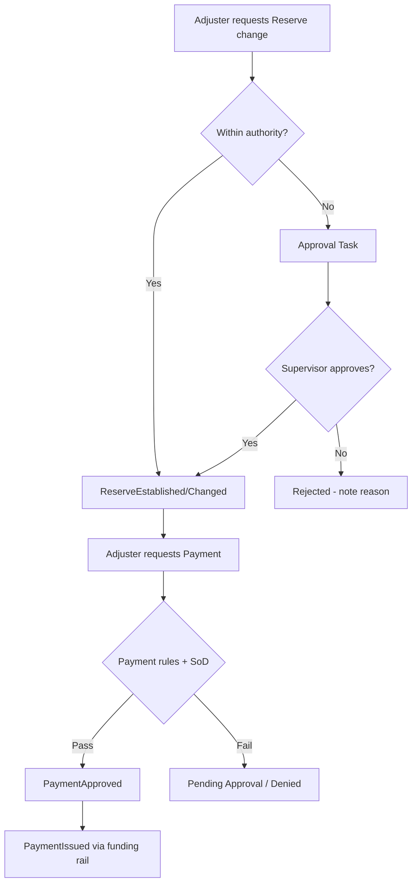
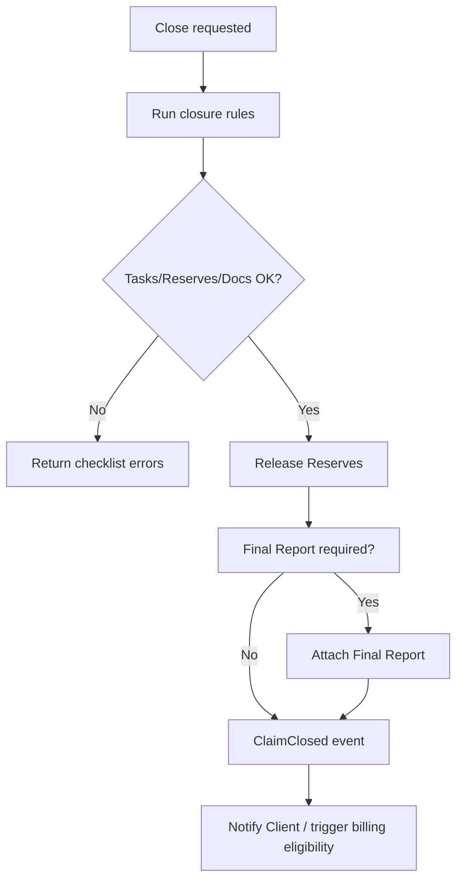
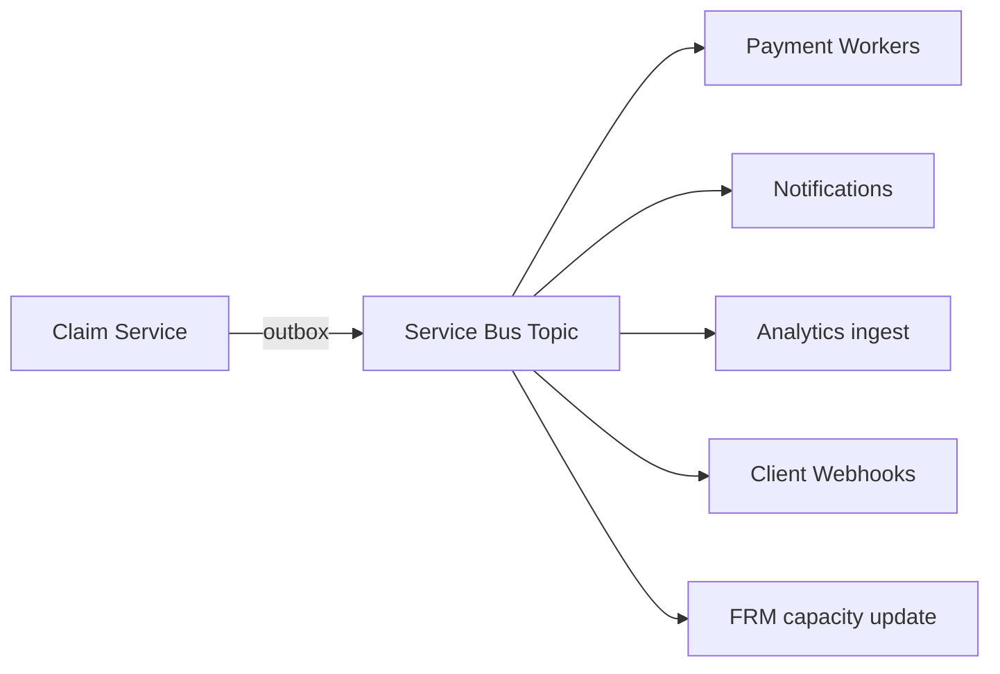
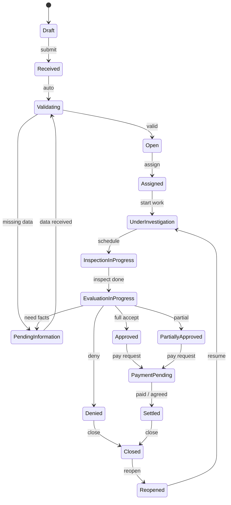

# Claim Business Guide for Solution Architects

**A progressive training course from beginner vocabulary to expert platform design**  
**Audience:** IT Solution Architects and Software Engineers working on claims systems  
**Context:** Typical TPA (Third-Party Administrator) / Sedgwick-style claims administration — illustrative, not proprietary  
**Also available:** [简体中文](./claim-business-guide-zh.md) · [Course README](./README.md)

> **Disclaimer:** This course teaches **general insurance claims industry practice**, **typical TPA operating models**, and **illustrative system design**. Actual workflows, authorities, product names, APIs, schemas, and rules vary by **client contract**, **Client Instructions**, **Service Agreement**, **Policy wording**, **line of business (LOB)**, **jurisdiction**, and **internal implementation**.  
> **Sedgwick** is generally a **TPA / claims administration partner**. It is **not necessarily** the Insurance Carrier that issued the Policy. Do not treat examples in this guide as confidential Sedgwick internals.

---

## Table of Contents

1. [Opening: Purpose, Audience, Outcomes, Mental Model](#1-opening-purpose-audience-outcomes-mental-model)
2. [Level 1 — Beginner Vocabulary](#2-level-1--beginner-vocabulary)
3. [Level 2 — Claim Lifecycle Foundation](#3-level-2--claim-lifecycle-foundation)
4. [Organizations and Operating Models](#4-organizations-and-operating-models)
5. [People and Roles](#5-people-and-roles)
6. [Policy, Coverage, and Claim Structure](#6-policy-coverage-and-claim-structure)
7. [Level 3 — Adjuster Operations](#7-level-3--adjuster-operations)
8. [Level 4 — Financial Concepts and Controls](#8-level-4--financial-concepts-and-controls)
9. [Claim Adjudication](#9-claim-adjudication)
10. [Property Claim Deep Dive and Case Study](#10-property-claim-deep-dive-and-case-study)
11. [Workers’ Compensation Comparison and LOB Table](#11-workers-compensation-comparison-and-lob-table)
12. [TPA and Sedgwick-Style Operating Model (RACI)](#12-tpa-and-sedgwick-style-operating-model-raci)
13. [Day in the Life of an Adjuster](#13-day-in-the-life-of-an-adjuster)
14. [Business Rules and Configurable Workflow](#14-business-rules-and-configurable-workflow)
15. [Level 5 — Solution Architecture](#15-level-5--solution-architecture)
16. [Level 6 — Domain-Driven Design (Bounded Contexts)](#16-level-6--domain-driven-design-bounded-contexts)
17. [Illustrative APIs and Integration Patterns](#17-illustrative-apis-and-integration-patterns)
18. [Logical Data Model and Governance](#18-logical-data-model-and-governance)
19. [Security and Compliance](#19-security-and-compliance)
20. [Non-Functional Requirements and Large Documents](#20-non-functional-requirements-and-large-documents)
21. [Reporting and KPIs](#21-reporting-and-kpis)
22. [Failure Scenarios and Recovery Design](#22-failure-scenarios-and-recovery-design)
23. [Project Requirements Toolkit](#23-project-requirements-toolkit)
24. [Claim State Machine](#24-claim-state-machine)
25. [Four End-to-End Case Studies](#25-four-end-to-end-case-studies)
26. [Learning Exercises Hub](#26-learning-exercises-hub)
27. [Required Comparison Tables](#27-required-comparison-tables)
28. [Course End: Glossary, Assessment, Workshops, Checklists, 30/60/90 Plan](#28-course-end-glossary-assessment-workshops-checklists-306090-plan)

**Learning progression:** L1 Vocabulary → L2 Lifecycle → L3 Adjuster ops → L4 Financial/legal controls → L5 Solution designer → L6 Expert architect (woven through Chapters 15–24).

---

## 1. Opening: Purpose, Audience, Outcomes, Mental Model

### 1.1 Course purpose

This course turns claims business language into **design-ready thinking**. You will learn how a First Notice of Loss (FNOL) becomes a managed Claim; how Adjusters investigate; how Reserve, Payment, and Invoice differ; and how to express those concepts as services, events, rules, APIs, and auditable workflows on a multi-client TPA platform.

### 1.2 Target audience

- Solution Architects and Software Engineers new to insurance claims
- Practitioners building or integrating Property / casualty / CTABS-style claims solutions
- Engineers comfortable with Azure, .NET, APIs, databases, and event-driven design
- Anyone joining a Sedgwick-style **TPA claims administration** project who must speak fluently with Adjusters, Client managers, and Finance

### 1.3 Prerequisites

- Enterprise software design (services, integration, data, security)
- Basic HTTP/REST and messaging concepts
- Comfort reading Mermaid diagrams and decision tables  
**Not required:** prior insurance license or Adjuster experience.

### 1.4 Learning outcomes

By the end of this course you will be able to:

1. Explain the Claim Lifecycle from Intake through Close and Invoicing.
2. Distinguish Policy, Claim, Coverage, Liability, Client Instructions, and Delegated Authority.
3. Model Exposures, Reserves, Payments, Recoveries, and TPA Service Invoices correctly.
4. Walk a Property Claim from FNOL to reopen with realistic Notes and controls.
5. Compare Property, Auto/Liability, Workers’ Compensation (WC), and Disability/Leave.
6. Draw logical architecture, DDD bounded contexts, state machines, and illustrative APIs.
7. Write user stories, decision tables, NFRs, and failure recoveries for a Claim project.
8. Ask the right questions in your first Client / TPA project meeting.

### 1.5 How to use this course

| Path | Use when |
|------|----------|
| Linear (Ch. 1→27) | First pass through claims domain |
| Property deep dive (Ch. 10) | You are on a Property / estimation project |
| Architecture track (Ch. 15–20) | You are designing services and events |
| Workshop track (Ch. 23, 25, 27) | You need project artifacts tomorrow |
| Glossary + assessment (Ch. 27) | Knowledge check before a Client workshop |

> **Architect’s view:** Treat every “system name,” API path, and event name in this guide as **illustrative**. Map them to the Client’s real System of Record (SoR) and integration contracts during discovery.

### 1.6 Important disclaimer (client and jurisdiction variation)

- **Carrier vs TPA vs Self-Insured** authority models differ.
- **WC and Disability** are heavily jurisdiction-specific.
- **Coverage interpretation** is legal/policy work — software encodes *documented rules*, not improvisation.
- **Accounting definitions** of Incurred, Reserve, and Recoveries may differ by organization.
- Examples are **synthetic** and for training only.

### 1.7 One-page Claim Business mental model

```text
Policy defines the promise.
Claim records the event.
Coverage determines whether the promise applies.
Adjuster investigates and manages the Claim.
Estimate values the damage.
Reserve predicts future cost.
Payment transfers actual money.
Invoice charges for the TPA service.
Reporting explains performance and outcomes.
```

| Idea | What it means in practice |
|------|---------------------------|
| Policy = promise | What was sold, for whom, where, when, with limits/deductibles/exclusions |
| Claim = event record | The administered file for a reported loss/incident under a program |
| Coverage = applicability | Does this peril, person, place, and time fall inside the promise? |
| Adjuster = investigator/manager | Investigates, documents, decides within authority, drives Tasks/Diaries |
| Estimate = damage valuation | Scope and cost of repair/replace (often before final settlement) |
| Reserve = predicted cost | Best estimate of remaining (and sometimes total) financial exposure |
| Payment = money out on the Claim | Indemnity or expense paid to a payee |
| Invoice = TPA service charge | Billing the Client for administration / T&E / service fees — **not** the same as Claim Payment |
| Reporting = explained performance | Ops, financial, stewardship, regulatory, and Client portal views |

> **Common mistake:** Treating Estimate, Reserve, Payment, and Invoice as interchangeable fields. They answer different questions: *value of damage*, *expected remaining cost*, *money already transferred*, *fee for TPA work*.

---

## 2. Level 1 — Beginner Vocabulary

### 2.1 Teaching pattern used throughout

For major topics this course uses: **definition, why, who, when, where, how, example, common misunderstanding, project-design implications, interview questions, knowledge-check**. Framework: **5Ws + How**.

### 2.2 Essential beginner terms

| Term | Plain definition |
|------|------------------|
| Insurance Carrier | Entity that underwrites risk and issues the Policy (often pays Claim funds) |
| TPA | Third-Party Administrator that administers Claims under contract |
| Policy | Legal contract defining coverages, limits, exclusions, conditions |
| FNOL | First Notice of Loss — initial report that a loss occurred |
| Claim | Administered record of a loss event under a Client program |
| Exposure / Feature | Sub-part of a Claim for a coverage/claimant/damage stream (terminology varies) |
| Adjuster | Professional who investigates and manages the Claim |
| Coverage | Specific protection within a Policy (e.g., Building, Contents) |
| Deductible | Amount the Insured typically retains before indemnity applies |
| Limit | Maximum payable under a coverage or Policy provision |
| Reserve | Amount set aside for expected future Claim cost |
| Payment | Actual disbursement on a Claim |
| Subrogation | Recovering from a responsible third party |
| Client Instructions | Client-specific handling rules the TPA must follow |
| Delegated Authority | Monetary/decision authority granted to TPA/Adjuster |

### 2.3 Why vocabulary comes first

Wrong words create wrong schemas. If Product calls a TPA fee a “payment,” Finance reconciliation and audit trails break.

### 2.4 Mini knowledge-check (L1)

1. Who typically **issues** the Policy? → **Insurance Carrier** (or occasionally specialty structures), not automatically the TPA.  
2. What does FNOL stand for? → **First Notice of Loss**.  
3. Is a Reserve the same as a Payment? → **No**. Reserve is expected future cost; Payment is money transferred.  
4. Who follows Client Instructions day to day? → **TPA / Adjusting staff**.  
5. Does Sedgwick always equal Carrier? → **No**. Sedgwick is generally a **TPA / claims administration partner**.

### Chapter 2 exercises

**Beginner (5)**  
1. Define Claim in one sentence.  
2. Name three FNOL channels.  
3. What is a Deductible?  
4. What is Delegated Authority?  
5. Difference between Claim Payment and TPA Invoice?

**Scenarios (3)**  
1. A homeowner reports a pipe burst by phone. Which lifecycle stage starts?  
2. An Adjuster recommends $8,000 for expected repair — Reserve or Payment?  
3. Client is billed $450 for handling fees — Claim Payment or Service Invoice?

**Architecture (2)**  
1. Why should Payment and Invoice be separate bounded contexts or aggregates?  
2. What reference data does Intake need before Claim setup?

**Answers**  
1. Administered record of a reported loss under a program.  
2. Phone, email, web, API/web service (also portal/broker).  
3. Amount Insured typically pays before indemnity.  
4. Authority matrix for decisions/payments without further approval.  
5. Claim Payment = indemnity/expense on loss; Invoice = TPA service fee.  
S1: Intake / FNOL. S2: Reserve (recommendation). S3: TPA Service Invoice.  
A1: Different money movement, payees, SoR, audit, accounting. A2: Client/program, policy key, LOB, location, severity cues, duplicate keys.

---

## 3. Level 2 — Claim Lifecycle Foundation

### 3.1 Central Claim Lifecycle (definition)

The **Claim Lifecycle** is the end-to-end path from notice of loss through investigation, financial management, closure, and (often separately) TPA billing — with reporting, Field Resource Management (FRM), QA, and billing potentially running **in parallel**.

### 3.2 Mermaid — lifecycle and supporting capabilities



> **Assumption:** Ordering above is a teaching model. Catastrophe (CAT) and complex losses loop, skip, or parallelize steps.

### 3.3 Stage-by-stage (5Ws + How)

#### 3.3.1 Intake

| Lens | Content |
|------|---------|
| **What** | Capture notice via phone, email, website, web service/API, portal — producing FNOL |
| **Why** | Start the clock for SLA, assignment, mitigation, and duplicate detection |
| **Who** | Claimant, Insured, Agent/Broker, Client risk team, automated feeds |
| **When** | As soon as a loss is reported (or discovered) |
| **Where** | Call center, Client portal, EDI/API gateway, email ingestion |
| **How** | Validate minimum fields → create Incident/FNOL → hand off to setup |

#### 3.3.2 Setup, Triage, Assign, Acknowledge

- Validate intake; detect duplicate incidents/claims  
- Triage by severity, LOB, CAT code, Client, jurisdiction  
- Apply Claim Template; identify Adjuster (skills/geo/license/workload)  
- Send Acknowledgment per Client Instructions / regulation  

#### 3.3.3 First Contact and Inspection

Modes: **Field**, **Desk**, **Virtual** (video), **Mobile app**, **Digital measurement / dimensions**, virtual reporting.

#### 3.3.4 Field Resource Management (FRM)

Resource database balancing: skills, geography, licensing, workload, Independent Adjuster (IA) capacity, CAT surge allocation.

#### 3.3.5 Estimation and Initial Reporting

Estimate scopes repair vs replacement; labor/materials; depreciation; **ACV** / **RCV**; recommended Reserve; recommended next actions; Initial Report.

#### 3.3.6 Adjudication and Management

Coverage, investigation, liability, decision, Reserve, Payment, Notes, Tasks, Diaries, Documents, Correspondence, Approvals, Litigation, Fraud indicators, Subrogation/Recovery.

#### 3.3.7 Reporting

Client Portal, Claimant Portal, Stewardship, Operational, Financial, Regulatory reports, analytics, KPIs — continuous.

#### 3.3.8 Close

Closure criteria; release remaining Reserve; complete Tasks; Final Report; Closure Reason; reopen scenarios.

#### 3.3.9 Invoicing

QA of file quality; Time & Expense (T&E); service fee; Client Invoice.  
**Claim Payment ≠ TPA Service Invoice.**

### 3.4 Project-design implications

- Model **lifecycle stage** separately from **Claim status** and from **Exposure status**.  
- Design FRM as its own capability with capacity events.  
- Billing may start before closure depending on contract.

### Chapter 3 exercises

**Beginner:** List 9 lifecycle stages; name 3 inspection modes; what FRM balances; two parallel capabilities; when Acknowledgment is sent.  
**Scenarios:** CAT surge day — what breaks first? Email FNOL with no policy number — next system step? Close with open Reserve — OK?  
**Architecture:** Where does duplicate detection live? Sync or async for CAT FNOL spikes?  

**Answers (summary):** Stages as in §3.2; Field/Desk/Virtual (+mobile/digital); skills/geo/license/workload/IA/CAT; Reporting/FRM/QA/Billing; after setup/assign per rules. CAT: assignment/inspection capacity. Missing policy: pending coverage / policy lookup queue. Closing with open Reserve usually blocked or forces release. Duplicate: Intake/Claim service with deterministic keys. CAT FNOL: queue/event-driven intake with back-pressure.

---

## 4. Organizations and Operating Models

### 4.1 Organizations (definition matrix)

| Organization | Definition | Typical money role | Design implication |
|--------------|------------|--------------------|--------------------|
| **Insurance Carrier** | Underwrites and issues Policy | Claim funds often Carrier’s | Policy & funds SoR integrations |
| **TPA** | Administers Claims under contract | May not hold indemnity funds; bills service fees | Multi-tenant Client Instructions engine |
| **Self-Insured** | Employer/entity retains risk | Pays losses from own funds | Funding account & approval wiring |
| **Captive** | Insurer owned by insureds | Captive treats as Carrier-like | Same as Carrier with special reporting |
| **MGA** | Managing General Agent — underwriting authority | May bind/issue within authority | Authority boundaries in UI/API |
| **Broker** | Intermediary placing coverage | Rarely pays Claim | Portal intake & status visibility |
| **Agent** | Producer; may take FNOL | Limited | Channel attribution |
| **Client** | Party contracting with TPA (Carrier, SI, etc.) | Pays TPA fees; may fund Claims | Tenant = Client/Program |
| **Vendor** | Inspectors, contractors, IAs, medical networks | Paid as expense or via network | Vendor master & SOC controls |
| **Regulator** | Sets rules / reporting | N/A | Jurisdictional rule packs |
| **Reinsurer** | Insures the insurer | Large-loss bordereaux | Threshold reporting events |

### 4.2 Carrier vs TPA (preview of comparison tables in Ch. 26)

> **Project meeting questions:** Who is the contractual Client? Who funds indemnity payments? Who owns coverage decision finality? What is Delegated Authority by dollar and by decision type?

### Chapter 4 exercises

**Beginner:** Define TPA; Captive; MGA; Client vs Claimant; Reinsurer.  
**Scenarios:** Self-Insured retailer hires TPA — who pays Claimant? Carrier + TPA — who owns Policy SoR?  
**Architecture:** Multi-tenant key? Separate Claim-funds rail from fee-billing rail?  

**Answers:** TPA administers under contract; Captive = insurer owned by insureds; MGA binds within authority; Client contracts TPA, Claimant asserts loss; Reinsurer covers Carrier. SI Client usually funds loss; Policy SoR typically Carrier. Tenant = Client+Program; yes separate rails.

---

## 5. People and Roles

### 5.1 Role catalog

For each role: **whom they represent**, **authority**, **info needed**, **actions**, **system access**, **role confusion**.

| Role | Represents | Authority (typical) | Info needed | Actions | System access | Common confusion |
|------|------------|---------------------|-------------|---------|---------------|------------------|
| **Policyholder** | Party who bought Policy | Contractual rights | Policy docs, status | Report loss, cooperate | Portal limited | ≠ always Claimant |
| **Named Insured** | Named on Policy | Coverage beneficiary status | Policy schedule | Notice, Proof of Loss | Portal | ≠ every user of asset |
| **Insured** | Protected party/person/property | Per Policy | Loss facts | Cooperate | Varies | Generic label overused |
| **Claimant** | Asserts right to payment | Claim rights | Status, payments | Submit docs, demand | Claimant portal | May be third party |
| **Injured Worker** | Employee in WC | Statutory benefits | Medical/wage data | Treat, RTW | WC portals | Not a “Property Claimant” |
| **Claims Adjuster** | Carrier/TPA/Client (by model) | Within Delegated Authority | File, Policy, facts | Investigate, reserve, pay | Claim desktop | Examiner vs Adjuster titles vary |
| **Claims Examiner** | Often liability/WC file owner | Authority matrix | Medical/liability record | Decision, benefits | Examiner workstation | Title overlap with Adjuster |
| **Desk Adjuster** | Same as staff Adjuster | Desk authority | Photos, reports | Manage without site visit | Claim system | Can still order Field |
| **Field Adjuster** | Same | Field + often estimate | Site access | Inspect on site | Mobile + claim | ≠ Appraiser always |
| **Independent Adjuster** | Contracted adjusting firm | Assignment-scoped | Assignment package | Inspect/estimate/report | IA portal | Not Public Adjuster |
| **Public Adjuster** | Policyholder | Negotiate for insured | Policy, damage | Advocate claim | External | Opposed interest vs Carrier Adjuster |
| **Catastrophe Adjuster** | Deployed for CAT | CAT programs | CAT codes, surge SLAs | High-volume adjusting | CAT tools | Temporary credentials |
| **Appraiser** | Valuation specialist | Appraisal opinion | Specs, comps | Value property/auto | Appraisal apps | May not “settle” Claim |
| **Estimator** | Scope/cost specialist | Estimate authority | Measurements | Build estimate | Estimating tools | Estimate ≠ settlement |
| **Risk Manager** | Client Employer/Corp | Oversight | Loss runs, trends | Direct TPA, Safety | Client portal | Not Underwriter |
| **Underwriter** | Carrier risk selection | Bind/price Policy | Submission data | Issue Policy | Policy admin | Rarely settles Claims |
| **Nurse Case Manager** | Medical management (WC) | Care coordination | Clinical data (PHI) | Guide treatment/RTW | Clinical systems | High PHI controls |
| **Defense Counsel** | Carrier/Client defense | Legal | Claim file | Defend suit | Legal hold access | Privilege marking |
| **Plaintiff Attorney** | Claimant | Advocacy | Demand package | Litigate/negotiate | Limited external | Adversarial access |
| **Supervisor** | TPA/Carrier management | Higher authority | Team inventory | Approve, coach, QA | Supervisor views | Bypass SoD risk |
| **SIU Investigator** | Special Investigations | Referral powers | Fraud indicators | Investigate fraud | Restricted SIU | Not routine Adjuster |
| **Finance / Billing Specialist** | Carrier/TPA Finance | Payment ops / invoicing | Banks, invoices | Fund, reconcile, bill | Finance modules | Mixing indemnity & fee |

### 5.2 System access design implication

Use **RBAC + ABAC** (Client, Program, LOB, jurisdiction, license flag, authority limit, PII/PHI tags). Never grant “all Claims in tenant” to Field IAs.

### Chapter 5 exercises

**Beginner:** Who does Public Adjuster represent? Desk vs Field? SIU purpose? Underwriter vs Adjuster? Injured Worker LOB?  
**Scenarios:** Third-party auto Claimant vs Named Insured — portals? IA without state license — allow assignment?  
**Architecture:** Attribute for payment approval? Privilege documents separation?  

**Answers:** Policyholder; Desk remote / Field on-site; fraud; UW binds Policy / Adjuster settles Claim; WC. Third-party gets Claimant portal, not full Policy. Block assignment without license. Attributes: authority limit + Client + currency. Legal privilege flag + restricted roles.

---

## 6. Policy, Coverage, and Claim Structure

### 6.1 Policy terms (catalog)

Policy, Policy Number, Policy Period, Effective Date, Expiration Date, Premium, Coverage, Coverage Limit, Per Person Limit, Per Occurrence Limit, Aggregate Limit, Deductible, Exclusion, Endorsement, Condition, Insured Location, Insured Asset, Reservation of Rights, Coverage Pending, Partial Coverage, Coverage Denial.

### 6.2 Critical distinctions

| Concept | Answers |
|---------|---------|
| **Policy** | What protection was **promised**? |
| **Claim** | What **happened** / what file are we administering? |
| **Coverage** | Does the event fall **within** the promise? |
| **Liability** | Who is **legally responsible** (especially third-party)? |
| **Client Instructions** | How should the **TPA handle** this assignment? |
| **Delegated Authority** | What may TPA/Adjuster **decide without escalation**? |

> **Common mistake:** Encoding Client Instructions as if they were Policy Coverage. Instructions can require courtesy calls or photo standards; they do not create coverage that the Policy excludes.

### 6.3 Claim structure comparison

| Concept | Meaning | Example |
|---------|---------|--------|
| Incident | Real-world event | Pipe burst 2026-03-02 06:40 |
| FNOL | Notice data package | Web form submission ID |
| Claim | Administered file | CLM-100245 |
| Assignment | Work package to Adjuster/IA | Field assignment #A-88 |
| Exposure / Feature | Coverage/claimant stream | Building; Contents; ALE |
| Coverage (structure) | Link to Policy coverage code | COV-BLDG |
| Loss / Cause of Loss | What/how damage occurred | Water - Accidental Discharge |
| Damage / Injury | Result | Ceiling drywall; sprain |
| Claimant / Party / Contact | People/orgs | Named Insured; plumber |
| Task / Activity / Diary | Work management | Diary: call Contractor Fri |
| Note | Chronological narrative | Contact notes |
| Document / Correspondence | Artifacts / letters | Estimate PDF; denial letter |
| Estimate / Inspection | Valuation / visit record | Xactimate-style scope (illustrative) |
| Reserve / Payment / Recovery | Financials | Indemnity case reserve |
| Invoice | TPA service billing | Monthly fee invoice |

### 6.4 Mermaid ERD (illustrative logical model)



### Chapter 6 exercises

**Beginner:** Effective vs Expiration; Endorsement; Exclusion; Exposure purpose; Reservation of Rights.  
**Scenarios:** Date of Loss one day after Expiration — coverage? Third-party liability Claim — Liability vs Coverage questions?  
**Architecture:** Soft vs hard link Claim→Policy? Why Exposure-level Reserve?  

**Answers:** Dates bound Policy Period; Endorsement changes terms; Exclusion removes coverage; Exposure splits financial streams; ROR preserves rights while investigating. Generally not covered if outside period (exceptions exist — verify). Liability = fault; Coverage = Policy response. Soft link with pending coverage status; multi-claimant/multi-coverage integrity.

---

## 7. Level 3 — Adjuster Operations

### 7.1 Definition

**Adjuster operations** are the daily investigative, evaluative, communicative, and financial-management activities that move a Claim from assignment toward decision, payment, and closure within Delegated Authority and Client Instructions.

### 7.2 Why / Who / When / Where / How

| Lens | Content |
|------|---------|
| **Why** | Claimants need timely, documented decisions; Clients need controlled Incurred; regulators expect a file that can be reconstructed |
| **Who** | Desk/Field/CAT Adjusters, Examiners, Supervisors, IA resources |
| **When** | From assignment through closure (and reopen) |
| **Where** | Claim desktop, mobile inspection apps, estimating tools, phone/email |
| **How** | Tasks/Diaries drive work; Notes capture facts; reserves/payments encode financial judgment |

### 7.3 What Adjusters actually do

1. Receive and review Assignment package  
2. Acknowledge per rules  
3. Complete First Contact  
4. Investigate facts / liability / coverage questions  
5. Coordinate Inspection (field/desk/virtual)  
6. Review or create Estimate  
7. Recommend/set Reserve  
8. Negotiate and request Payments  
9. Manage Documents and Correspondence  
10. Escalate litigation, SIU, or authority breaches  
11. Manage SLA clocks and Diaries  
12. Close when checklist complete  

### 7.4 Why Notes, Tasks, and Diaries matter

They are the **operational truth** for QA, litigation defense, Client stewardship, and regulatory review.

> **Architect’s view:** Notes need append-only semantics (or full version history), authorship, timestamps (with time zone), and retention independent of UI “edit.”

> **Common mistake:** Building a Claim UI with status alone and no Task/Diary engine — Adjusters will bypass the system with personal spreadsheets.

> **Project meeting questions:** What is the contractual first-contact clock? Which note types are privileged? Who may edit vs amend Notes?

### Chapter 7 exercises

**Beginner:** Name 5 Adjuster activities; purpose of Diary; why timestamps matter; Desk vs Field; what escalates to Supervisor.  
**Scenarios:** Estimate arrives 3× triage severity — next Adjuster actions? Missing first contact after 48h on 24h SLA?  
**Architecture:** Task vs Diary difference in data model?  

**Answers:** Review/assign contact/inspect/estimate/reserve/pay/note/close; future follow-up; audit/legal reconstructability; remote vs on-site; authority overrun/quality. Peer review + Reserve approval + optional SIU. SLA breach Task/escalation. Task=work item to complete; Diary=time-triggered reminder (may create Task). See Chapter 13 for Day-in-the-Life depth.

---

## 8. Level 4 — Financial Concepts and Controls

### 8.1 Definitions

| Term | Definition |
|------|------------|
| **Reserve** | Estimate of unpaid / remaining Claim cost |
| **Indemnity Reserve** | Expected benefits/loss payments |
| **Expense Reserve** | Expected ALAE/ULA E-style expenses (definitions vary) |
| **Case Reserve** | Reserve on a known Claim/Exposure |
| **Bulk / IBNR** | Portfolio-level; claims incurred but not enough reported/reserved (actuarial) — conceptual |
| **Paid** | Cumulative amount paid |
| **Outstanding** | Remaining Reserve (unpaid expected) |
| **Incurred** | Typically **Paid + Outstanding Reserve** |
| **Recovery** | Money back (subrogation, salvage, deductible, overpayment) |
| **Claim Payment** | Disbursement on Claim |
| **Expense Payment** | Payment of adjusting/vendor expense on Claim |
| **TPA Invoice** | Bill to Client for TPA services |
| **Authority Limit** | Max Adjuster may reserve/pay without approval |
| **Void / Stop / Reissue** | Cancel erroneous payment; halt bank item; issue replacement |

**Core formula (typical case estimating):**

\[
\text{Incurred} = \text{Paid} + \text{Outstanding Reserve}
\]

> **Assumption:** Some organizations define Incurred net of recoveries; always confirm Client accounting policy.

### 8.2 Full numeric walkthrough (synthetic Property example)

**Facts**

- Gross loss (RCV of damage): **$40,000**  
- Depreciation: **$6,000** → ACV of damage = **$34,000**  
- Coverage applies; Exclusion no  
- Deductible: **$2,500**  
- Coverage Limit: **$250,000** (not binding)  
- Covered ACV after deductible: \(34000 - 2500 = 31500\)  
- If Policy is RCV and Insured repairs, recoverable depreciation may pay later

**Initial Reserve (indemnity case):** Adjuster sets **$32,000** outstanding (uncertainty + possible ALE).

| Step | Paid | Outstanding Reserve | Incurred |
|------|------|---------------------|----------|
| Open, reserve set | 0 | 32,000 | 32,000 |
| Partial payment ACV net ded. | 31,500 | 500 | 32,000 |
| Recoverable dep. paid after repairs | 37,500 | 0 | 37,500 |
| Subrogation recovery $4,000 | 37,500 | 0 | *Net incurred often* 33,500 |

Illustration of **gross vs covered vs deductible vs limit vs depreciation vs reserve vs payment vs recovery vs net incurred**:

1. Gross loss RCV = 40,000  
2. Depreciation = 6,000 → ACV = 34,000  
3. Deductible = 2,500 → payable ACV = 31,500  
4. Limit 250,000 → not constraining  
5. Reserve progression as table  
6. Payments 31,500 then +6,000 recoverable dep. = 37,500 paid  
7. Recovery 4,000 → **Net incurred ≈ 33,500** (if netting recoveries)

### 8.3 Authority, approvals, voids

- Maker-checker for payments above threshold  
- Reserve increases above authority → Supervisor approval Task  
- Void/Stop/Reissue require audit reason codes and dual control for large amounts  

### Chapter 8 exercises

**Beginner:** Incurred formula; Indemnity vs Expense Reserve; IBNR vs Case; Stop vs Void; Invoice vs Payment.  
**Scenarios:** Paid 10k, Outstanding 5k — Incurred? Payment fails after approval — states?  
**Architecture:** Idempotency key on payments? Where store authority limits?  

**Answers:** Paid+Outstanding; indemnity=loss benefits, expense=handling costs; IBNR portfolio, Case known file; Stop=bank halt, Void=cancel record/instruction; Invoice=TPA fee. Incurred 15k. Approval≠Issued — use Payment Pending→Failed→Retry. Idempotency mandatory; authority in rules engine / user attributes versioned.

---

## 9. Claim Adjudication

### 9.1 Twelve questions

1. Did a valid loss occur?  
2. Was the Policy active on the Date of Loss?  
3. Is the person, location, or asset insured?  
4. Is the Cause of Loss covered?  
5. Does an Exclusion apply?  
6. What evidence supports the Claim?  
7. Who is liable?  
8. What is the value of the covered loss?  
9. What Deductible and Limit apply?  
10. Who should be paid?  
11. Does the Adjuster have sufficient authority?  
12. Is additional approval required?

### 9.2 Outcomes

Accepted · Denied · Partially Accepted · Pending Investigation · Reservation of Rights · Settled · Closed · Reopened

### 9.3 Decision table (illustrative)

| Q1 Valid loss | Q2 Policy active | Q4 Covered COL | Q5 Exclusion | Result (typical) |
|---------------|------------------|----------------|--------------|------------------|
| N | * | * | * | Deny / no claim |
| Y | N | * | * | Deny (not in force) |
| Y | Y | N | * | Deny (not covered) |
| Y | Y | Y | Y | Deny or partial (exclusion) |
| Y | Y | Y | N | Continue valuation & payee checks |

### 9.4 Mermaid decision flow



### Chapter 9 exercises

**Beginner:** Name 3 of 12 questions; ROR meaning; Partial Acceptance; who confirms payee; Liability vs Coverage.  
**Scenarios:** Fire with vacancy exclusion possible — outcome path? Adjuster authority 5k, payment 12k?  
**Architecture:** Encode all 12 in one microservice? Where store decision reasons for audit?  

**Answers:** e.g. valid loss, policy active, exclusion; ROR preserves rights; some coverages/items paid some not; Adjuster validates payee vs Party roles; Liability=fault Coverage=policy. Vacancy → investigate → deny/partial. Escalate approval. Prefer rules in adjudication/coverage context + reason codes; immutable decision record.

---

## 10. Property Claim Deep Dive and Case Study

### 10.1 Property landscape

Residential & Commercial; Building; Contents; Business Interruption (BI); Additional Living Expense (ALE); Temporary Housing; Emergency Mitigation; Water; Fire; Windstorm; Hail; Theft; CAT; Major/Complex Loss; Repair vs Replacement; Scope of Damage; Estimate Revision; Contractor Quote; Proof of Loss; Depreciation; ACV; RCV; Recoverable Depreciation; Inspection / Initial / Interim / Final Reports.

### 10.2 ACV vs RCV (teaching)

| | ACV | RCV |
|--|-----|-----|
| Idea | Value minus depreciation | Cost to replace with like kind/quality |
| Cash often | Earlier/at settlement if ACV policy | Full RCV often after repairs documented |
| Recoverable depreciation | N/A or limited | Common feature on many forms |

### 10.3 Complete Property case study — FNOL → Invoice → Close → Reopen

**Title:** Residential accidental water discharge — kitchen supply line  

#### Sample intake data

| Field | Value (synthetic) |
|-------|-------------------|
| FNOL channel | Web portal |
| Date of Loss | 2026-04-12 |
| Date Reported | 2026-04-12 |
| Named Insured | Jordan Lee |
| Location | 814 Maple Ave, Austin, TX |
| Cause | Accidental discharge — ice maker line |
| Description | Kitchen cabinets and hardwood wet; mitigation vendor on site |
| Policy # | HO-778812 (illustrative) |
| CAT | None |

#### Triage decision

- LOB: Homeowners Property  
- Severity: Moderate (habitable, localized)  
- Template: Water-Residential-Standard  
- Inspection: Field preferred within 48h; mitigation photos accepted  

#### Assignment logic

Match: TX license, water skill tag, geo ≤ 40 miles, workload < threshold → Staff Field Adjuster **A. Nguyen**.

#### First contact

Same day call: confirm emergency mitigation, advise document contents, diary inspection appointment.

#### Inspection findings

- Supply line failure; ~120 sq ft kitchen hard surfaces affected; lower cabinets swollen; no secondary mold visible yet.  
- Roof unrelated; no wind.  

#### Estimate (illustrative)

| Item | RCV | Deprec. | ACV |
|------|-----|---------|-----|
| Cabinets/counter | 9,200 | 1,800 | 7,400 |
| Flooring | 4,800 | 900 | 3,900 |
| Drywall/paint/misc | 2,500 | 200 | 2,300 |
| **Subtotal** | **16,500** | **2,900** | **13,600** |
| Mitigation invoice | 1,850 | 0 | 1,850 |
| **Total** | **18,350** | | **15,450** |

Deductible $1,000 → ACV payable ≈ **14,450** (plus later recoverable dep. if repairs completed under RCV terms).

#### Coverage question

Accidental discharge covered; exclusion for long-term seepage not triggered; mold sublimit watch if develops.

#### Reserve recommendation

Indemnity **$16,000** (uncertainty + possible ALE none currently); Expense **$1,200**.

#### Payment approval

Mitigation paid to vendor $1,850 (expense/indemnity coding per Client Instructions). ACV building payment to Insured $14,450 after approval (< Adjuster limit $25k).

#### Contractor involvement

Insured chooses contractor; Adjuster reviews supplement #1 +$1,100 for additional cabinetry — estimate revision → reserve tweak → supplement payment if covered.

#### Claim Notes (good excerpt)

```text
2026-04-12 16:05 CDT | A. Nguyen | Contact
Spoke with Jordan Lee. Confirmed DOL 2026-04-12 ~07:15. Mitigation vendor DryRight on site.
Photos uploaded to file. Inspection scheduled 2026-04-14 10:00. No ALE requested.
```

#### Client reporting

Weekly open inventory feed; Claim appears in Client portal with Incurred and status.

#### QA

QA samples file: first contact timestamp, estimate support, payment letter, recovery checklist (possible product liability on supply line — SIU/subro flag optional).

#### TPA billing

T&E 3.5 hours + flat fee per Service Agreement → **Service Invoice** line for Client (separate from indemnity payments).

#### Claim closure

Repairs complete; recoverable depreciation $2,900 paid on Proof of Repair; Reserves → 0; Tasks complete; Closure Reason: Settled.

#### Reopen scenario

Six weeks later Insured reports mold in adjacent wall cavity related to same event → **Reopen** with cause linkage, new inspection, mold sublimit check, new Reserve, possible Partial Coverage.

### 10.4 Project-design implications

- Support estimate versions and supplements  
- Track recoverable depreciation separately  
- Mitigation vendor payments and Insured payments as distinct Payment records  

### Chapter 10 exercises

**Beginner:** ALE; BI; recoverable depreciation; mitigation; Interim vs Final report.  
**Scenarios:** CAT hail — FRM effect? RCV Policy, Insured takes ACV cash — recoverable dep.?  
**Architecture:** Estimate versioning model? Separate Exposure for Building vs Contents vs ALE?  

**Answers:** ALE=additional living expense; BI=business income loss; recoverable dep=held back until repair; mitigation=emergency dry-out; Interim=progress, Final=closing narrative. CAT: surge IA networks. Often forfeits recoverable dep. if cash-out — confirm form. Versioned Estimate aggregate; yes separate Exposures recommended.

---

## 11. Workers’ Compensation Comparison and LOB Table

### 11.1 How WC differs from Property

WC centers on **workplace injury**, **compensability**, medical & indemnity benefits, **AWW**, temporary/permanent disability, bill review, utilization review, pharmacy, nurse case management, return to work / modified duty, OSHA (where applicable), and **jurisdiction-specific** statutes. Property centers on damaged property valuation and Policy wording.

> **Disclaimer:** WC rules differ significantly by jurisdiction. This section is comparative teaching only.

### 11.2 LOB comparison table

| Dimension | Property | Auto / Liability | Workers’ Comp | Disability / Leave |
|-----------|----------|------------------|---------------|--------------------|
| Core question | Covered damage to property? | Fault & liability damages? | Compensable work injury? | Benefit eligibility / leave entitlement? |
| Key valuation | ACV/RCV estimates | Bodily injury / property damage | Medical + wage indemnity | Wage replacement / leave duration |
| Primary specialist | Property Adjuster / Estimator | Liability Examiner / Auto Adjuster | WC Examiner / NCM | Leave/ Disability specialist |
| Typical regulators | Insurance DOI | DOI + civil courts | State WC boards | Employment/ Disability regulators |
| PHI sensitivity | Lower (usually) | Medium | **High** | **High** |
| “Inspection” | Property site | Vehicle / scene | Medical / employer investigation | Medical certification |
| Payments | Repair/replace/ALE/BI | Bodily injury / PD / defense | Medical providers / indemnity | Benefit payments |
| Common reopen | Hidden damage | New injury claim | Surgery / disability increase | Relapse / extension |

### Chapter 11 exercises

**Beginner:** Compensability; AWW; RTW; Utilization Review; why WC ≠ Property workflow.  
**Scenarios:** Employee hurt in parking lot — Property or WC? Multi-state employer — design impact?  
**Architecture:** Isolate PHI stores? Shared Claim header across LOBs?  

**Answers:** Injury arises out of/in course of employment; average weekly wage; return to work; medical necessity review; statute-driven benefits vs Policy property. Often WC not Property. Jurisdiction packs + benefit calculators. Yes isolate PHI; optional shared Claim shell with LOB modules.

---

## 12. TPA and Sedgwick-Style Operating Model (RACI)

### 12.1 How a typical TPA engagement works

1. **Client contracts with TPA** (Service Agreement, SLAs, fee schedule, Delegated Authority, Client Instructions).  
2. **Claim or assignment arrives** through Intake channels.  
3. **TPA follows** Service Agreement + Client Instructions (and applicable law).  
4. **Adjuster works within Delegated Authority**; escalates beyond it.  
5. **TPA coordinates** inspections, vendors, medical (if LOB), litigation support, reporting.  
6. **Claim funds** may belong to the **Carrier** or **Self-Insured Client** — not automatically the TPA.  
7. **TPA bills the Client separately** for services (fees, T&E).  
8. **Client monitors** via portals, stewardship reports, audits.

> **Assumption:** “Sedgwick-style” here means a large multi-client TPA claims administration pattern. It does **not** assert a specific Sedgwick product architecture.

### 12.2 Party differences (mini table)

| Party | Role in operating model |
|-------|-------------------------|
| Insurance Carrier | Risk bearer / Policy issuer (often) |
| TPA | Administrator under contract |
| Adjusting Firm / IA firm | Surge or specialty field capacity |
| Self-Insured Client | Risk retainer + often funding source |
| Vendor Network | Service delivery (mitigation, shops, clinics) |
| Claimant | Seeks indemnity/benefits |

### 12.3 RACI (contract-dependent — illustrative only)

**Legend:** R = Responsible, A = Accountable, C = Consulted, I = Informed  

| Activity | Carrier | TPA Ops | Adjuster | Client Risk | Vendor | Claimant |
|----------|---------|---------|----------|-------------|--------|----------|
| Intake | C/I | A/R | I | C | I | R (notify) |
| Coverage decision | A (often) | R/C | R | C | I | I |
| Assignment | I | A | C | C | I | I |
| Inspection | I | A | R | I | R (if hired) | C |
| Reserve | A/C | A | R | I/C | I | I |
| Payment | A (funds) | A (controls) | R (request) | A/C (SI) | I | I (payee) |
| Litigation | A | C | C | C | I | C (via counsel) |
| Reporting | I | R | C | A (consumer) | I | I |
| Claim closure | C | A | R | I | I | I |
| Service invoicing | I | A/R | C (T&E) | A (payer of fees) | I | — |

> **Important:** Exact RACI **depends on the client contract and authority model**. Self-insured programs often shift Payment Accountable to Client. Some Carriers retain final coverage denial authority even when TPA drafts the letter.

### 12.4 Project-design implications

- Configuration packs per Client/Program: authority, letters, SLAs, funding rails.  
- Dual ledger thinking: **indemnity funds** vs **service revenue**.  
- Audit: who decided coverage vs who typed the letter.

### Chapter 12 exercises

**Beginner:** Does TPA always fund Claim Payments? What are Client Instructions? Delegated Authority? Why separate Service Invoice? Who typically owns Policy SoR?  
**Scenarios:** SI Client wants dual approval >$50k — how model? Carrier disputes TPA coverage recommendation — workflow?  
**Architecture:** Tenant isolation key? Encode RACI in BPMN or data?  

**Answers:** No; Client-specific handling rules; authority limits; different money & GL; Carrier policy admin. Payment approval workflow with Client role. Pending Carrier decision status. ClientId+ProgramId. Prefer data/rules + audit over hard-coded BPMN alone.

---

## 13. Day in the Life of an Adjuster

### 13.1 Typical day (Level 3 practitioner view)

| Time block | Work |
|------------|------|
| Morning | New Assignment review; Diary/Task queue; SLA aging list |
| Mid-morning | First Contact calls; request documents; set inspection |
| Midday | Investigation (recorded statements scheduling, police report chase) |
| Afternoon | Inspection coordination / file photos / estimate review |
| Afternoon | Reserve review; payment packages; Supervisor approval requests |
| Late day | Client communication; litigation handoffs; documentation; close candidates |

Also: fraud referral cues, subrogation checklist, CAT huddles when applicable.

### 13.2 Good vs bad Claim Notes

**Good note**

```text
2026-05-03 09:42 CDT | M. Ortiz | Investigation
Received police report #PR-55219. Report lists Other Driver as cited for failure to yield.
Requested recorded statement from Other Driver via counsel; due 2026-05-10.
No medical bills received to date. Diary set for bill follow-up 2026-05-17.
```

**Bad note**

```text
Guy is lying and this claim is fraud. Paying anything would be stupid.
Updated stuff. Will check later.
```

### 13.3 Note quality rules

Notes must be: **objective**, **time-stamped**, **factual**, **concise**, **auditable**, **free from unsupported conclusions**, and **protected from improper deletion/silent modification**.

> **Common mistake:** Soft-deleting Notes without audit. Litigation and regulators expect history.

> **Architect’s view:** Store `authoredAt`, `authorId`, `noteType`, `visibility` (e.g., privileged), and immutable versions.

### Chapter 13 exercises

**Beginner:** Why Diary? What is first contact? Why avoid conclusions in Notes? Who reads Notes later? What is SLA aging?  
**Scenarios:** Adjuster pastes medical diagnosis gossip — risk? Diary missed for 14 days — KPI impact?  
**Architecture:** Append-only Notes API? Separate privileged Note store?  

**Answers:** Future work prompts; initial outreach; audit/legal; QA/counsel/Client auditors; Claims past target dates. PHI + defamation/bias risk. First-contact & cycle-time KPIs suffer. Yes append-only/versioned; yes with stricter RBAC.

---

## 14. Business Rules and Configurable Workflow

### 14.1 Why config over hard-code

Multi-client TPA platforms die when Client Instructions are embedded in `if (client == "X")` branches. Prefer **versioned rule packs** owned by business configuration teams with change audit.

### 14.2 Rule examples with decision tables

#### Rule A — Assignment

**Business statement:** Assign Field Adjuster by geography, license, skill, severity, client, workload, and language.

| Geo match | License | Skill | Workload OK | Severity | Action |
|-----------|---------|-------|-------------|----------|--------|
| Y | Y | Y | Y | Low/Med | Auto-assign best score |
| Y | Y | Y | N | * | Expand radius / IA pool |
| Y | N | * | * | * | Block / route Supervisor |
| N | Y | Y | Y | High | Broaden geo / IA |
| * | * | N | * | High | Specialist queue |

- **Inputs:** lat/long, jurisdiction, skill tags, open count, ClientId, language  
- **Outputs:** assigneeId or queueId  
- **Exception:** Manual override with reason  
- **Audit:** ruleVersion, score breakdown  
- **Config owner:** Operations / Client Implementation  

#### Rule B — Reserve authority

| Reserve delta | New total | Adjuster limit | Action |
|---------------|-----------|----------------|--------|
| Any | ≤ limit | OK | Allow |
| Any | > limit | Exceeded | Create Approval Task |
| Decrease | Any | OK | Allow + reason code |

#### Rule C — Closure validation

| Open Tasks | Outstanding Reserve | Required docs | Action |
|------------|---------------------|---------------|--------|
| 0 | 0 | Complete | Allow close |
| >0 | * | * | Block |
| 0 | >0 | * | Block or force release path |
| 0 | 0 | Missing | Block with checklist |

Other rule families: automatic Task creation, SLA escalation, payment authority, mandatory documents, duplicate detection, fraud referral thresholds, CAT routing, reopening windows.

### Chapter 14 exercises

**Beginner:** What is a decision table? Why not hard-code Client rules? What is ruleVersion audit? Example mandatory document? Duplicate detection key?  
**Scenarios:** Client Instructions change mid-Claim — apply new or grandfather?  
**Architecture:** Rules engine vs workflow engine split? Hot-reload rules without redeploy?  

**Answers:** Tabular conditions→actions; multi-tenant change velocity; proves which logic fired; Proof of Loss / W9; party+address+DOL+policy. Policy: effective-dated rules with Claim.capturedRuleSetId. Rules decide; workflow orchestrates. Yes via config service + version pins.

---

## 15. Level 5 — Solution Architecture

### 15.1 Logical capability map

```mermaid
flowchart LR
  subgraph Cap["Claims Platform Capabilities"]
    INT[Intake Service]
    CLM[Claim Service]
    POL[Policy/Coverage Service]
    PAR[Party/Contact Service]
    ASG[Assignment and Triage]
    WF[Workflow/Task Service]
    INSP[Inspection Service]
    EST[Estimation Service]
    DOC[Document Management]
    RSV[Reserve Service]
    PAY[Payment Service]
    REC[Recovery Service]
    BILL[Billing/Invoicing]
    NTF[Notification Service]
    RPT[Reporting/Analytics]
    IAM[Identity and Access]
    RULES[Rules Engine]
    AUD[Audit Service]
    GW[Integration Gateway]
  end
```



### 15.2 Logical components (illustrative Azure/.NET stack)

> **Illustrative only** — not a Sedgwick system diagram.

| Capability | Example tech |
|------------|--------------|
| API edge | Azure API Management (APIM) |
| Services | ASP.NET Core on App Service / AKS |
| Async workers | Azure Functions |
| Commands/queues | Azure Service Bus |
| Domain events | Azure Event Grid / Service Bus topics |
| SoR | SQL Server |
| Documents | Azure Blob Storage |
| Observability | Application Insights |
| Identity | Entra ID + app roles |

### 15.3 Sequence — FNOL to Claim creation



### 15.4 Inspection and Estimate flow



### 15.5 Reserve and Payment approval flow



### 15.6 Claim Closure flow



### 15.7 Event-driven integration flow



### Chapter 15 exercises

**Beginner:** Purpose of Intake Service vs Claim Service? Why APIM? What stores photos? What emits domain events? Why separate Billing?  
**Scenarios:** Policy service down at FNOL — design? CAT 10x traffic — which components scale first?  
**Architecture:** Outbox pattern why? Sync REST for payment issue?  

**Answers:** Capture vs administer; gateway security/throttle; Blob; Claim/Inspection/etc.; different GL. Accept intake PendingPolicy. Intake/APIM/Functions/queues. Outbox for reliable publish; payment issue often async with status polling.

---

## 16. Level 6 — Domain-Driven Design (Bounded Contexts)

> Example names — **not** verified Sedgwick internal names.

### 16.1 Bounded contexts

| Context | Responsibility | Core entities | Value objects | Example commands | Example events | Dependencies | Ownership |
|---------|----------------|---------------|---------------|------------------|----------------|--------------|-----------|
| Intake | Capture notice | Incident, FNOL | Channel, DOL | ReportIncident | IncidentReported | Policy lookup | Intake team |
| Claims | Claim aggregate lifecycle | Claim, Exposure | ClaimNumber, Status | OpenClaim, CloseClaim | ClaimCreated, ClaimClosed | Intake, Parties | Claims domain |
| Policy and Coverage | Eligibility | Policy, Coverage | Limit, Deductible | VerifyCoverage | CoverageDetermined | Carrier feeds | Coverage team |
| Assignment | Match resources | Assignment | Skill, Geo | AssignAdjuster | AdjusterAssigned | FRM, IAM | Ops systems |
| Inspection | Site/virtual visits | Inspection | AppointmentWindow | ScheduleInspection | InspectionCompleted | Docs, FRM | Field ops |
| Estimation | Scope/cost | Estimate, LineItem | ACV, RCV | SubmitEstimate | EstimateSubmitted | Inspection | Estimating |
| Adjudication | Decisioning | Decision | ReasonCode | AdjudicateClaim | ClaimDecisionRecorded | Policy, Estimate | Claims |
| Financials | Reserve/Payment | Reserve, Payment | Money, Authority | SetReserve, RequestPayment | PaymentIssued | Funding rails | Finance claims |
| Recovery | Subro/salvage | Recovery | RecoveryType | OpenRecovery | RecoveryReceived | Financials | Recovery unit |
| Billing | TPA fees | Invoice, T&E | FeeCode | GenerateInvoice | ServiceInvoiceGenerated | Claims metadata | Client billing |
| Documents | ECM | Document | Hash, Mime | UploadDocument | DocumentAttached | Blob | ECM |
| Communications | Letters/SMS/email | Correspondence | TemplateId | SendLetter | CorrespondenceSent | Notifications | Comms |
| Reporting | Analytics | Fact/dim models | AsOfDate | N/A (ingest) | (projections) | Events | BI |
| Identity and Access | AuthZ | User, Role | Permission | GrantRole | AccessChanged | Entra | Security |

### 16.2 Illustrative domain events (example names)

IncidentReported · ClaimCreated · ClaimTriaged · AdjusterAssigned · AcknowledgmentSent · FirstContactCompleted · InspectionScheduled · InspectionCompleted · EstimateSubmitted · ReserveEstablished · ReserveChanged · PaymentRequested · PaymentApproved · PaymentIssued · ClaimClosed · ClaimReopened · ServiceInvoiceGenerated

### Chapter 16 exercises

**Beginner:** What is a bounded context? Why Estimate ≠ Financials? Name 3 events after inspection. Who owns Policy context?  
**Scenarios:** CoverageDetermined late — Claim status? Shared database across all contexts?  
**Architecture:** Anti-corruption layer for Carrier Policy API?  

**Answers:** Explicit model boundary; different ubiquitous language & lifecycle; InspectionCompleted, Estimate may follow; Coverage team. Coverage Pending. Avoid — integrate via events/APIs. Yes ACL mapping Carrier DTOs → Coverage VOs.

---

## 17. Illustrative APIs and Integration Patterns

> **Not real Sedgwick APIs.** Representative design for teaching.

### 17.1 Endpoint catalog

| Method | Path | Purpose |
|--------|------|---------|
| POST | `/api/intakes` | Create FNOL/intake |
| POST | `/api/claims` | Create Claim (if separate from intake) |
| GET | `/api/claims/{claimId}` | Fetch Claim |
| POST | `/api/claims/{claimId}/assignments` | Assign Adjuster |
| POST | `/api/claims/{claimId}/inspections` | Schedule/complete inspection |
| POST | `/api/claims/{claimId}/estimates` | Submit estimate |
| POST | `/api/claims/{claimId}/reserves` | Set/change Reserve |
| POST | `/api/claims/{claimId}/payments` | Request Payment |
| POST | `/api/claims/{claimId}/close` | Close Claim |
| POST | `/api/claims/{claimId}/reopen` | Reopen Claim |

### 17.2 POST `/api/intakes` (selected detail)

**Request**

```json
{
  "idempotencyKey": "01J9intake-7741",
  "clientId": "CLIENT-ACME",
  "programId": "PROG-HO-01",
  "channel": "Web",
  "dateOfLoss": "2026-04-12",
  "lossTimeZone": "America/Chicago",
  "policyNumber": "HO-778812",
  "causeOfLoss": "WaterAccidentalDischarge",
  "lossDescription": "Ice maker line failed; kitchen wet",
  "location": {
    "line1": "814 Maple Ave",
    "city": "Austin",
    "region": "TX",
    "postalCode": "78702",
    "country": "US"
  },
  "reporter": {
    "partyType": "NamedInsured",
    "fullName": "Jordan Lee",
    "phone": "+1-512-555-0142",
    "email": "jordan.lee@example.com"
  }
}
```

**Response (202)**

```json
{
  "intakeId": "INT-100902",
  "claimId": "CLM-100245",
  "status": "Received",
  "links": { "claim": "/api/claims/CLM-100245" }
}
```

| Concern | Guidance |
|---------|----------|
| Validation | DOL required; Client/Program known; address minimal completeness |
| Idempotency | `idempotencyKey` unique per Client for 24h+ |
| Auth | OAuth2 client credentials / user token with `intakes.write` |
| Audit | actor, correlationId, receivedAt, payload hash |
| Errors | 400 validation; 401/403 authz; 409 duplicate; 503 policy dependency degraded |

### 17.3 POST payments (selected detail)

**Request**

```json
{
  "idempotencyKey": "pay-CLM-100245-0007",
  "exposureId": "EXP-BUILDING",
  "paymentType": "Indemnity",
  "amount": 14450.00,
  "currency": "USD",
  "payeePartyId": "PTY-778",
  "memo": "ACV building less deductible"
}
```

**Response (202)**

```json
{
  "paymentId": "PAY-55601",
  "status": "PaymentPendingApproval",
  "requestedAuthorityUsed": 14450.00
}
```

Errors: 422 insufficient authority; 409 duplicate idempotency; 424 missing W9/payee validation.

### 17.4 When to use which integration style

| Style | Use when | Example |
|-------|----------|---------|
| Sync REST | User waits for validation result | Create intake field errors |
| Async event | Many consumers, decoupled | ClaimCreated → analytics, FRM |
| Message queue | Work buffering, retries | Payment issuance workers |
| Event bus | Fan-out notifications | InspectionCompleted |
| Batch file | Legacy Client nightly bordereaux | Stewardship extracts |
| Webhook | Client wants push status | ClaimClosed to Client URL |

### Chapter 17 exercises

**Beginner:** Why idempotency on payments? 202 vs 200? What is correlationId? When webhook vs poll?  
**Scenarios:** Double-click Pay — outcome with idempotency? APIM timeout but Function succeeded?  
**Architecture:** Service Bus vs Event Grid for PaymentIssued?  

**Answers:** Prevent duplicate money movement; accepted async work; traces across services; webhook for near-real-time Client systems. One payment. Need idempotent handler + client reconcile. Queue/work for processing; bus/topic for broadcast — often both.

---

## 18. Logical Data Model and Governance

### 18.1 Illustrative entity list

Client · Program · Policy · Coverage · Incident · Claim · Exposure · Party · Role · Assignment · Inspection · Estimate · Reserve · Payment · Recovery · Invoice · Task · Note · Document · Communication · Audit Record

### 18.2 Governance themes

| Theme | Teaching point |
|-------|----------------|
| **System of Record** | Declare SoR per entity (Claim SoR ≠ Document SoR ≠ Policy SoR) |
| **Data ownership** | Domain team owns quality SLAs |
| **Master data** | Party golden record cautiously — claimants duplicate often |
| **Reference data** | Cause of loss codes, jurisdictions, currencies |
| **PII** | Names, phones, emails, addresses — minimize & mask |
| **PHI** | WC/medical — heightened controls |
| **Segregation / tenant isolation** | Row filters + app checks + separate keys per Client |
| **Retention** | LOB/jurisdiction schedules |
| **Legal hold** | Freeze deletion/overwrite |
| **Encryption** | At rest & in transit |
| **Lineage** | From event to warehouse fact |
| **Audit history** | Who changed Reserve/Payment and why |

### Chapter 18 exercises

**Beginner:** SoR meaning; PII vs PHI; why tenant isolation; legal hold; reference vs master data.  
**Scenarios:** Client leaves — retention clash with legal hold? Analytics copy of PII?  
**Architecture:** Shared Party DB across tenants?  

**Answers:** Authoritative write system; PHI health-related; prevent cross-Client bleed; suspend purge; ref=codes, master=parties/orgs. Hold wins until released. Prefer tokenize/minimize. Avoid shared unprotected Party DB without strict tenancy.

---

## 19. Security and Compliance

### 19.1 Controls catalog

RBAC · ABAC · Least Privilege · Segregation of Duties (SoD) · Multi-tenant isolation · Adjuster licensing gates · Payment fraud controls · Maker-checker · PII/PHI protection · Encryption at rest/in transit · Immutable audit logs · Document access ACLs · Retention · Regulatory reporting · Jurisdiction rules · DR · Business continuity

### 19.2 Example roles and permissions (illustrative)

| Role | Can | Cannot |
|------|-----|--------|
| Field Adjuster | Read assigned Claims; write Notes; submit Estimates; request Reserve ≤ limit | Approve own Payment above SoD; cross-Client search |
| Supervisor | Approve Reserve/Payment within higher limit; reassign | Disable audit logging |
| Finance Specialist | Issue approved Payments; reconcile | Alter coverage decision Reasons without Claims role |
| SIU | Open restricted SIU notes; freeze payments | Casual browse unrelated Claims |
| Billing Specialist | Generate Service Invoices | Create indemnity Payments |
| Client Portal User | View own program Claims summary | See other Clients; raw SIU files |

> **Architect’s view:** Maker-checker means the user who **requests** Payment cannot be the only **approver** above threshold.

### Chapter 19 exercises

**Beginner:** SoD example; ABAC attribute examples; why license gate; maker-checker; immutable audit.  
**Scenarios:** Adjuster promotes self-approve in UI by role escape — control?  
**Architecture:** Enforce authz in API only or also DB?  

**Answers:** Requester≠approver; ClientId, jurisdiction, LOB, limit; illegal to practice without license; dual control; non-editable logs. Server-side authorization always. Both API and persistence filters for defense in depth.

---

## 20. Non-Functional Requirements and Large Documents

### 20.1 Claims-specific NFRs

| NFR | Claims nuance |
|-----|---------------|
| Availability | Intake & acknowledgment during CAT |
| Scalability | Surge 5–20× on CAT |
| Performance | Search Claim by policy/DOL/party < target p95 |
| Resilience | Payment retries without duplicate pay |
| DR | RPO/RTO for SoR + blobs |
| Auditability | Reconstruct decisions years later |
| Observability | Business + tech metrics (first contact breach) |
| Accessibility | Adjuster UI a11y |
| Localization / time zones | Diary local time; store UTC |
| Retention | Multi-year LOB rules |
| Batch | Nightly Client extracts |
| Integration reliability | Poison message handling |

### 20.2 Large Claim files and documents (special section)

Claims may include **hundreds or thousands of pages** (medical bundles, litigation productions).

Design practices:

- **Metadata-first retrieval** (list docs before bytes)  
- **Pagination** of document lists and of page images  
- **Batch retrieval** with capped page ranges  
- **Streaming** downloads  
- **Caching** of hot packages  
- **Parallel processing with controlled concurrency**  
- **Retry and throttling** (OCR providers)  
- **Token reuse** for multi-part fetches  
- **OCR** async with status  
- **Document versioning**  
- **Avoid page-by-page chatty network loops** in UI and agents  

> **Common mistake:** Loading entire claim file into memory for “AI summary” — stream, chunk, and gate on purpose.

### Chapter 20 exercises

**Beginner:** Why CAT affects availability targets? UTC vs local for Diary? What is RPO? Why metadata-first?  
**Scenarios:** OCR vendor rate-limits mid-CAT — design?  
**Architecture:** Sync OCR at upload?  

**Answers:** Surge risk to FNOL SLA; store UTC display local; recovery point objective; don’t pull GB blobs to show list. Queue + backoff + priority lanes. Prefer async job + webhook/status.

---


## 21. Reporting and KPIs

### 23.1 Why reporting sits beside the lifecycle

Reporting is not only a post-close activity. Client portals, stewardship packs, operational dashboards, financial extracts, regulatory filings, and analytics consume Claim events continuously.

> **Assumption:** Exact KPI definitions vary by Client contract. Confirm numerator/denominator and timezone/as-of rules before wiring scorecards.

### 23.2 KPI catalog with formulas (illustrative)

| KPI | Formula / definition (typical) | Class |
|-----|--------------------------------|-------|
| **Claim Volume** | Count of Claims opened in period | Operational |
| **Open Claim Inventory** | Count of Claims not Closed as of as-of date | Operational |
| **Closure Rate** | Claims closed in period ÷ Claims available to close (define cohort) | Operational |
| **Average Claim Duration** | Average(CloseDate − OpenDate) for closed Claims in period | Operational |
| **Average Claim Cost** | Average(Incurred) for closed Claims in period | Financial |
| **Paid** | Sum of Payment amounts issued in period (define void treatment) | Financial |
| **Outstanding Reserve** | Sum of current Outstanding Reserves on open Exposures | Financial |
| **Incurred** | Paid + Outstanding Reserve (confirm net of Recoveries policy) | Financial |
| **Reserve Accuracy** | e.g. 1 − \|Final Incurred − Early Reserve\| ÷ Final Incurred (define early point) | Quality / Financial |
| **First Contact Timeliness** | % Claims with first contact ≤ SLA hours from assignment/receipt | Customer / Operational |
| **Inspection Turnaround Time** | Average(InspectionCompleted − InspectionRequested) | Operational |
| **Payment Cycle Time** | Average(PaymentIssued − PaymentRequested) | Operational / Financial |
| **Litigation Rate** | Claims with litigation flag ÷ Claims in cohort | Risk |
| **Reopen Rate** | Reopened Claims ÷ Closed Claims in cohort | Quality / Risk |
| **SLA Compliance** | % Claims meeting contractual SLA clocks | Operational / Customer |
| **Adjuster Workload** | Open assigned Claims (or weighted severity points) per Adjuster | Operational |
| **Customer Satisfaction** | Survey score / CSAT or NPS for Claim experience | Customer |
| **Recovery Rate** | Recoveries collected ÷ Recoverable identified (or ÷ Paid) | Financial |
| **Leakage** | Estimated overpay / missed recovery / avoidable expense ÷ baseline (Client definition) | Financial / Quality |
| **Expense Ratio** | Claim expense (LAE-like) ÷ Incurred or Premium (define) | Financial |

### 22.3 Classification cheat sheet

| Class | Examples |
|-------|----------|
| Operational | Volume, inventory, duration, inspection TAT, workload, SLA |
| Financial | Paid, Outstanding, Incurred, average cost, recovery rate, expense ratio |
| Quality | Reserve accuracy, reopen rate, leakage, QA pass rate |
| Customer | First contact timeliness, CSAT/NPS, acknowledgment SLA |
| Risk | Litigation rate, fraud referral rate, authority breach count |

### 22.4 Project-design implications

- Publish **as-of timestamps** on every stewardship extract.  
- Keep operational metrics near the SoR; heavy analytics in the warehouse.  
- Never silently change Incurred definition without contract versioning.

> **Architect’s view:** KPI engines should subscribe to domain events (`ClaimClosed`, `PaymentIssued`, `ReserveChanged`) and materialize facts — not scrape the transactional screens.

> **Common mistake:** Comparing Client portal Incurred to Finance Incurred without confirming recovery netting and void handling.

### Chapter 21 exercises

**Beginner (5)**  
1. Formula for typical Incurred?  
2. Is Reopen Rate operational or quality/risk?  
3. Name two customer KPIs.  
4. Why as-of date matters?  
5. Expense Ratio inputs?

**Scenarios (3)**  
1. Inventory rising while Volume flat — possible causes?  
2. Payment Cycle Time spikes after new maker-checker — good or bad?  
3. Analytics Paid ≠ SoR Paid for same week — first checks?

**Architecture (2)**  
1. Event vs nightly batch for First Contact Timeliness dashboard?  
2. Where to store KPI definition version?

**Answers**  
1. Paid + Outstanding Reserve. 2. Quality/Risk. 3. First contact timeliness, CSAT. 4. Point-in-time comparability. 5. Expense ÷ Incurred (or premium) per definition.  
S1: Closure lag, assignment bottlenecks, CAT. S2: Often expected temporarily (control cost). S3: void timing, timezone, filter on status Issued.  
A1: Near-real-time events preferred for SLA. A2: Metrics catalog / semantic layer with version IDs.

---
## 22. Failure Scenarios and Recovery Design

For each scenario: **Business impact · Technical cause · Detection · Recovery · Audit · Prevention**

### 21.1 Duplicate FNOL
- **Impact:** Double Claims, double contacts, leakage risk  
- **Cause:** No deterministic key; retries without idempotency  
- **Detection:** Matching DOL+location+party+policy; user flag  
- **Recovery:** Merge/suppress duplicate; keep audit trail  
- **Audit:** Link duplicate IDs; who merged  
- **Prevention:** Idempotency keys + fuzzy match queue  

### 21.2 Missing Policy
- **Impact:** Coverage delay; poor Client experience  
- **Cause:** Bad policy number; lagging policy feed  
- **Detection:** Coverage Pending aging report  
- **Recovery:** Manual policy attach / Carrier call  
- **Audit:** Pending duration + resolution reason  
- **Prevention:** Policy search assist; partial match UI  

### 21.3 Policy service unavailable
- **Impact:** Intake blocked or blind open  
- **Cause:** Dependency outage  
- **Detection:** Circuit breaker / health  
- **Recovery:** Accept FNOL with PendingPolicy; retry verify  
- **Audit:** Degraded-mode flag on Claim  
- **Prevention:** Cache recent policies; async verify  

### 21.4 Incorrect Claim assignment
- **Impact:** SLA miss; wrong license risk  
- **Cause:** Bad rules; stale workload  
- **Detection:** Supervisor dashboard; licensee mismatch job  
- **Recovery:** Reassign with reason; notify parties  
- **Audit:** Prior vs new assignee  
- **Prevention:** Rule tests; license SoR sync  

### 22.5 Adjuster lacks jurisdiction license
- **Impact:** Regulatory breach  
- **Cause:** License expired or wrong state  
- **Detection:** Pre-assign validation  
- **Recovery:** Block work; reassign; disclose if contacts already made  
- **Audit:** Block events  
- **Prevention:** Nightly license refresh + hard gate  

### 22.6 Inspection cannot be scheduled
- **Impact:** Delay Estimate/Reserve accuracy  
- **Cause:** No capacity; insured unavailable; access issues  
- **Detection:** Task overdue  
- **Recovery:** Virtual option; IA expand; desk photos  
- **Audit:** Attempts log  
- **Prevention:** FRM capacity forecasts; alternate modality rules  

### 22.7 Estimate exceeds expected severity
- **Impact:** Reserve shock; fraud suspicion; Client spike  
- **Cause:** Hidden damage; poor triage; estimate error  
- **Detection:** Threshold vs triage band  
- **Recovery:** Peer review; re-inspect; Reserve increase approvals  
- **Audit:** Estimate versions + reviewers  
- **Prevention:** Severity models; photo QA  

### 22.8 Reserve exceeds Adjuster authority
- **Impact:** Process delay if UI allows silent ignore  
- **Cause:** Missing approval workflow  
- **Detection:** Rule engine deny  
- **Recovery:** Route Approval Task  
- **Audit:** Request vs decision  
- **Prevention:** Hard block write without approval token  

### 22.9 Duplicate payment request
- **Impact:** Overpayment / leakage  
- **Cause:** Double submit; no idempotency  
- **Detection:** Same amount/payee/exposure within window  
- **Recovery:** Void/stop; reclaim overpayment  
- **Audit:** Duplicate candidates  
- **Prevention:** Idempotency + payee fingerprint  

### 22.10 Payment service timeout
- **Impact:** Uncertainty if paid  
- **Cause:** Downstream bank/rails timeout  
- **Detection:** Orphan PaymentPending  
- **Recovery:** Status reconcile job; safe retry  
- **Audit:** All status transitions  
- **Prevention:** Outbox + idempotent issuer  

### 22.11 Document upload failure
- **Impact:** Cannot support Estimate/Payment  
- **Cause:** Network; virus scan; size limits  
- **Detection:** Failed upload metrics  
- **Recovery:** Retry; alternate channel; chunked upload  
- **Audit:** Failure reason codes  
- **Prevention:** Resumable uploads; clear limits  

### 22.12 Large file performance issue
- **Impact:** UI hangs; agent timeouts  
- **Cause:** Monolithic download; N+1 page fetch  
- **Detection:** p95 download/APM  
- **Recovery:** Switch to metadata + range requests  
- **Audit:** Access logs still required  
- **Prevention:** Design in §20.2  

### 22.13 Claim closed with open Task
- **Impact:** QA fail; Client complaint; reopen  
- **Cause:** Weak closure guards  
- **Detection:** Closure validation  
- **Recovery:** Reopen or undo close if policy allows  
- **Audit:** Bypass attempts  
- **Prevention:** Hard checklist rules  

### 22.14 Reopen request after closure
- **Impact:** Financial restatement; KPI noise  
- **Cause:** New damage; supplemental bills  
- **Detection:** Reopen API/workflow  
- **Recovery:** Controlled reopen with reason + new Reserve  
- **Audit:** Reopen reason taxonomy  
- **Prevention:** Clear supplemental vs reopen policy  

### 22.15 Client instructions changed mid-Claim
- **Impact:** Wrong letters/SLA; disputes  
- **Cause:** Config push without version pin  
- **Detection:** Diff of instruction version on Claim  
- **Recovery:** Apply effective-dating policy; Client confirmation  
- **Audit:** instructionSetId at open vs now  
- **Prevention:** Pin instruction version on Claim create  

### 22.16 Catastrophe volume spike
- **Impact:** SLA collapse; staffing crisis  
- **Cause:** Weather event; under-provisioned async  
- **Detection:** Intake rate / queue depth  
- **Recovery:** CAT mode; IA surge; virtual first  
- **Audit:** CAT code application  
- **Prevention:** Autoscaling + CAT playbooks  

### 22.17 Reporting data differs from transactional data
- **Impact:** Client distrust of stewardship  
- **Cause:** ETL lag; different incurred definitions  
- **Detection:** Reconciliation controls  
- **Recovery:** Publish as-of timestamps; fix transforms  
- **Audit:** Reconciliation breaks  
- **Prevention:** Shared definitions + contract tests  

### Chapter 22 exercises

**Beginner:** Name 3 payment failure modes; what is degraded FNOL? Why pin instruction versions?  
**Scenarios:** Duplicate pay $10k cleared bank — recovery steps?  
**Architecture:** Poison message for payment handler?  

**Answers:** Duplicate, timeout ambiguity, authority breach; accept without live policy verify; mid-Claim config drift. Stop/void attempts, recovery claim, Client notice, root-cause idempotency. Dead-letter + alert + manual repair tool with SoD.

---

## 23. Project Requirements Toolkit

### 22.1 Artifact templates (condensed)

| Artifact | Must include |
|----------|--------------|
| Business Requirement | Outcome, actors, LOB, Client variation, non-goals |
| User Story | Persona + value |
| Acceptance Criteria | Given/When/Then |
| Business Rule | Statement + decision table + owner |
| Process Flow | Mermaid + exceptions |
| State Transition | From/to/guards/side effects |
| Data Mapping | Source→target→transform→PII flag |
| API Contract | Auth, idempotency, errors |
| Event Contract | Envelope, version, ordering |
| Error Handling | Code, user message, retryability |
| NFR | Metric + target + measurement |
| RACI | Activity×role |
| Test Scenario | Data setup + expected financials |
| Audit Requirement | Who/what/when fields |

### 22.2 User stories (≥5) with Given/When/Then

#### US1 — FNOL intake
**Story:** As a Claimant portal user, I submit FNOL so the TPA can open my Claim quickly.  
**AC:**  
- Given a valid Client program and required FNOL fields  
- When I POST intake with a new idempotency key  
- Then the system creates Intake and Claim in `Received`/`Open` and returns identifiers within SLA  
- And duplicate key returns the original resource without creating a second Claim  

#### US2 — Automatic Adjuster assignment
**Story:** As Operations, I want eligible Claims auto-assigned so SLAs start with the right license.  
**AC:**  
- Given triage complete and FRM candidates exist  
- When Claim enters `ReadyToAssign`  
- Then system assigns highest scoring Adjuster with matching geo/license/skill/workload  
- And if none, routes to Supervisor queue with reason `NoEligibleResource`  

#### US3 — Field inspection
**Story:** As a Field Adjuster, I complete inspection with photos so Estimate can proceed.  
**AC:**  
- Given an Assignment on my queue  
- When I complete inspection with required photo types  
- Then Inspection status=`Completed`, documents linked, `InspectionCompleted` published  
- And a Task `SubmitEstimate` is created  

#### US4 — Reserve increase
**Story:** As an Adjuster, I increase Reserve when scope grows so Incurred stays accurate.  
**AC:**  
- Given Exposure open and new estimate total exceeds current Outstanding  
- When I submit Reserve change within authority  
- Then Outstanding updates and `ReserveChanged` is audited  
- When above authority, Then Approval Task created and Reserve not applied until approved  

#### US5 — Payment approval
**Story:** As a Supervisor, I approve indemnity Payment requests above Adjuster limit.  
**AC:**  
- Given Payment `PendingApproval` and I am not the requester  
- When I approve  
- Then status becomes `Approved` and issuance workflow starts  
- When I reject, Then Adjuster notified with mandatory reason code  

#### US6 — Claim closure
**Story:** As an Adjuster, I close Settled Claims when work is complete.  
**AC:**  
- Given no open Tasks, Outstanding Reserve=0, required docs present  
- When I close with reason `Settled`  
- Then Claim=`Closed`, `ClaimClosed` published, billing eligibility evaluated  
- When checklist fails, Then API returns 422 with failing rules list  

### Chapter 23 exercises

**Beginner:** Purpose of Given/When/Then? What belongs in Audit Requirement? Why map PII flags?  
**Scenarios:** Client wants “AI auto-deny” — which artifacts first?  
**Architecture:** Event contract versioning strategy?  

**Answers:** Testable behavior; actor/fields/retention; classify & protect. Decision table + legal review + human appeal story before API. Explicit version field + dual publish period.

---

## 24. Claim State Machine

### 24.1 Illustrative Claim statuses

Draft → Received → Validating → Open → Assigned → Under Investigation → Pending Information → Inspection in Progress → Evaluation in Progress → Approved → Partially Approved → Denied → Payment Pending → Settled → Closed → Reopened



### 24.2 Guards, approvals, side effects

| Transition | Guard examples | Side effects |
|------------|----------------|--------------|
| Assign | License/skill OK | Acknowledgment Task; SLA clocks |
| Approve/Deny | Reason codes required; authority | Letters; Client notify |
| Close | Tasks/Reserves/docs | Release Reserve; billing flag |
| Reopen | Reason + permission | New Tasks; financial reopen codes |

### 24.3 Why one status is not enough

Complex Claims need **parallel statuses**:

| Object | Example statuses |
|--------|------------------|
| Claim | Open / Closed / Reopened |
| Exposure | Open / Denied / Settled |
| Inspection | Scheduled / Completed / Cancelled |
| Estimate | Draft / Submitted / Approved / Superseded |
| Payment | Requested / Approved / Issued / Voided / Failed |
| Invoice | Draft / Submitted / Paid / Disputed |

> **Architect’s view:** Persist status per aggregate; derive a **display status** for UI carefully documented.

### Chapter 24 exercises

**Beginner:** Status after FNOL accepted? Difference Settled vs Closed? Why Exposure status? Payment Failed meaning?  
**Scenarios:** One Exposure denied, one paid — Claim status?  
**Architecture:** Enum in DB vs state machine library?  

**Answers:** Received/Validating/Open; Settled=agreement/payments done path, Closed=file shutdown; split coverages; issuance failed after approve. Often Open/PartiallyApproved until all exposures terminal. Either — consistency tests matter more.

---

## 25. Four End-to-End Case Studies

### 25.1 Case 1 — Simple residential water damage

| 5Ws+How | |
|---------|-|
| Who | Named Insured Maya Chen; Desk/Field Adjuster |
| What | Supply line leak, kitchen damage |
| When | DOL 2026-02-01; reported same day |
| Where | Condo unit, Chicago, IL |
| Why | Accidental discharge |
| How | FNOL web → triage moderate → Field inspect → ACV estimate → pay less deductible → close |

- **Policy/Coverage:** HO Policy, Building/Contents, $1,000 deductible, RCV with recoverable dep.  
- **Intake:** Photos + mitigation invoice.  
- **Triage/Assign:** Water skill, IL license.  
- **Investigation/Inspect/Estimate:** Localized; RCV $9,800; dep $1,200.  
- **Coverage:** Covered.  
- **Reserve/Payment:** Reserve $9,000 → pay ACV net ded → later recoverable dep.  
- **Reporting/Closure:** Routine; Closed Settled.  
- **Exception:** Supplement for additional cabinet — estimate revision.  
- **Systems:** Intake API, Claim, Inspection mobile, Estimate, Payment, Client portal.  
- **Learnings:** Deductible & recoverable dep cashflows are separate Payment events.

### 25.2 Case 2 — Large commercial property fire

| 5Ws+How | |
|---------|-|
| Who | Risk Manager; Large Loss Adjuster; forensic; contractors; BI specialist |
| What | Warehouse fire |
| When | DOL night of 2026-01-18 |
| Where | Distribution center, OH |
| Why | Undetermined origin initially — possible electrical |
| How | 24/7 intake → CAT-like major loss protocol → team assignment → sequential reports |

- **Policy:** Commercial Property + BI; high limits; coinsurance clauses possible.  
- **Intake:** Broker + alarm central station notice.  
- **Triage:** Major/Complex Loss desk.  
- **Investigation:** Cause/origin expert; subro vs manufacturer.  
- **Inspection/Estimate:** Multiple trades; iterative scopes; contents inventory.  
- **Coverage:** Partial disputes on code upgrade / stock valuation.  
- **Reserve:** Multi-million staged increases with Carrier approvals.  
- **Payment:** Progress payments; BI separate Exposure.  
- **Reporting:** Daily Large Loss reports to Client/Carrier.  
- **Closure:** Long-tail; settlement conferences.  
- **Exception:** Litigation with tenant.  
- **Systems:** Document vault scale, reserve approval matrix, BI worksheets.  
- **Learnings:** Multi-Exposure, authority hierarchies, and document scale dominate design.

### 25.3 Case 3 — Auto liability accident

| 5Ws+How | |
|---------|-|
| Who | Insured driver; third-party Claimant; Liability Examiner |
| What | Intersection collision |
| When | DOL 2026-03-09 |
| Where | City street, CA |
| Why | Disputed failure to yield |
| How | FNOL → liability investigation → comparative negligence → BI/PD handling |

- **Policy:** Auto liability limits 100/300.  
- **Intake:** Police report number.  
- **Triage:** Bodily injury indicated → Examiner.  
- **Investigation:** Statements, scene photos, medical bills.  
- **Liability:** 70/30 assessment (illustrative — jurisdiction rules vary).  
- **Reserve:** BI Reserve separate from PD.  
- **Payment:** PD to Claimant/shop; BI settlement with release.  
- **Reporting:** Loss run to Carrier.  
- **Exception:** Attorney representation → litigation module.  
- **Systems:** Party roles critical; release documents; payment to multiple payees.  
- **Learnings:** Liability ≠ Coverage; multiple Claimants/Exposures.

### 25.4 Case 4 — WC workplace injury

| 5Ws+How | |
|---------|-|
| Who | Injured Worker; Employer; WC Examiner; NCM |
| What | Back injury lifting inventory |
| When | DOL 2026-05-21 |
| Where | Warehouse, jurisdiction State A |
| Why | Alleged work-related injury |
| How | Employer first report → compensability review → medical + indemnity |

- **“Policy”/program:** WC statutory coverage for employer.  
- **Intake:** First Report of Injury.  
- **Triage:** Medical only vs lost time.  
- **Investigation:** Compensability interviews; employer knowledge.  
- **Medical:** Bill review; UR as required.  
- **Benefits:** TTD based on AWW; RTW modified duty.  
- **Reserve:** Medical + indemnity case reserves.  
- **Payment:** Provider payments; wage indemnity schedule.  
- **Reporting:** Jurisdictional EDI (illustrative concept).  
- **Exception:** Denied compensability → dispute process.  
- **Systems:** PHI isolation; benefit calculators; pharmacy integrations.  
- **Learnings:** Do not reuse Property Estimate modules for WC benefits.

### Chapter 25 exercises

**Beginner:** Which case needs BI Exposure? Who is Claimant in auto liability? What is compensability? Why Large Loss approvals differ?  
**Scenarios:** Water Claim later mold — which case pattern?  
**Architecture:** One Claim type table with LOB discriminator or separate services?  

**Answers:** Commercial fire; third-party injured/owner; work-related legal test; authority & reporting. Reopen property pattern. Often modular services with shared Claim kernel — decide per complexity.

---

## 26. Learning Exercises Hub

> Major chapters already embed **5 beginner / 3 scenario / 2 architecture** checks. This hub adds a final practice set spanning L4–L6.

### Practice set F — Cross-cutting

**Beginner**  
1. Incurred formula?  
2. Claim Payment vs Invoice?  
3. Name 4 inspection modalities.  
4. What is Delegated Authority?  
5. Why Sedgwick ≠ always Carrier?  

**Scenarios**  
1. Map the 12 adjudication questions to API validations vs human Tasks.  
2. Design for Client Instruction version pin on an open Claim when Client updates photo SLA.  
3. Choose sync vs queue for CAT FNOL.  

**Architecture**  
1. Draw bounded contexts touching Reserve change.  
2. List audit fields for PaymentIssued.  

**Answers**  
1. Paid + Outstanding Reserve (typical). 2. Indemnity/expense vs TPA fee. 3. Field/Desk/Virtual/Mobile (digital measurement). 4. Allowed decision/payment scope. 5. TPA partner role.  
S1: automated checks for DOL/policy/limits; human for liability nuance/exclusions gray areas. S2: pin old SLA for in-flight unless Client mandates cutover with notice. S3: queue.  
A1: Financials, Adjudication, Claims, Audit, Notifications. A2: paymentId, amount, payee, actor, approver, timestamps, correlationId, result.

---

## 27. Required Comparison Tables

### 27.1 Insurance Carrier vs TPA

| Dimension | Insurance Carrier | TPA |
|-----------|-------------------|-----|
| Primary role | Underwrite & issue Policy; bear risk (typical) | Administer Claims under contract |
| Policy SoR | Usually yes | Usually consumes policy data |
| Claim funds | Often Carrier’s | May handle but not own |
| Revenue | Premium | Service fees / T&E |
| Coverage finality | Often retains or defines | Executes within delegated model |
| Multi-client | Portfolio of insureds | Many Clients/programs on one platform |

### 27.2 Policyholder vs Insured vs Claimant

| | Policyholder | Insured | Claimant |
|--|--------------|---------|----------|
| Meaning | Party who purchased Policy | Party/property protected | Party asserting right to payment |
| May differ? | Yes | Yes | Yes — especially liability |
| Portal needs | Policy + Claim status | Similar | Claim status focused |

### 27.3 Underwriter vs Adjuster

| | Underwriter | Adjuster |
|--|-------------|----------|
| Timing | Before/at bind | After loss |
| Question | Should we insure? At what price/terms? | What happened? What is owed? |
| Core artifacts | Quote, binder, Policy | Claim file, Reserve, Payment |

### 27.4 Staff Adjuster vs Independent Adjuster vs Public Adjuster

| | Staff | Independent (IA) | Public |
|--|-------|------------------|--------|
| Employed by | Carrier/TPA | Adjusting firm under assignment | Hired by Policyholder |
| Loyalty | Client/Carrier program | Assignment instructions | Insured advocacy |
| System access | Full staff desktop | Limited IA portal | External — not TPA employee |

### 27.5 Incident vs Claim vs Exposure

| | Incident | Claim | Exposure |
|--|----------|-------|----------|
| Nature | Real-world event | Administered file | Coverage/claimant financial stream |
| Cardinality | 1 event | 1+ Claims possible | Many per Claim |
| Example | Collision at 2pm | CLM-55 | BI Claimant A; PD vehicle B |

### 27.6 Policy vs Coverage vs Liability

| | Policy | Coverage | Liability |
|--|--------|----------|-----------|
| Question | What was promised? | Does promise apply to this loss piece? | Who is legally responsible? |
| Driver | Contract | Contract + facts | Facts + law |
| Softwares | Policy admin | Coverage engine + human | Liability investigation tools |

### 27.7 Estimate vs Reserve vs Payment vs Invoice

| | Estimate | Reserve | Payment | Invoice (TPA) |
|--|----------|---------|---------|---------------|
| Answers | Cost to repair/replace | Expected unpaid cost | Money transferred on Claim | Fee for TPA services |
| Changes | Scope revisions | Up/down with knowledge | Immutable history + voids | Billing cycles |
| Payee | N/A | N/A | Claimant/vendor/provider | Client |

### 27.8 Claim Payment vs TPA Service Invoice

| | Claim Payment | TPA Service Invoice |
|--|---------------|---------------------|
| Purpose | Settle loss/expense on Claim | Charge for administration |
| Funded by | Carrier/SI Claim funds | Client operating/expense budget |
| Typical GL | Loss & LAE | Vendor/professional services |
| Trigger | Adjudication | Contract fee schedule / T&E |

### 27.9 Field vs Desk vs Virtual Inspection

| | Field | Desk | Virtual |
|--|-------|------|---------|
| Where | On site | Office review of docs/photos | Live video / remote tools |
| Best for | Complex/structural | Clear photos/simple losses | Mid complexity + access limits |
| FRM load | High travel | Low travel | Medium specialist time |

### 27.10 ACV vs RCV

| | ACV | RCV |
|--|-----|-----|
| Definition | Replacement minus depreciation | Cost to replace like kind/quality |
| Typical cash | Often initial payment basis | Often after repairs / Proof of Repair |
| Recoverable depreciation | Usually not central | Common holdback concept |

### 27.11 Property vs Auto/Liability vs WC vs Disability/Leave

(See also Chapter 11 table — repeated here as required comparison.)

| | Property | Auto/Liability | WC | Disability/Leave |
|--|----------|----------------|----|--------------------|
| Center of gravity | Damaged property | Fault & damages | Compensability & benefits | Eligibility & duration |
| Valuation | ACV/RCV | BI/PD demands | Medical + wage | Benefit schedules |
| Key risk data | Cause of loss, scope | Liability evidence | Employment & medical PHI | Medical certs PHI |
| Reopen drivers | Hidden damage | New injury demands | Surgery/disability | Relapse/extension |

### 27.12 REST API vs Event vs Queue vs Batch

| | REST | Event | Queue | Batch |
|--|------|-------|-------|-------|
| Coupling | Request/response | Pub/sub | Worker pull | File/schedule |
| UX fit | Form validation | Fan-out | Burst work | Legacy Clients |
| Failure | Sync error codes | At-least-once design | Retry/DLQ | Restart job |

### 27.13 Operational Database vs Analytics Platform

| | Operational DB (SoR) | Analytics platform |
|--|----------------------|--------------------|
| Purpose | Run Claim transactions | Stewardship, KPIs, trends |
| Freshness | Real-time | Near-real / daily |
| Schema | Normalized / transactional | Dimensional / lakehouse |
| Users | Adjusters, APIs | Clients, finance, leadership |
| Risk | Overloading with reports | Definition drift vs SoR |

### Chapter 27 exercises

**Beginner:** Who funds Claim Payment typically? ACV vs RCV one line each? Staff vs Public Adjuster loyalty? Why analytics ≠ SoR?  
**Scenarios:** Client confuses Service Invoice with Claim Payment in portal — UX fix?  
**Architecture:** Separate read models for portals?  

**Answers:** Carrier/SI; ACV depreciated, RCV replace cost; staff for Carrier/TPA, public for insured; different latency/definitions. Separate labeled balances & help text. Yes CQRS/projections for portal.

---

## 28. Course End: Glossary, Assessment, Workshops, Checklists, 30/60/90 Plan

### 28.1 Glossary (50 terms)

1. **ACV (Actual Cash Value)** — Replacement cost less depreciation.  
2. **Acknowledgment** — Notice to Insured/Claimant that Claim was received.  
3. **Aggregate Limit** — Max payable over Policy Period for a coverage.  
4. **ALE (Additional Living Expense)** — Extra living costs while home uninhabitable.  
5. **Assignment** — Work package allocating Claim to a resource.  
6. **Authority Limit** — Max decision/payment without escalation.  
7. **AWW (Average Weekly Wage)** — Wage basis for WC indemnity.  
8. **BI (Business Interruption)** — Income loss coverage for commercial property.  
9. **Case Reserve** — Reserve on a known Claim/Exposure.  
10. **CAT (Catastrophe)** — High-volume loss event (storm, etc.).  
11. **Cause of Loss** — Peril or mechanism of damage/injury.  
12. **Claim** — Administered record of a reported loss.  
13. **Claimant** — Party asserting payment rights.  
14. **Client Instructions** — Client-specific handling rules for TPA.  
15. **Compensability** — Whether WC injury qualifies for benefits.  
16. **Coverage** — Specific protection under a Policy.  
17. **Coverage Pending** — Status while eligibility unresolved.  
18. **Deductible** — Amount typically retained by Insured.  
19. **Delegated Authority** — Authority granted to TPA/Adjuster.  
20. **Diary** — Scheduled future follow-up on a Claim.  
21. **Endorsement** — Amendment to Policy terms.  
22. **Estimate** — Scoped valuation of damage.  
23. **Exclusion** — What Policy does not cover.  
24. **Exposure / Feature** — Sub-financial/coverage stream of a Claim.  
25. **FNOL** — First Notice of Loss.  
26. **FRM** — Field Resource Management.  
27. **IBNR** — Incurred But Not Reported (portfolio concept).  
28. **Incurred** — Typically Paid + Outstanding Reserve.  
29. **Indemnity** — Benefit/loss payment (vs expense).  
30. **Independent Adjuster (IA)** — Contract field/desk adjuster resource.  
31. **Inspection** — Assessment of damages (field/desk/virtual).  
32. **Invoice (TPA)** — Bill for TPA services.  
33. **Liability** — Legal responsibility for damages.  
34. **Named Insured** — Person/entity named on Policy.  
35. **Note** — Chronological file documentation.  
36. **Outstanding Reserve** — Unpaid expected cost remaining.  
37. **Payment** — Disbursement on a Claim.  
38. **Policy** — Contract of insurance / coverage promise.  
39. **Public Adjuster** — Adjuster representing Policyholder.  
40. **RCV (Replacement Cost Value)** — Cost to replace without depreciation deduction (per form).  
41. **Recovery** — Funds returned (subrogation, salvage, etc.).  
42. **Reinsurer** — Insurer of the insurer.  
43. **Reservation of Rights (ROR)** — Carrier preserves coverage defenses while investigating.  
44. **Reserve** — Estimate of unpaid Claim cost.  
45. **SIU** — Special Investigations Unit (fraud).  
46. **Subrogation** — Recovery from responsible third party.  
47. **TPA** — Third-Party Administrator.  
48. **Triage** — Prioritization and routing of new Claims.  
49. **Underwriter** — Professional who evaluates and prices risk.  
50. **Utilization Review (UR)** — Review of medical necessity (WC/health contexts).  

### 28.2 Final assessment (30 questions)

**Q1.** Policy primarily defines: a) event record b) the promise c) bank payment d) TPA fee  
**Q2.** Sedgwick is generally: a) always the Carrier b) TPA/claims admin partner c) reinsurer d) public adjuster firm only  
**Q3.** FNOL is: a) final notice b) first notice of loss c) finance notice d) fraud notice  
**Q4.** Incurred (typical case) = a) Paid only b) Reserve only c) Paid + Outstanding Reserve d) Invoice + Reserve  
**Q5.** Deductible is: a) TPA fee b) amount often retained by Insured c) reinsurer share d) IA travel  
**Q6.** Which is NOT parallel-capable? a) Reporting b) FRM c) QA/Billing d) “Must wait for all forever before any Reserve” as a universal law — false; Reserves often early  
*(Select the bad universal rule.)*  
**Q7.** Public Adjuster represents: a) Carrier b) TPA c) Policyholder d) Regulator  
**Q8.** ACV vs RCV — ACV includes: a) ignoring depreciation b) depreciation deduction concept c) TPA fee d) premium  
**Q9.** Claim Payment vs Service Invoice — Service Invoice is: a) indemnity to Claimant b) TPA fee to Client c) premium refund d) salvage  
**Q10.** Exposure is best described as: a) weather b) sub-stream of Claim for coverage/claimant c) login d) mirror of Policy PDF  
**Q11.** Delegated Authority limits: a) UI theme b) what Adjuster may decide/pay without escalation c) OCR language d) SMTP relay  
**Q12.** Which question is part of adjudication? a) Did a valid loss occur? b) What is CDN TTL? c) What IDE? d) Sprint velocity  
**Q13.** ROR means: a) random ops review b) reservation of rights c) reserve over run d) reopen only rule  
**Q14.** FRM balances all EXCEPT: a) license b) geo c) skills d) underwriting appetite for new Policies  
**Q15.** WC compensability concerns: a) roof pitch b) work-related injury eligibility c) hail size d) ALE hotels  
**Q16.** Maker-checker primarily prevents: a) CSS bugs b) single person requesting and approving sensitive payments unchecked c) OCR d) DNS  
**Q17.** Best store for claim photos: a) only in Notes text b) blob/object store with metadata c) KPI cube only d) email subject  
**Q18.** Idempotency on Payment POST prevents: a) SSL b) duplicate disbursements on retry c) dark mode d) indexing  
**Q19.** Analytics disagreeing with SoR often caused by: a) gravity b) ETL lag / definition drift c) toner d) HDMI  
**Q20.** Close Claim typically requires: a) open Tasks OK forever b) checklist including Tasks/Reserves/docs c) deleting audits d) removing payee  
**Q21.** Independent Adjuster is: a) Policyholder advocate by default b) contracted resource on assignment c) DOI examiner d) reinsurer  
**Q22.** Subrogation is: a) new Policy b) recovery from responsible third party c) premium finance d) CAT code  
**Q23.** PHI is especially critical in: a) roof photos only b) WC/medical claims c) hail radar d) invoice PDF fonts  
**Q24.** Event-driven ClaimCreated helps: a) one UI only b) many consumers react without tight coupling c) eliminate auth d) skip audit  
**Q25.** Large document design favors: a) page-by-page chatty loops b) metadata-first + streaming/ranges c) loading all pages into browser always d) disabling OCR forever  
**Q26.** Client Instructions should be: a) hard-coded per forever b) configurable/versioned c) secret from auditors d) equal to Coverage  
**Q27.** Denial without reason codes harms: a) nothing b) audit, appeals, Client trust c) only CSS d) only mobile batteries  
**Q28.** Multi-tenant isolation failure risk: a) cross-Client data bleed b) prettier charts c) faster CAT d) free lunch  
**Q29.** Reopen is used when: a) changing logo b) new related developments after close c) nightly ETL d) password reset  
**Q30.** Best first project meeting question: a) favorite color b) who is Client, who funds Claims, what is Delegated Authority c) ignore Policy d) skip LOB  

### 28.3 Answer key

1-b 2-b 3-b 4-c 5-b 6-d (the false universal) 7-c 8-b 9-b 10-b 11-b 12-a 13-b 14-d 15-b 16-b 17-b 18-b 19-b 20-b 21-b 22-b 23-b 24-b 25-b 26-b 27-b 28-a 29-b 30-b  

### 28.4 Five project workshop exercises

**Workshop 1 — FNOL capability design**  
Design Intake API + duplicate detection + degraded Policy mode. Deliver: OpenAPI sketch, decision table, sequence diagram.

**Workshop 2 — Authority matrix**  
Build Reserve/Payment authority table for Staff Adjuster, Supervisor, Client Approver. Deliver: decision tables + SoD rules.

**Workshop 3 — Property water Claim walkthrough**  
Using Chapter 10 numbers, produce Exposure, Reserve timeline, Payment list, and TPA Invoice line items (synthetic).

**Workshop 4 — Failure drill**  
Pick duplicate payment + CAT spike. Write runbooks covering detection, recovery, audit, prevention.

**Workshop 5 — Bounded context map**  
Map events from InspectionCompleted → EstimateSubmitted → ReserveChanged → PaymentIssued → ClaimClosed → ServiceInvoiceGenerated. Name owners.

### 28.5 Checklist — What I must understand before joining a Claim project

- [ ] Carrier vs TPA vs Self-Insured roles on **this** account  
- [ ] Which system is SoR for Policy, Claim, Documents, Payments  
- [ ] Client Instructions vs Policy Coverage vs Delegated Authority  
- [ ] LOB in scope (Property / Auto / WC / Disability) and jurisdiction packs  
- [ ] Reserve & Incurred accounting definition used by Finance  
- [ ] Claim Payment funding rail vs TPA billing rail  
- [ ] Assignment/FRM constraints (license, geo, IA)  
- [ ] Status model: Claim vs Exposure vs Payment  
- [ ] SLA clocks and acknowledgment rules  
- [ ] Audit/immutable Note expectations  
- [ ] PII/PHI boundaries  
- [ ] CAT surge expectations  
- [ ] Integration styles already in flight (API, batch, webhook)  
- [ ] Reopen and supplemental policies  
- [ ] What is explicitly **out of scope** for v1  

### 28.6 Checklist — Questions to ask in my first Claim project meeting

- [ ] Who is the contractual Client? Who is the Carrier (if any)?  
- [ ] Who funds indemnity Payments day to day?  
- [ ] What is the Delegated Authority matrix (amounts & decision types)?  
- [ ] Where do Client Instructions live and how are they versioned?  
- [ ] What are FNOL channels and duplicate rules today?  
- [ ] Which estimating tools and inspection modalities are in scope?  
- [ ] How are Recoveries and salvage coded against Incurred?  
- [ ] What KPIs/SLAs are contractual vs informal?  
- [ ] What does QA sample on closed files?  
- [ ] How is Service Invoicing calculated (fee schedule vs T&E)?  
- [ ] What regulatory reports apply for these jurisdictions/LOBs?  
- [ ] What are the top production incidents last 12 months?  
- [ ] What must never be hard-coded per Client?  
- [ ] What identity provider and role model exist?  
- [ ] What is the reopen reason taxonomy?  

> **Project meeting questions:** Always separate **coverage truth**, **handling preferences**, and **money movement**. Teams that conflate them ship the wrong workflows.

### 28.7 30 / 60 / 90 learning plan

#### First 30 days — Foundations

**Focus:** Vocabulary · Claim Lifecycle · Core roles · Policy and Coverage · Adjuster workflow · One simple Property Claim  

**Measurable outcomes**

- [ ] Score ≥80% on a 20-term flash quiz from the glossary  
- [ ] Draw the lifecycle Mermaid from memory and explain parallel FRM/Reporting/Billing  
- [ ] Explain Policy vs Claim vs Coverage vs Liability vs Client Instructions vs Delegated Authority to a peer in ≤10 minutes  
- [ ] Complete a written walkthrough of a simple residential water Claim (intake→close) with Reserve/Payment math  
- [ ] Shadow or review 5 anonymized Claim Note samples for good vs bad patterns  

#### Days 31–60 — Practitioner / Controls

**Focus:** Reserve and Payment · Triage and Assignment · Inspection and Estimation · Client Instructions · Workflow and status · Reporting and SLA · API and integration  

**Measurable outcomes**

- [ ] Build decision tables for assignment, reserve authority, and closure validation  
- [ ] Produce sequence diagrams for FNOL→Claim and Reserve/Payment approval  
- [ ] Write 3 user stories with Given/When/Then including idempotency and audit  
- [ ] Classify 10 KPIs as operational/financial/quality/customer/risk  
- [ ] Document SoR map for Policy/Claim/Payment/Invoice/Documents on your project  

#### Days 61–90 — Expert architect

**Focus:** DDD and bounded contexts · Event-driven architecture · Security and audit · Catastrophe scalability · Multi-client configuration · Financial reconciliation · Designing an end-to-end Claim platform  

**Measurable outcomes**

- [ ] Publish a bounded-context map with owners and example domain events  
- [ ] Design CAT scale story (queues, FRM surge, degraded dependencies) with NFRs  
- [ ] Specify RBAC/ABAC + SoD for Payment approval including maker-checker  
- [ ] Build a reconciliation approach when analytics ≠ transactional Incurred  
- [ ] Deliver a 10-page illustrative architecture package (capabilities, APIs, states, failures) for a multi-client Property TPA program — explicitly labeled illustrative  

---

## Appendix A — Chapter summary (architect’s pocket card)

```text
Policy = promise | Claim = event file | Coverage = applies?
Adjuster investigates | Estimate values | Reserve predicts
Payment moves Claim money | Invoice bills TPA work | Reporting explains
Funds rail ≠ fee rail | Config > hard-code | Audit everything material
TPA ≠ always Carrier | LOB workflows diverge | Jurisdictions matter
```

## Appendix B — Disclaimer (final)

This training manual uses **typical TPA implementation / illustrative design / example architecture** language. It does **not** disclose or invent confidential Sedgwick schemas, internal APIs, system names, or proprietary rules. Always validate against your Client’s contracts, Policy forms, jurisdictional law, and the systems designated as Systems of Record on your engagement.

---

*End of Claim Business Guide (English) — Levels 1–6 progressive course for Solution Architects.*
