# 理赔业务完整课程手册（Claim Business Guide）

> **版本：** 示意教学手册 v1.0  
> **适用：** 企业级理赔系统项目（含 Sedgwick 风格 TPA / Property / CTABS 类方案）  
> **语言：** 简体中文（关键术语保留英文）  
> **配套：** 英文等价版 `claim-business-guide-en.md`

---

## 目录

1. [开篇：课程目的、受众与免责声明](#1-开篇课程目的受众与免责声明)
2. [一页心智模型](#2-一页心智模型claim-business-mental-model)
3. [Level 1：初学者词汇与组织角色](#3-level-1初学者词汇与组织角色)
4. [Level 2：Claim Lifecycle 中央框架](#4-level-2claim-lifecycle-中央框架)
4A. [Level 3：Adjuster 作业实践要点](#4a-level-3adjuster-作业实践要点)
5. [对照表总览（必需）](#5-对照表总览必需)
6. [Policy / Coverage / Claim 结构](#6-policy--coverage--claim-结构)
7. [财务概念与完整数值示例](#7-财务概念与完整数值示例)
8. [Claim Adjudication：12问与决策流](#8-claim-adjudication12问与决策流)
9. [Property 深潜与完整案例](#9-property-深潜与完整案例)
10. [Workers’ Compensation 对比](#10-workers-compensation-对比)
11. [TPA / Sedgwick 风格模式与 RACI](#11-tpa--sedgwick-风格模式与-raci)
12. [Adjuster 的一天与 Claim Notes](#12-adjuster-的一天与-claim-notes)
13. [业务规则与可配置决策表](#13-业务规则与可配置决策表)
14. [系统设计与架构（含全部 Mermaid）](#14-系统设计与架构含全部-mermaid)
15. [DDD 限界上下文与领域事件](#15-ddd-限界上下文与领域事件)
16. [示意 API 与集成模式](#16-示意-api-与集成模式)
17. [逻辑数据模型与治理](#17-逻辑数据模型与治理)
18. [安全与合规](#18-安全与合规)
19. [非功能需求与大文档处理](#19-非功能需求与大文档处理)
20. [Reporting 与 KPIs](#20-reporting-与-kpis)
21. [常见失败场景](#21-常见失败场景)
22. [项目需求工具包](#22-项目需求工具包)
23. [Claim 状态机](#23-claim-状态机)
24. [四个端到端案例](#24-四个端到端案例)
25. [章节练习汇总](#25-章节练习汇总)
26. [50词术语表](#26-50词术语表)
27. [30题期末测评与答案](#27-30题期末测评与答案)
28. [五个工坊练习](#28-五个工坊练习)
29. [两份 Checklist](#29-两份-checklist)
30. [30/60/90 学习计划](#30-306090-学习计划)

---

## 1. 开篇：课程目的、受众与免责声明

### 1.1 课程目的

本课程把**保险理赔业务（Claim Business）**从零讲到能参与企业级系统设计。读者读完后，应能：

- 听懂理赔员（Claims Adjuster）、核保员（Underwriter）、客户（Client）、第三方管理人（Third-Party Administrator, TPA）在会议里说什么；
- 用统一语言区分保单（Policy）、理赔（Claim）、保险责任范围（Coverage）、责任认定（Liability）、估损（Estimate）、准备金（Reserve）、赔付（Payment）与服务发票（Invoice）；
- 把业务规则翻译成用户故事（User Story）、决策表（Decision Table）、状态机（State Machine）、API 契约与可审计架构。

### 1.2 目标受众

主要学习者是：

- 对保险理赔业务较陌生；
- 已有 IT 解决方案架构师 / 软件工程师经验；
- 正在参与理赔相关应用或 Property / CTABS 风格项目设计；
- 熟悉软件架构、API、数据库、Azure、.NET、事件驱动与企业集成；
- 尚不熟悉保险术语、Adjuster 作业、Coverage、Reserve、Payment、Loss Adjusting、TPA 运营与 Claim Adjudication。

### 1.3 前置知识

| 需要 | 不需要 |
|------|--------|
| 企业系统、API、数据模型、工作流 | 保险从业资格 |
| 基本 Azure / .NET / 事件总线概念 | Sedgwick 内部系统经验 |
| 能读 Mermaid、用户故事、决策表 | 精通商法或精算 |

### 1.4 学习成果

完成本课程后，你应能：

1. 解释 Claim Lifecycle 每一步的业务目标与系统触点；
2. 正确区分 Carrier vs TPA、Estimate vs Reserve vs Payment vs Invoice；
3. 为一个 Property Claim 写出 Intake → Close → Invoice 的端到端故事与异常路径；
4. 设计示意的能力图、组件图、序列图与事件模型（不冒充真实厂商内部实现）；
5. 在项目会上提出正确的 Client Instructions、Delegated Authority、管辖区与审计问题。

### 1.5 用法建议

| Level | 适合 | 建议时长 |
|-------|------|----------|
| Level 1–2 | 入职第一周 | 2–3 天精读 + 对照表背诵 |
| Level 3–4 | 跟 Adjuster / 业务分析开会前 | 3–5 天 |
| Level 5–6 | 写架构/需求前 | 1–2 周做工坊练习 |
| 案例与测评 | 结课检核 | 2 天 |

建议：**先记心智模型九句，再串生命周期，再啃财务与裁决，最后落到架构。**

### 1.6 重要免责声明（必读）

> **免责声明：**  
> 本文描述的是**一般行业实践、典型 TPA 实现、示意设计与示例架构**。  
> 实际流程取决于：**Client Instructions（客户指令）**、**Service Agreements（服务协议）**、**Policy 条款**、**管辖区（Jurisdiction）**、**Delegated Authority（授权额度）**与各组织内部实现。  
> **Sedgwick** 通常是 **TPA / 理赔管理合作方**，未必是出具保单的 **Insurance Carrier（保险公司）**。  
> **不得**把本文中的示意库表、API、系统名、字段名、业务规则当作 Sedgwick 机密或真实生产配置。  
> 文中不构成法律、精算或保单解释意见。涉及 Coverage / Liability 争议时，以保单、合同与合格专业意见为准。

---

## 2. 一页心智模型（Claim Business Mental Model）

把这句话钉在脑子里：

| 概念 | 一句话 |
|------|--------|
| **Policy（保单）** | **定义承诺**——承保了什么、不承保什么、限额与免赔 |
| **Claim（理赔案件）** | **记录事件**——谁、何时、何地、发生了什么损失 |
| **Coverage（保险责任范围）** | **判断承诺是否适用**——该事件是否落在保单承诺内 |
| **Adjuster（理赔员）** | **调查并管理案件**——取证、估损、沟通、裁决建议 |
| **Estimate（估损）** | **为损害计价**——修/换成本、折旧、ACV/RCV |
| **Reserve（准备金）** | **预测未来成本**——尚未支付但预计会发生的金额 |
| **Payment（赔付/付款）** | **实际出款**——给 Claimant、供应商或费用方的钱 |
| **Invoice（发票）** | **收取 TPA 服务费**——管理服务本身的账单，≠ 赔款 |
| **Reporting（报告）** | **说明绩效与结果**——给 Client、监管、运营与财务 |

> **架构师视角：** 九个概念几乎对应九个不同的系统边界或事务边界。最常见的设计灾难，是把 Estimate、Reserve、Payment、Invoice 塞进同一个“金额”字段。

> **常见错误：** 以为“关了 Claim 就等于财务结束”。服务费结算（Invoicing）、回收（Recovery）、审计抽检（QA）可以在关闭后继续。

> **项目会议问题：** “我们系统里的 Money 对象，到底是 Reserve、Payment，还是 TPA Invoice？”

### Level 总览

| Level | 名称 | 你要会 |
|-------|------|--------|
| 1 | Beginner | 词汇、组织、角色 |
| 2 | Foundation | Lifecycle、实体关系 |
| 3 | Practitioner | Adjuster 作业、Notes、Inspection |
| 4 | Advanced | 财务、法律控制、裁决、规则 |
| 5 | Solution Designer | 需求、用户故事、状态机、数据 |
| 6 | Expert Architect | DDD、事件、NFR、安全、可配置多客户平台 |

---

## 3. Level 1：初学者词汇与组织角色

### 3.1 组织与经营模式

| 术语 | 定义 | Why 重要 |
|------|------|----------|
| 保险公司（Insurance Carrier） | 签发 Policy、承担保险风险（通常） | 决定 Coverage 最终解释与资金归属 |
| 第三方管理人（Third-Party Administrator, TPA） | 受委托处理 Claims 的运营伙伴 | Sedgwick 风格角色；执行 Client Instructions |
| 自保雇主（Self-Insured Employer） | 用自己的资金承担风险，常委托 TPA | Claim 资金可能不经过 Carrier |
| 自保实体（Captive） | 集团自设保险公司 | 治理与报表更复杂 |
| 管理总代理（Managing General Agent, MGA） | 有承保权的中介/管理机构 | 可能对接 TPA 与 Carrier |
| 经纪人（Broker） | 代表投保方选保险 | 常参与大客户服务 |
| 代理人（Agent） | 代表 Carrier 销售 | 勿与 Adjuster 混淆 |
| 客户（Client） | 与 TPA 签约的一方（Carrier、自保雇主等） | **系统租户与配置的主人** |
| 供应商（Vendor） | 查勘、维修、医疗、翻译等网络 | Field Resource Management 核心 |
| 监管机构（Regulatory Authority） | 州保险局等 | 时效、执照、披露 |
| 再保险人（Reinsurer） | 为 Carrier 分担风险 | 大灾后报表敏感 |

> **常见错误：** 默认 Sedgwick = Carrier。多数场景它是 **TPA / 理赔管理合作方**。

### 3.2 人员与角色（英文 brief 全部角色）

对每个角色按下表六维理解：**代表谁 / 权限 / 所需信息 / 动作 / 系统访问 / 角色混淆**。

#### 投保人与当事人

| 角色 | 代表谁 | 权限（典型） | 需要什么信息 | 做什么 | 系统访问 | 易混淆点 |
|------|--------|--------------|--------------|--------|----------|----------|
| 保单持有人（Policyholder） | 与 Carrier 订立合同的一方 | 合同权利依 Policy | Policy、联系方式 | 报案、交保费等 | 门户有限 | ≠ 一定是 Claimant |
| 记名被保险人（Named Insured） | Policy 上具名 | 享有约定保障 | 身份与资产清单 | 报案、配合调查 | 门户 | 可有多名 |
| 被保险人（Insured） | 受保障主体（可宽于 Named） | 依条款 | DOL、损失事实 | 配合 | 门户/电话 | ≠ Claimant |
| 索赔人（Claimant） | 主张赔付的人 | 提出 Claim | 损失证明 | 提交材料、签字 | Claimant Portal | 可第三方 |
| 受伤员工（Injured Worker） | WC 场景的劳动者 | 法定权益 | 伤害、AWW | 就医、返岗 | WC 门户 | ≠ Property Claimant |

#### 理赔与检验角色

| 角色 | 代表谁 | 权限 | 需要信息 | 动作 | 系统访问 | 混淆 |
|------|--------|------|----------|------|----------|------|
| 理赔员（Claims Adjuster） | Client/Carrier 委托下处理 Claim | 在 Delegated Authority 内 | Policy、FNOL、证据 | 调查、估损、建议 Reserve/Payment | Claim 工作台 | ≠ Underwriter |
| 理赔审查员（Claims Examiner） | 常为桌上审查 | 审查文书与支付建议 | 卷宗 | 审查、批准建议 | 审查队列 | 与 Desk Adjuster 重叠 |
| 桌上理赔员（Desk Adjuster） | 不出差的 Adjuster | 案卷管理 | 照片、电话、文档 | Desk Inspection、协调 | 工作台 | 大案可能转 Field |
| 现场理赔员（Field Adjuster） | 赴现场 | 现场取证 | 地址、钥匙、执照 | Field Inspection | 移动端+工作台 | 需地理与执照匹配 |
| 独立理赔员（Independent Adjuster, IA） | 合同外包给 TPA/Carrier | 按 Assignment | 任务书 | 查勘、报告 | 受限 Assignment | ≠ Public Adjuster |
| 公估人/公共理赔人（Public Adjuster） | **代表被保险人** | 与 Insured 签约 | 损失材料 | 代 Insured 谈判 | 通常外系统 | 利益对立于 Carrier/TPA |
| 巨灾理赔员（Catastrophe Adjuster） | CAT 池资源 | CAT 授权 | CAT 码、地址 | 高峰查勘 | CAT 分派系统 | 临时执照规则 |
| 评估师（Appraiser） | 独立估值 | 估值意见 | 标的资料 | 出具 Appraisal | 文档交换 | 与 Estimator 交叉 |
| 估损员（Estimator） | 估损编制 | Scope/Estimate | 面积、材料价 | 出 Estimate | Estimating 工具 | 不等于最终裁决 |

#### 风险、医疗、法律与财务

| 角色 | 代表谁 | 权限 | 需要信息 | 动作 | 系统访问 | 混淆 |
|------|--------|------|----------|------|----------|------|
| 风险管理人（Risk Manager） | Self-Insured Client | 策略与监督 | KPI、损失趋势 | 指导 Client Instructions | Client Portal | ≠ Adjuster |
| 核保员（Underwriter） | Carrier 承保 | 签发/修改 Policy | 风险资料 | 承保定价 | Policy Admin | **不是**理赔裁决者 |
| 护士个案经理（Nurse Case Manager） | WC/医疗管理 | 医疗协调 | 诊疗记录（PHI） | RTW、UM | 临床模块 | 需 PHI 隔离 |
| 抗辩律师（Defense Counsel） | Carrier/Client | 诉讼策略 | 证据、保留函 | 诉讼 | Litigation 空间 | Privilege 注意 |
| 原告律师（Plaintiff Attorney） | Claimant | 代表 Claimant | 诉状 | 索赔诉讼 | 外部 | 通信管控 |
| 主管（Supervisor） | TPA 管理线 | 更高 Authority | 工作量、异常 | 审批、辅导 | 审批台 | Maker-Checker |
| SIU 调查员（SIU Investigator） | 反欺诈 | 调查转介 | 欺诈指标 | 调查 | SIU 模块 | 勿污染 Notes 措辞 |
| 财务与账单专员（Finance and Billing Specialist） | TPA 财务 | 出账、对账 | Time & Expense | 开 Client Invoice | Billing | ≠ Claim Payment |

### 3.3 5Ws + How：Claims Adjuster

| 维度 | 内容 |
|------|------|
| **What** | 调查损失、核对 Coverage、建议 Reserve/Payment、留可审计轨迹 |
| **Why** | 兑现或正当拒绝 Policy 承诺，控制泄漏（Leakage）与时效 |
| **Who** | Staff / Desk / Field / IA / Cat / Examiner；向 Supervisor 与 Client 负责 |
| **When** | Assignment 之后直至 Close / Reopen |
| **Where** | 电话、现场、门户、估损工具、工作台 |
| **How** | 日记（Diary）、任务（Task）、笔记（Note）、文档、审批、往来函 |

**示例：** 住宅水管爆裂，Desk Adjuster 当天 First Contact，48 小时内安排紧急减损（Emergency Mitigation），Field Adjuster 次日现场拍照并出具 Initial Report。

**常见误解：** “Adjuster 就是决定赔多少的法官。”实际上许多关键决策受 Policy、Client Instructions、Authority Limit 与审批链约束。

**项目设计含义：** 权限模型必须是 **角色 + 属性（客户、州执照、金额阈值、LOB）**，纯 RBAC 不够。

**面试/会议问题：** “Staff Adjuster、IA、Public Adjuster 在系统里权限边界如何划分？”

#### 知识自测（Level 1）

1. Sedgwick 风格组织通常更可能是 Carrier 还是 TPA？  
2. Public Adjuster 代表谁？  
3. Underwriter 是否做日常 Claim Adjudication？  
4. Claim Payment 和 TPA Invoice 是否同一笔钱？  
5. Named Insured 是否一定等于 Claimant？

**答案：** 1) TPA/合作方（典型） 2) Insured/被保险人 3) 否 4) 否 5) 否

---

## 4. Level 2：Claim Lifecycle 中央框架

### 4.1 总览

主路径可以理解为：

**Intake → Setup / Triage / Assign / Acknowledge → First Contact & Inspection → Estimation & Initial Reporting → Adjudication & Management → Close → Invoicing**

并行能力（常与主路径同时运行）：

- **Reporting（报告）**
- **Field Resource Management（现场资源管理, FRM）**
- **Quality Assurance（QA）**
- **Billing（计费）**

> **关键：** **Claim Payment ≠ TPA Service Invoice。** 前者是赔案资金流出；后者是 TPA 向 Client 收取的管理服务费。

### 4.2 分阶段说明

#### 1) Intake（报案接入）

渠道：电话 / 邮件 / 网站 / Web Service·API / First Notice of Loss（FNOL，出险首次通知）。

| 5W+H | 要点 |
|------|------|
| What | 捕获损失事实与联系人，生成 Intake/Incident |
| Why | 启动时效时钟、减少 Duplicate、留证据 |
| Who | Call Center、Client Portal、Broker、API 集成 |
| When | 出险后尽快；监管/合同常有时效 |
| Where | Intake Service、CTI、门户、APIM |
| How | 表单校验、查重、附件、幂等键 |

#### 2) Setup / Triage / Assign / Acknowledge

- Setup Claim：从 Intake 生成 Claim  
- 校验缺失字段、检测重复 Incident/Claim  
- Triage：严重度、LOB、客户、语言、CAT  
- Apply Claim Template：按客户/险种套任务模板  
- Identify and Assign Adjuster：技能、地理、执照、负荷  
- Send Acknowledgment：确认已收案  

#### 3) First Contact & Inspection

- First Contact：联络 Insured/Claimant  
- Field / Desk / Virtual Inspection  
- Mobile App、Digital Measurement、Virtual Reporting、Video  

#### 4) Field Resource Management

资源库、技能、地理可用性、执照、工作量、IA、巨灾资源调度。

#### 5) Estimation & Initial Reporting

Estimate、Initial Report、修 vs 换、人工材料、折旧（Depreciation）、实际现金价值（Actual Cash Value, ACV）、重置成本（Replacement Cost Value, RCV）、建议准备金（Recommended Reserve）、下一步行动建议。

#### 6) Claim Adjudication and Management

Coverage 审查、调查、Liability、裁决、Reserve、Payment、Notes、Tasks、Diaries、Documents、Correspondence、Approvals、Litigation、Fraud indicators、Subrogation & Recovery。

#### 7) Reporting

Client Portal、Customer/Claimant Portal、Stewardship、Operational、Financial、Regulatory、Analytics、KPIs。

#### 8) Close Claim

关闭条件、释放剩余 Reserve、完成未结 Task、Final Report、Closure Reason、Reopen 场景。

#### 9) Invoicing

QA、Billing、Time and Expense、Service Fee、Client Invoice。

### 4.3 Mermaid：完整生命周期 + 并行能力

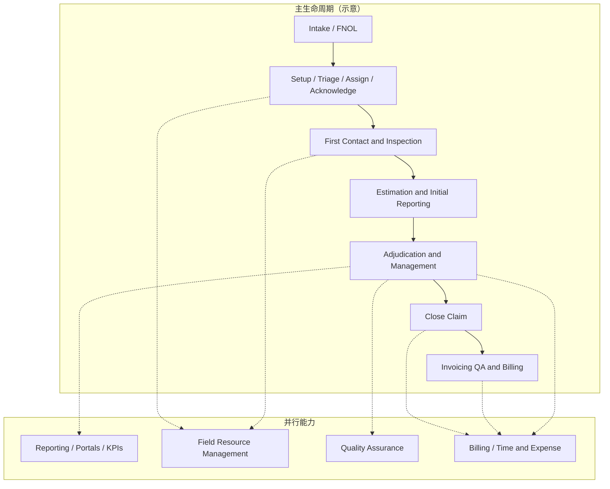

### 4.4 知识自测（Lifecycle）

1. Reporting 是否只能在 Close 之后发生？  
2. TPA Service Invoice 是否等于 Claim Payment？  
3. Triage 的典型输入有哪些？  
4. ACV 与 RCV 哪个通常含“未计折旧的重置”视角？  
5. Acknowledge 发生在 Assign 之前还是前后取决于客户？

**答案：** 1) 否，可并行 2) 否 3) LOB、严重度、客户、地理、语言、CAT 等 4) RCV 5) 可配置，常见为 Assign 后很快 Acknowledge

---


## 4A. Level 3：Adjuster 作业实践要点

Level 3 关注**把生命周期变成每天可执行的工作习惯**。完整「一天」见 §12；此处先建立操作模型。

### 4A.1 定义（What）

理赔员（Claims Adjuster）按 Client Instructions 与 Delegated Authority，调查事实、评估损失、管理 Reserve、推动 Payment/Closure，并用 Notes / Tasks / Diaries / Documents 留下可审计轨迹。

### 4A.2 5Ws + How

| W | 说明 |
|---|------|
| Who | Desk / Field / Independent / Catastrophe Adjuster；Supervisor；偶有 Appraiser |
| What | 调查、联系、查勘协调、估损审阅、Coverage 协作、财务动作建议 |
| When | 自 Assignment 起，贯穿 Open；Diary 到日优先 |
| Where | Claim 工作台、移动查勘、电话/邮件、Client/Carrier 门户 |
| Why | 没有纪律性工作队列，SLA、审计与泄漏（Leakage）都会恶化 |
| How | Diary 驱动 → First Contact → 证据 → Estimate → Reserve/Payment 审批 → 关闭清单 |

### 4A.3 Adjuster 实际在做什么

1. 审阅新 Assignment 与 Client Instructions
2. 处理到期 Diary / SLA
3. First Contact（被保险人 / Claimant / 雇主）
4. 安排 Field / Desk / Virtual Inspection
5. 审阅 Estimate 与 Scope（维修 vs 更换）
6. 与 Coverage / Liability 结论对齐（或上报）
7. 建议/调整 Reserve；在权限内发起 Payment
8. 协调承包商、律师、SIU、护士个案管理（按 LOB）
9. 写客观 Notes；完成 Tasks；上传 Documents
10. 满足关前检查后关闭，或正确申请 Reopen

### 4A.4 Notes / Tasks / Diaries 为何关键

| 构件 | 作用 | 设计含义 |
|------|------|----------|
| Note | 事实与时间线 | 时间戳、作者、最小化随意改写 |
| Task | 可完成动作 | 状态、负责人、到期、完成证据 |
| Diary | 未来提醒 | 与 SLA 染色；不是“随便记一下” |
| Document | 证据 | 版本、ACL、与 Inspection/Payment 关联 |

| 主题 | 实务要点 | 系统含义 |
|------|----------|----------|
| Diary 驱动 | 当日到期决定优先级 | 到期队列与 SLA 染色 |
| First Contact | 确认事实、期望、安全减损 | 强制字段 + 时间戳 Note |
| 证据管理 | 照片/视频绑定 Inspection | Document 关联，禁止孤立附件 |
| Estimate 审阅 | 对 Scope 挑战而非只接受总额 | 行项版本与差异原因码 |
| 升级判断 | 权限、欺诈、诉讼、媒体 | 规则引擎 + SIU 转介 |
| 关闭纪律 | 关前检查清单 | 关闭守卫 API |

> **架构师视角：** Adjuster 体验差，往往不是缺字段，而是**任务、Diary、权限、文档**四条总线没有串起来。

> **常见错误：** 用“状态=Open”代替真正的工作队列设计。

> **项目会议问题：** 你们的 First Contact SLA 从哪个时间戳起算？Notes 是否允许删除，还是只能追加更正？

#### 知识自测（Level 3）

1. Diary 与 Note 的区别？
2. 为什么 Estimate 要审行项而不是只看总额？
3. Delegated Authority 不够时系统应怎样？

**答案：** 1) Diary=未来提醒；Note=已发生事实记录。2) 范围/单价/折旧错误会制造 Leakage。3) 阻塞动作并开审批 Task，写审计。

## 5. 对照表总览（必需）

### 5.1 Insurance Carrier vs TPA

| 维度 | Insurance Carrier | TPA（示意） |
|------|-------------------|-------------|
| 角色 | 签发 Policy，承担保险风险（典型） | 按合同管理 Claims |
| 资金 | 保费与赔款准备金常在 Carrier 侧 | 可能代付或代管，但不等于风险承担者 |
| 决策 | Coverage 最终解释权常在 Carrier | 在 Delegated Authority / Client Instructions 内行事 |
| 收入 | 保费 | Service Fee / Time & Expense |
| 系统 | Policy Admin + Claim | Claim 运营平台 + 报告门户 |
| Sedgwick 典型定位 | 不必然是 | **常见定位** |

### 5.2 Policyholder vs Insured vs Claimant

| 角色 | 含义 | 例子 |
|------|------|------|
| Policyholder | 订立合同方 | 公司购买物业险 |
| Insured | 受保障主体 | 公司及其子公司建筑物 |
| Claimant | 主张赔付者 | 租户主张 ALE；或第三方人身伤害 |

### 5.3 Underwriter vs Adjuster

| | Underwriter | Adjuster |
|--|-------------|----------|
| 时机 | Policy 签发前/续保 | 损失发生后 |
| 问题 | “是否承保、收多少保费？” | “是否赔、赔多少、给谁？” |
| 产出 | Policy、费率、批单 | Reserve、Payment、Notes、报告 |

### 5.4 Staff vs IA vs Public Adjuster

| | Staff Adjuster | Independent Adjuster | Public Adjuster |
|--|----------------|----------------------|-----------------|
| 雇佣 | Carrier/TPA 雇员 | 独立合同方 | Insured 聘请 |
| 利益方向 | Client/Carrier 委托 | 按 Assignment | **代表 Insured** |
| 系统 | 完整工作台 | 受限 Assignment 门户 | 通常不进 TPA 核心 |

### 5.5 Incident vs Claim vs Exposure

| 概念 | 含义 |
|------|------|
| Incident（事故/事件） | 现实世界发生的事（可尚未立案） |
| Claim（理赔案件） | 正式管理中的赔案记录 |
| Exposure / Feature（风险敞口/子案） | Claim 下按 Coverage/当事人拆分的管理单元 |

一个 Incident 可能零个、一个或多个 Claim；一个 Claim 可有多个 Exposure（如 Building + Contents + ALE）。

### 5.6 Policy vs Coverage vs Liability

| 概念 | 问题 |
|------|------|
| Policy | 合同承诺是什么？ |
| Coverage | 该事件是否落入承诺？ |
| Liability | 法律上谁对损害负责？（尤其第三人责任） |

### 5.7 Estimate vs Reserve vs Payment vs Invoice

| 概念 | 是什么 | 是否一定付钱 |
|------|--------|--------------|
| Estimate | 损害估价 | 否 |
| Reserve | 预计未来成本（账务预留） | 否（尚非出款） |
| Payment | 实际资金转移 | 是 |
| Invoice（TPA） | 向 Client 收取服务费 | 是（服务费维度） |

### 5.8 Claim Payment vs TPA Service Invoice

| | Claim Payment | TPA Service Invoice |
|--|---------------|---------------------|
| 付给谁 | Claimant / 承包商 / 医疗方等 | Client 付给 TPA |
| 资金性质 | 赔案资金 | 管理服务费 |
| 审批 | Payment Authority | Billing 规则 |
| 对账 | Claim 财务 | AR/AP 服务费 |

### 5.9 三类 Inspection

| 类型 | 场景 | 优点 | 限制 |
|------|------|------|------|
| Field Inspection | 需要摸、量、闻、拍 | 证据最强 | 成本与调度 |
| Desk Inspection | 照片/远程材料足够 | 快、便宜 | 复杂损失可能不足 |
| Virtual Inspection | 视频/App 引导 | CAT 高峰高效 | 依赖连接与当事人配合 |

### 5.10 ACV vs RCV

| | ACV（Actual Cash Value） | RCV（Replacement Cost Value） |
|--|-------------------------|-------------------------------|
| 含义 | 重置成本减折旧等调整后价值 | 以同类重置成本计价（条款定义） |
| 常见支付 | 先付 ACV，条件满足后再 Recoverable Depreciation | 依批单/条款 |
| 设计注意 | 折旧规则要可配置 | 勿把“屏幕显示 RCV”当成已付金额 |

### 5.11 四类业务对照（管辖差异大）

| 维度 | Property | Auto/Liability | Workers’ Comp | Disability/Leave |
|------|----------|----------------|---------------|------------------|
| 核心问题 | 物损是否承保、价值多少 | 过错与人身/车损 | 补偿资格（Compensability） | 请假/失能资格 |
| 关键产出 | Scope、ACV/RCV | Liability、伤残 | 医疗+收入替代 | 认证、期限 |
| 数据敏感 | 地址、资产 | 驾驶记录、伤情 | **PHI** | 健康信息 |
| 管辖 | 州保险法+条款 | 州侵权+保险 | **州 WC 法差异极大** | 雇佣法/福利计划 |

### 5.12 REST vs Event vs Queue vs Batch vs Webhook

| 模式 | 何时用 |
|------|--------|
| REST | 用户等待结果、强一致读写 |
| Event / Event Bus | 状态变化广播、松耦合 |
| Queue | 异步任务、削峰、重试 |
| Batch | 报表、对账、大批量夜间作业 |
| Webhook | 通知外部系统“有结果了” |

### 5.13 OLTP vs Analytics

| | OLTP（事务库） | Analytics |
|--|---------------|-----------|
| 用途 | Claim 日作业 | KPI、Stewardship |
| 特性 | 规范化、强一致 | 星型/宽表、可延迟 |
| 警告 | 勿让 BI 直打高频事务表 | 对不上账时先问刷新延迟 |

---

## 6. Policy / Coverage / Claim 结构

### 6.1 关键区分（再强调）

- **Policy** 定义保护承诺；
- **Claim** 记录发生的事件；
- **Coverage** 判定事件是否落入承诺；
- **Liability** 判定法律责任；
- **Client Instructions** 规定 TPA 如何执行委托；
- **Delegated Authority** 规定 TPA/Adjuster 无需再报批的决策边界。

### 6.2 Policy 与 Coverage 术语

| 术语 | 白话 |
|------|------|
| Policy Number | 保单号 |
| Policy Period / Effective / Expiration | 保障起讫 |
| Premium | 保费 |
| Coverage Limit | 限额 |
| Per Person / Per Occurrence / Aggregate | 每人/每次事故/累计限额 |
| Deductible（免赔额） | 被保险人自担部分 |
| Exclusion（除外） | 明确不保 |
| Endorsement（批单） | 修改原条款 |
| Condition（条件） | 义务与程序条件 |
| Insured Location / Asset | 承保地点/资产 |
| Reservation of Rights（权利保留） | 继续调查同时保留抗辩权利 |
| Coverage Pending / Partial / Denial | 待定 / 部分承保 / 拒赔 |

### 6.3 Claim 结构实体

Incident、FNOL、Claim、Assignment、Exposure/Feature、Coverage、Loss、Cause of Loss、Damage、Injury、Claimant、Party、Contact、Task、Activity、Diary、Note、Document、Correspondence、Estimate、Inspection、Reserve、Payment、Recovery、Invoice。

### 6.4 Mermaid ERD（示意逻辑模型）

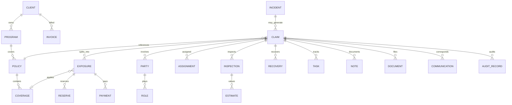

> **架构师视角：** Exposure 是财务与流程拆分的关键粒度。复杂 Property Claim 往往 Building / Contents / BI / ALE 分轨 Reserve 与 Payment。

### 6.5 知识自测

1. Client Instructions 与 Policy 哪个回答“怎么做案件”？  
2. Reservation of Rights 是否等于 Denial？  
3. 一个 Claim 能否多个 Exposure？  
4. Endorsement 改变什么？  
5. Deductible 是从 Estimate 还是最终赔付结算中常体现？

**答案：** 1) Client Instructions（执行方式）；Policy 回答承诺内容 2) 否 3) 能 4) Policy 条款 5) 赔付结算（也影响净承担），系统需显式字段

---

## 7. 财务概念与完整数值示例

> **Level 4 焦点：** 财务、法律与运营控制。读完本章应能向 CFO/Client 解释 Incurred，并向开发说明为何 Payment 必须幂等。


### 7.1 核心公式（组织会计口径可能不同）

\[
\text{Incurred} = \text{Paid} + \text{Outstanding Reserve}
\]

| 术语 | 含义 |
|------|------|
| Reserve | 对未来赔付/费用的预估占用 |
| Indemnity Reserve | 对赔付本金类储备 |
| Expense Reserve | 对理赔费用（律师费、鉴定费等）储备 |
| Case Reserve | 单案层面储备 |
| Bulk Reserve / IBNR | 组合层面：已发生未报案等（概念级） |
| Paid | 已支付 |
| Outstanding | 仍挂着的 Reserve |
| Incurred | 已发生成本视角 = Paid + Outstanding |
| Recovery | 追回：代位（Subrogation）、残值（Salvage）、免赔追回、溢付追回等 |
| Authority Limit | 个人/角色可批准金额上限 |
| Void / Stop / Reissue | 作废 / 止付 / 重开票 |

> **常见错误：** 把 Estimate 总金额直接写成 Paid；或把 TPA Invoice 记进 Incurred。

### 7.2 完整数值示例（住宅水损 — 示意）

**背景：** 厨房供水软管破裂，地板与橱柜受损。Policy：建筑物限额 $300,000；Contents $50,000；免赔 $1,000；含 RCV 批单（示意）。

| 项目 | 金额 (USD) | 说明 |
|------|------------|------|
| Gross loss（估损毛额） | 12,500 | Estimate 合计 |
| 不适用除外后 Covered loss | 12,500 | 假设 Cause 承保 |
| Depreciation | 1,500 | 橱柜/地板折旧 |
| ACV | 11,000 | 12,500 − 1,500 |
| Deductible | 1,000 | 自担 |
| 初次 ACV 赔付 | 10,000 | 11,000 − 1,000 |
| Recoverable Depreciation（修好后） | 1,500 | 依条款释放 |
| 最终 Indemnity Paid | 11,500 | 10,000 + 1,500 |
| 紧急抽水费用（Expense Paid） | 800 | Mitigation vendor |
| 初始 Outstanding Reserve（设置时） | 12,000 | 含或有费用缓冲 |
| 支付后调整 Outstanding | 500 | 剩余或有 |
| Paid 合计 | 12,300 | 11,500 + 800 |
| Incurred（当时） | 12,800 | 12,300 + 500 |
| Salvage Recovery | 0 | 无 |
| Subrogation Recovery | 2,000 | 向制造缺陷方追偿成功（示意） |
| Net incurred cost（示意） | 10,800 | 12,800 − 2,000 |

**TPA Invoice（另账）：** Adjuster 工时 + 差旅 + 管理费，例如 $950 —— **不进入上述 Claim Indemnity**，而是 Client 的服务费支出。

### 7.3 项目设计含义

- Reserve、Payment、Recovery、Invoice 分表/分事件；
- 每次变更写审计：谁、何时、前后值、授权依据；
- 支付要幂等键，防 Duplicate payment；
- Maker-Checker：提案人 ≠ 最终批准人（按阈值）。

#### 知识自测

1. Incurred 公式？  
2. Recoverable Depreciation 何时常见？  
3. Expense Reserve 与 Indemnity Reserve 区别？  
4. Bulk/IBNR 是否适合塞进单个 Case 详情屏作为唯一真相？  
5. Stop Payment 与 Void 业务差异？

**答案：** 1) Paid + Outstanding Reserve 2) RCV 条款且修复完成等条件满足 3) 费用 vs 赔款本金 4) 否，组合会计视图 5) Stop 常针对在途票据；Void 作废已生成的支付意图（以组织流程为准）

---

## 8. Claim Adjudication：12问与决策流

### 8.1 十二问

1. 是否发生有效损失（Valid Loss）？  
2. Date of Loss 时 Policy 是否有效？  
3. 人/地点/资产是否被保？  
4. Cause of Loss 是否承保？  
5. 是否触发 Exclusion？  
6. 证据是否充分支撑 Claim？  
7. 谁负 Liability？  
8. 承保损失价值是多少？  
9. Deductible 与 Limit 如何适用？  
10. 应支付给谁？  
11. Adjuster 权限是否足够？  
12. 是否需要额外 Approval？

### 8.2 可能结果

Accepted / Denied / Partially Accepted / Pending Investigation / Reservation of Rights / Settled / Closed / Reopened。

### 8.3 决策表（示意）

| # | 条件 | 结果倾向 | 下一步 |
|---|------|----------|--------|
| 1 | 无有效损失 | Denied / Closed | 通知理由 |
| 2 | Policy 不在期间 | Denial（依条款） | 保留文档 |
| 3 | 标的不在保 | Denial / Partial | 拆 Exposure |
| 4 | Cause 除外 | Denied | Exclusion 引用 |
| 5 | 证据不足 | Pending | Diary 追材料 |
| 6 | 可能抗辩但继续查 | Reservation of Rights | 发函+调查 |
| 7 | 价值争议 | Partial / Appraisal | 估损修订 |
| 8 | 超 Authority | Pending Approval | 升级 Supervisor |
| 9 | 全部满足 | Accepted → Payment | 付款审批流 |

### 8.4 Mermaid 决策流

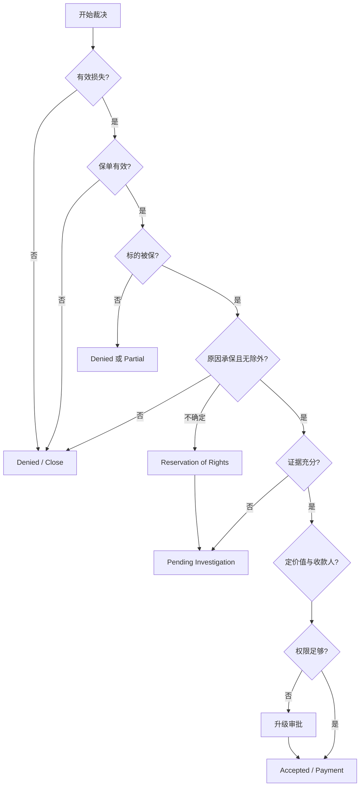

> **项目会议问题：** “Denial 信函模板、监管用语与审批是否按州配置？”

#### 知识自测

1. ROR 与 Denial 区别？  
2. 第十二问解决什么？  
3. Partial Acceptance 典型场景？  
4. 裁决是否等于已 Payment？  
5. 谁常见最终覆盖解释权？

**答案：** 1) ROR 保留抗辩继续查；Denial 拒绝 2) 审批与 Authority 3) Contents 承保但 BI 不保等 4) 否 5) Carrier/条款解释机制（合同而定）

---

## 9. Property 深潜与完整案例

### 9.1 Property 业务地图

| 主题 | 要点 |
|------|------|
| Residential / Commercial | 住宅 vs 商业触发不同 Vendor 与报表 |
| Building / Contents | 常分 Exposure |
| Business Interruption (BI) | 利润与持续费用；需财务证据 |
| Additional Living Expense (ALE) / Temporary Housing | 住宅无法居住时的额外生活费用 |
| Emergency Mitigation | 止损（抽水、堵漏、干板）— 早期 Reserve 常见 |
| Water / Fire / Windstorm / Hail / Theft | Cause of Loss 驱动规则与估损模板 |
| Catastrophe Event | CAT code、资源池、简化 triage |
| Major and Complex Loss | 多楼栋、BI、诉讼、专家团队 |
| Repair vs Replacement | Scope 核心判断 |
| Scope of Damage / Estimate Revision / Contractor Quote | 估损演化 |
| Proof of Loss | 被保险人宣誓损失表（依管辖/条款） |
| Depreciation / ACV / RCV / Recoverable Depreciation | 财务支付节奏 |
| Inspection / Initial / Interim / Final Report | 报告阶梯 |

### 9.2 完整 Property 案例：Intake → Invoice → Close → Reopen

**案例名：** 「枫叶路住宅水损」CLAIM-ILLUSTRATIVE-10087（示意编号）

#### Intake 样本数据

| 字段 | 值 |
|------|-----|
| Channel | Client Web Portal |
| DOL | 2026-03-12 06:40 |
| Location | 122 Maple Ave, Austin, TX |
| Cause | Accidental discharge of water |
| Reporter | Named Insured — Ana Lopez |
| Description | 二楼管道接口渗水，楼下天花板湿渍 |
| Photos | 门户上传 6 张 |
| Policy | HOM-ILLUS-44219（有效） |

**查重：** 同址同日无 Open Claim → 新建。

#### Triage

- LOB: Residential Property  
- Severity: Moderate  
- 需 Emergency Mitigation：是  
- Template: `RES_WATER_STD`（示意）→ 自动建 Task：First Contact 24h、Inspection 72h  

#### Assignment

规则：TX 执照 + Water 技能 + 工作量 < 阈值 → Desk Adjuster Jordan Lee；若需开墙则另派 Field。

#### First Contact（Notes 摘要）

> 2026-03-12 14:05 CT — Jordan Lee — Spoke with Ana Lopez. Confirmed date/time of discovery. Advised temporary plumbing shutoff and mitigation vendor contact within 2 hours. No injuries reported.

#### Inspection 发现

- Desk + 次日 Field：确认二楼供水管接头失败；楼下石膏板、木地板受损；橱柜踢脚受潮。  
- Digital Measurement：受影响天花约 120 sq ft；地板 180 sq ft。

#### Estimate（示意）

| 行项 | 金额 |
|------|------|
| Mitigation（已发生） | 800 |
| Drywall & paint | 2,400 |
| Flooring | 5,800 |
| Cabinets base | 3,500 |
| Contents（小额） | 0（本次无） |
| **Gross** | **12,500** |
| Depreciation | 1,500 |
| **ACV** | **11,000** |

#### Coverage 问题

- Cause 落入意外漏水？示意：是  
- 排除“长期渗漏/缺乏维护”？检查维护记录后未触发  
- ALE：被保险人仍可居住 → 不适用  

#### Reserve 建议

| 类型 | 金额 |
|------|------|
| Indemnity Reserve | 11,500 |
| Expense Reserve | 1,200 |
| **Total** | **12,700** |

Jordan Authority = $15,000 → 可自建。

#### Payment 审批与承包商

1. 付 Mitigation vendor $800（Expense）  
2. 付 Insured ACV $10,000（11,000 − deductible 1,000）  
3. 承包商完工并 Proof → 付 Recoverable Depreciation $1,500  

#### Claim Notes / Client Reporting / QA / Billing

- Notes：客观时间戳；照片引用 Document ID  
- Stewardship：周期报表计入“Open→Paid”样本  
- QA：抽检 Coverage 引用与照片一致性 = Pass  
- TPA Billing：3.5 小时 Desk + 2 小时 Field + 管理费 → **Client Invoice $950**

#### Closure

条件：无 Open Task、Outstanding Reserve 释放至 0、Final Report 已发、Closure Reason = Settled Paid。关闭日：2026-04-28。

#### Reopen

2026-05-20：地板再次翘曲，怀疑隐藏潮湿 → Reopen Reason = Newly Discovered Damage → 新 Inspection → 追加 Estimate $2,200 → 新 Reserve → 支付或拒付依调查。

**关键学习点：** Exposure 拆分、ACV→RCV 节奏、Payment≠Invoice、Reopen 需审计原因码。

### 9.3 Level 3 练习（Property）

**初级：** Field/Desk/Virtual 区别？ALE 何时出现？Mitigation 为何急？CAT 对 Assignment 影响？Estimate Revision 何时？  

**情景：** BI 报案缺财务报表怎么 Pending？Hail 与 Wear-Tear 争议如何留证？  

**架构：** Scope 行项模型？照片与 Estimate 行如何关联？  

**答案要点：** 见 §5.9；无法居住；止损法定义务与成本控制；CAT 池与执照；新损坏/价格变更；缺文档建 Task；拍照留存+专家；行项实体+版本；Document→LineItem 关联表。

---


## 10. Workers’ Compensation 对比

> **重要：** Workers’ Compensation（工伤补偿）流程**随管辖区差异极大**。下列为教学对照，不是某州法规。

### 10.1 WC 与 Property 的根本差异

| 维度 | Property | Workers’ Compensation |
|------|----------|------------------------|
| 核心问题 | 物是否承保、价值多少 | 伤害是否因工、是否补偿（Compensability） |
| 受益结构 | Building/Contents/BI/ALE | Medical Benefits + Indemnity Benefits |
| 关键计算 | ACV/RCV、折旧 | Average Weekly Wage (AWW)、TTD/TPD/PPD 等 |
| 协作角色 | 承包商、估损 | 医生、Nurse Case Manager、Pharmacy、UR |
| 监管 | 保险法规 + 条款 | 州 WC 委员会/法规 + OSHA 相关报告义务可能并存 |
| 数据 | 地址、资产 | **PHI** 极高敏感 |

### 10.2 WC 关键概念速览

| 术语 | 含义 |
|------|------|
| Workplace Injury | 工作相关伤害/疾病主张 |
| Compensability | 是否属于可补偿工伤 |
| Medical Benefits | 医疗费用保障 |
| Indemnity Benefits | 收入替代等现金给付 |
| AWW | 平均周工资，多州给付基数 |
| Temporary / Permanent Disability | 暂时/永久失能等级（命名因州而异） |
| Medical Bill Review / Utilization Review | 账单审核 / 医疗必要性审查 |
| Pharmacy | 处方管理 |
| Nurse Case Management | 就医与返岗协调 |
| Return to Work / Modified Duty | 返岗 / 轻症岗位 |
| OSHA reporting | 雇主安全报告义务（与 Claim 系统可能交叉） |

### 10.3 四类业务总表（详见 §5.11）

Property · Auto/Liability · WC · Disability/Leave —— 不要用同一套状态机硬套全部 LOB。

#### 知识自测

1. Compensability 接近 Property 的哪一概念？  
2. AWW 用于什么？  
3. Nurse Case Manager 处理的敏感数据？  
4. WC 能否忽略州差异做全国硬编码？  
5. Modified Duty 目的？

**答案：** 1) Coverage/是否成立的判定类比，但法律框架不同 2) 计算 indemnity 基数 3) PHI 4) 不能 5) 促进安全返岗、控制失能成本

---

## 11. TPA / Sedgwick 风格模式与 RACI

### 11.1 典型 TPA 委托如何运转（示意）

1. Client 与 TPA 签约（Service Agreement）  
2. Claim / Assignment 经 Intake 进入  
3. TPA 遵循 **Service Agreement + Client Instructions**  
4. Adjuster 在 **Delegated Authority** 内作业  
5. TPA 协调 Inspection、Vendor、医疗、诉讼、报告  
6. **Claim 资金**可能属于 Carrier 或 Self-Insured Client  
7. TPA **另行**向 Client 收取服务费  
8. Client 通过 Portal / Stewardship 监控结果  

### 11.2 参与方差异

| 方 | 关注点 |
|----|--------|
| Carrier | 风险、保费、覆盖解释 |
| TPA | 运营交付、SLA、服务费 |
| Adjusting Firm | 查勘产能（可作 Vendor） |
| Self-Insured Client | 现金流出与可控性 |
| Vendor Network | 履约质量与价格 |
| Claimant | 沟通与支付体验 |

### 11.3 RACI（标注：随合同变化）

R=Responsible A=Accountable C=Consulted I=Informed  

| 活动 | Carrier/Client | TPA Ops | Adjuster | Vendor | Finance |
|------|----------------|---------|----------|--------|---------|
| Intake | C/I | A | C | I | I |
| Coverage decision | A（常） | C | R | I | I |
| Assignment | I | A | R | I | I |
| Inspection | I | C | A/R | R | I |
| Reserve | A/C（阈值上） | C | R | I | I |
| Payment | A（资金方） | C | R | I | C |
| Litigation | A | C | C | I | I |
| Reporting | A（需求） | R | C | I | C |
| Claim closure | C | A | R | I | I |
| Service invoicing | I（付款方） | A | C | I | R |

> **说明：** 上表为**示意**。真实 RACI 完全取决于合同、资金模型和 Authority。

> **架构师视角：** 多租户配置中心必须把 RACI 里的 A/R 边界变成可配置的审批链与可见性策略。

---

## 12. Adjuster 的一天与 Claim Notes

### 12.1 Day in the Life（示意）

| 时段 | 活动 |
|------|------|
| 08:30 | 新 Assignment 复核：Policy、Client Instructions、SLA |
| 09:00 | Diary 到期事项：催材料、催批准 |
| 09:30 | First Contact 电话并写 Note |
| 10:30 | 协调 Inspection / Vendor |
| 13:00 | 审 Estimate、对照照片 |
| 15:00 | Reserve 复核；超权限则起草升级 |
| 16:00 | Payment 包审查；防重复收款人 |
| 16:30 | Client 邮箱问答；Litigation 协调时段 |
| 17:00 | 文档齐全性检查、SLA 仪表盘、可关案件关闭 |

### 12.2 好 vs 坏 Claim Notes

**好的 Note（客观、时间戳、可审计）：**

```text
2026-03-12 14:05 CT | Jordan Lee | Role: Desk Adjuster
Contacted Named Insured Ana Lopez at +1-555-0102.
Insured confirmed discovery at approx 06:40 CT on 2026-03-12.
Water supply to upstairs bath shut off by insured at 07:10 CT.
Photos uploaded to Doc# D-88291 (6 images).
Mitigation vendor AquaDry scheduled ETA 16:00 CT same day.
No injury reported. No third-party property mentioned.
Next action: Field inspection 2026-03-13 AM; Diary set.
```

**坏的 Note：**

```text
Insured 显然在撒谎，这水渍是旧的。直接拒赔。
（无时间、无来源、无证据引用、含主观结论、不可审计）
```

### 12.3 Notes 质量准则

客观、带时间戳、事实、简洁、可审计、避免无依据结论、禁止不当删除/静默篡改（应版本+审计）。

> **常见错误：** 在 Note 写入未经证实的欺诈定性，可能造成法律与披露风险。应走 SIU 转介流程并用适当措辞。

---

## 13. 业务规则与可配置决策表

### 13.1 规则为何必须可配置

Client、LOB、州、CAT、Authority 组合爆炸；硬编码 = 每个新 Client 改代码发版。

### 13.2 规则示例包

对每个规则给出：**业务陈述 / 决策表 / 输入 / 输出 / 例外 / 审计 / 配置 Owner**。

#### 规则 A：Assignment

**陈述：** 按地理、执照、技能、严重度、客户、负荷、语言分派。

| 输入 | 输出 |
|------|------|
| State, LOB, Severity, Language, Workload, License | AdjusterId 或 Queue |

例外：无人命中 → Supervisor Queue。审计：记录候选集与选定理由。Owner：Operations Config。

#### 规则 B：Reserve Authority

**陈述：** 超过角色限额需升级。

| AdjusterLimit | RequestedReserve | Action |
|---------------|------------------|--------|
| 15000 | 12000 | Auto-approve |
| 15000 | 50000 | Route Supervisor |

审计：前后金额、审批人。Owner：Client Finance + TPA。

#### 规则 C：Payment Authority / Maker-Checker

提案人不可自批超额支付。Owner：Controls。

#### 规则 D：Duplicate FNOL

同保单+同址+近时窗+相似 Cause → 疑似重复。例外：CAT 簇拥报案需人工。Owner：Intake Product。

#### 规则 E：Closure Validation

Open Task、Outstanding Reserve≠0、未完成强制文档 → 禁止关闭。Owner：QA。

#### 规则 F：CAT Routing / Fraud Referral / Mandatory Documents / Reopen

均应以决策表 + 审计事件落地。

---

## 14. 系统设计与架构（含全部 Mermaid）

> **示意技术栈示例：** .NET · Azure APIM · Azure Functions · Azure Service Bus · Azure Event Grid · SQL Server · Blob Storage · Application Insights —— **仅为示例架构，非厂商机密。**

### 14.1 逻辑能力

Intake · Claim · Policy/Coverage · Party/Contact · Assignment/Triage · Workflow/Task · Inspection · Estimation · Document · Reserve · Payment · Recovery · Billing/Invoicing · Notification · Reporting/Analytics · IAM · Rules Engine · Audit · Integration Gateway。

### 14.2 Mermaid：业务能力图

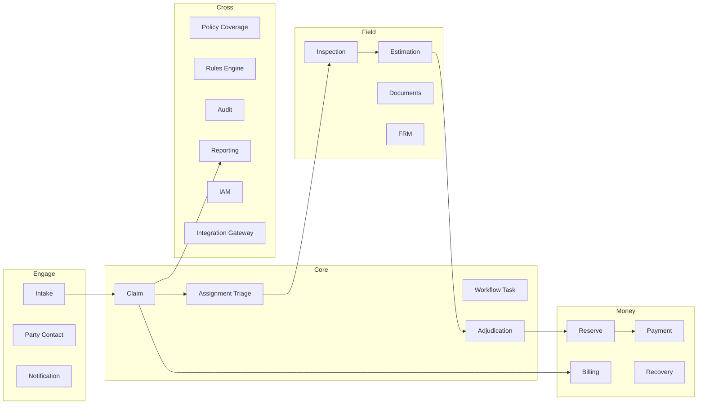

### 14.3 Mermaid：逻辑组件架构

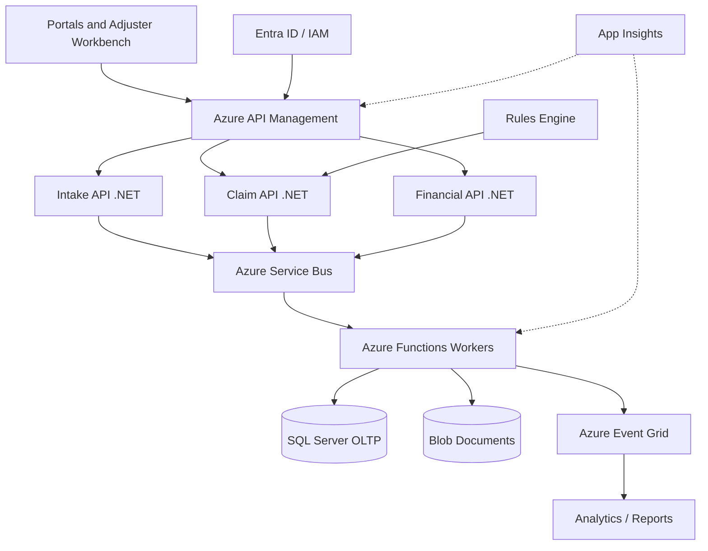

### 14.4 Mermaid：FNOL → Claim 创建序列

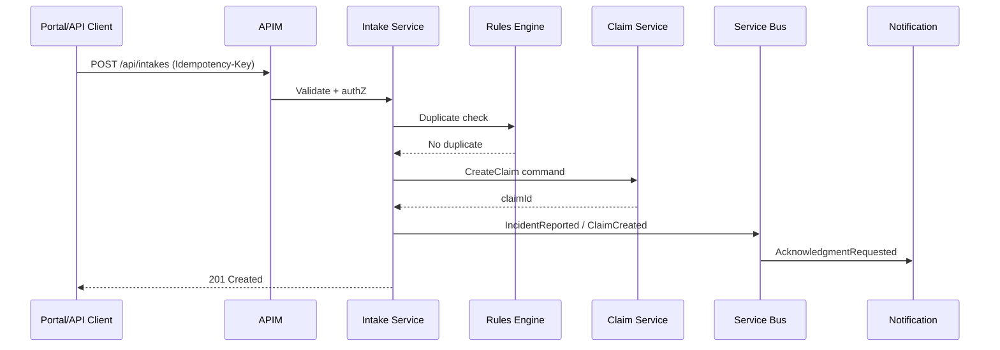

### 14.5 Mermaid：查勘与估损流

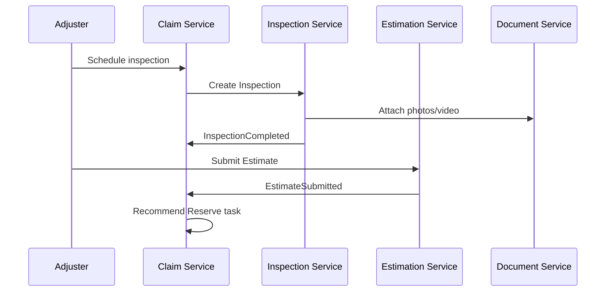

### 14.6 Mermaid：准备金与付款审批

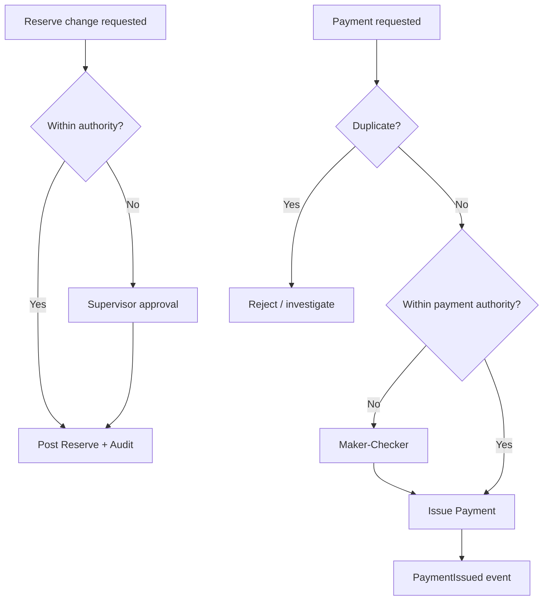

### 14.7 Mermaid：关闭流

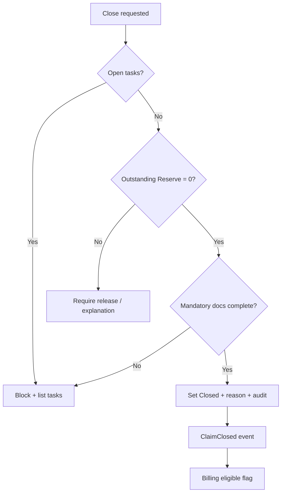

### 14.8 Mermaid：事件驱动集成

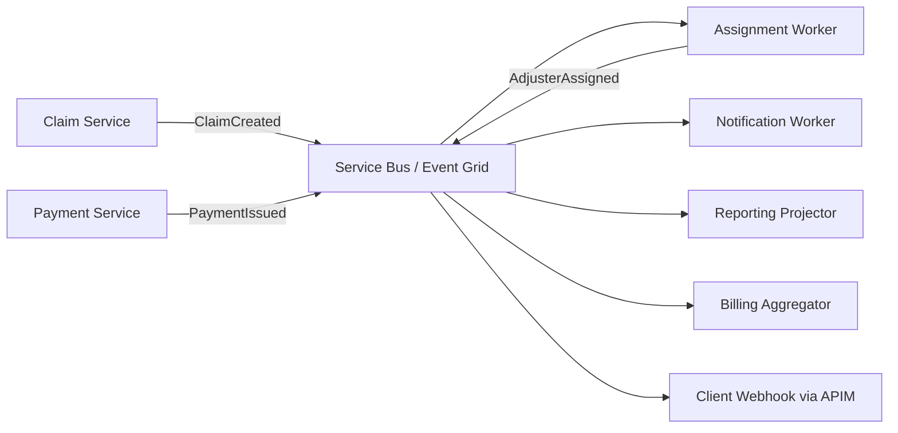

---

## 15. DDD 限界上下文与领域事件

> 事件名为**示例**，非 Sedgwick 真实名称。

### 15.1 限界上下文（示意）

| Context | 职责 | 核心实体 | 值对象例 | 依赖 |
|---------|------|----------|----------|------|
| Intake | 收案查重 | Intake, Incident | Channel, DOL | Party, Policy lookup |
| Claims | 案件聚合 | Claim, Exposure | ClaimNumber, Status | Intake, Assignment |
| Policy and Coverage | 承诺与适用性 | Policy, Coverage | Limit, Deductible | 外部 Policy Admin |
| Assignment | 分派 | Assignment | Skill, License | FRM, IAM |
| Inspection | 查勘 | Inspection | Geo, Method | Documents |
| Estimation | 估损 | Estimate, LineItem | ACV, RCV | Inspection |
| Adjudication | 裁决 | Decision | Outcome code | Coverage, Evidence |
| Financials | Reserve/Payment | Reserve, Payment | Money, Authority | Adjudication |
| Recovery | 追偿 | Recovery | Type | Financials |
| Billing | 服务费 | Invoice, T&E | FeeSchedule | Claims |
| Documents | 文档 | Document | Hash, Version | Blob |
| Communications | 函件通知 | Correspondence | TemplateId | Notify |
| Reporting | 读写模型 | Projection | KPI | Events |
| Identity and Access | 身份权限 | User, Role | Scope | Entra |

### 15.2 示例领域事件

`IncidentReported` `ClaimCreated` `ClaimTriaged` `AdjusterAssigned` `AcknowledgmentSent` `FirstContactCompleted` `InspectionScheduled` `InspectionCompleted` `EstimateSubmitted` `ReserveEstablished` `ReserveChanged` `PaymentRequested` `PaymentApproved` `PaymentIssued` `ClaimClosed` `ClaimReopened` `ServiceInvoiceGenerated`

---


## 16. 示意 API 与集成模式

> 下列 endpoint **不是**真实 Sedgwick API，仅为教学示意。

### 16.1 Endpoint 清单

- `POST /api/intakes`
- `POST /api/claims`
- `GET /api/claims/{claimId}`
- `POST /api/claims/{claimId}/assignments`
- `POST /api/claims/{claimId}/inspections`
- `POST /api/claims/{claimId}/estimates`
- `POST /api/claims/{claimId}/reserves`
- `POST /api/claims/{claimId}/payments`
- `POST /api/claims/{claimId}/close`
- `POST /api/claims/{claimId}/reopen`

### 16.2 例：POST /api/intakes

**Request**

```http
POST /api/intakes HTTP/1.1
Authorization: Bearer {token}
Idempotency-Key: 8f3c2a1e-intake-10087
Content-Type: application/json

{
  "clientId": "CLIENT-ILLUS-01",
  "channel": "WebPortal",
  "dateOfLoss": "2026-03-12T06:40:00-05:00",
  "policyNumber": "HOM-ILLUS-44219",
  "lossLocation": {
    "line1": "122 Maple Ave",
    "city": "Austin",
    "region": "TX",
    "postalCode": "78701",
    "country": "US"
  },
  "causeOfLoss": "AccidentalWaterDischarge",
  "reporter": {
    "fullName": "Ana Lopez",
    "phone": "+1-555-0102",
    "role": "NamedInsured"
  },
  "description": "Upstairs supply line leak; downstairs ceiling staining.",
  "documentIds": ["D-88291"]
}
```

**Response 201**

```json
{
  "intakeId": "INT-10087",
  "claimId": "CLM-10087",
  "status": "Received",
  "duplicateSuspect": false,
  "acknowledgment": { "scheduled": true },
  "audit": {
    "createdBy": "user:portal-svc",
    "createdAt": "2026-03-12T14:01:12Z",
    "correlationId": "corr-9aa1"
  }
}
```

**校验：** DOL 必填；地址；clientId 存在；Policy 格式；描述长度；附件病毒扫描状态。  
**幂等：** 同 Idempotency-Key 24h 内返回同一结果。  
**授权：** Client 作用域 + `intake:create`。  
**审计：** actor、token appId、IP、payload hash。  
**错误：** `400` 校验失败；`401/403`；`409` 明确重复；`502` Policy 服务超时（可先 Coverage Pending）。

### 16.3 例：POST .../reserves

```json
{
  "exposureId": "EXP-BLDG-01",
  "indemnityAmount": 11500.00,
  "expenseAmount": 1200.00,
  "currency": "USD",
  "reasonCode": "InitialEstimate",
  "comment": "Based on estimate EST-55"
}
```

超出 Authority → `409`/`422` + `approvalRequired: true`。

### 16.4 例：POST .../payments

必须含 `payeeId`、`amount`、`paymentType`（Indemnity/Expense）、`idempotency`、`supportingDocumentIds`。超时用 outbox + 查询，切勿盲目重试无幂等键请求。

### 16.5 例：Close / Reopen

Close：服务端执行 §14.7 守卫。  
Reopen：强制 `reasonCode` + 审批策略（按 Client）。

### 16.6 何时用哪种集成

| 模式 | 例子 |
|------|------|
| 同步 REST | 打开 Claim 详情、提交表单即时校验 |
| 异步 Event | ClaimClosed 驱动报表投影 |
| Queue | OCR、大文件、批量通知 |
| Event Bus | 跨限界上下文集成 |
| Batch | 夜间 Stewardship 抽取、对账 |
| Webhook | 通知 Client 外部系统状态 |

---

## 17. 逻辑数据模型与治理

### 17.1 实体清单（示意）

Client, Program, Policy, Coverage, Incident, Claim, Exposure, Party, Role, Assignment, Inspection, Estimate, Reserve, Payment, Recovery, Invoice, Task, Note, Document, Communication, Audit Record。

### 17.2 治理要点

| 主题 | 实践 |
|------|------|
| System of Record (SoR) | Claim 事务真相在 OLTP；报表是投影 |
| Data ownership | Client 配置归 Client Ops；卷宗操作归 TPA；Policy 主数据可能归属 Carrier 系统 |
| Master / Reference data | 原因码、州、币种、费用类型 |
| PII | 姓名、电话、地址、DOB 等 — 最小化、脱敏 |
| PHI | WC/医疗 — 更严访问与审计 |
| Tenant isolation | `clientId` 强制过滤；防跨租户 IDOR |
| Retention / Legal hold | 州与合同；Hold 抑制删除 |
| Encryption | 静态/传输；密钥轮换 |
| Lineage / Audit history | 谁在何时改了 Reserve/Payment/Status |

---

## 18. 安全与合规

> **常见错误：** 只用角色名控制支付——忽略州执照、客户范围与金额阈值（缺 ABAC）。

| 控制 | 说明 |
|------|------|
| RBAC | 角色权限基线 |
| ABAC | 客户、州执照、LOB、金额、数据敏感标签 |
| Least Privilege | 默否认 |
| Segregation of Duties | 制单与批复分离 |
| Multi-tenant isolation | 数据与密钥边界 |
| Adjuster licensing | 州执照校验后才能 Field Assign |
| Payment fraud controls | 收款人变更双审、异常速度 |
| Maker-checker | 超额必须二人 |
| PII/PHI | 字段级权限、会话超时 |
| Immutable audit logs | 追加写、防篡改存储 |
| Document access | 链接时效、下载审计 |
| Regulatory reporting | 州报表时点 |
| DR / BCP | RTO/RPO 与 CAT 峰值计划 |

**权限示例：** `claim:read` `claim:write` `reserve:propose` `reserve:approve` `payment:propose` `payment:approve` `note:add` `doc:download` `invoice:generate` `siu:referral`。

---

## 19. 非功能需求与大文档处理

### 19.1 Claims 特有 NFR

| NFR | 关注 |
|-----|------|
| Availability | 报案与支付窗口 |
| Scalability / CAT surge | 弹性工人、队列 |
| Performance | 工作台列表 < 约定秒级 |
| Resilience | 外部 Policy 宕机时的降级（Coverage Pending） |
| DR | 跨区域 |
| Auditability | 金融级 |
| Observability | 关联 ID 贯穿 APIM→Functions |
| Accessibility / Localization / Time zones | 门户与 Notes 时区标注 |
| Search | 索引与权限过滤同施 |
| Batch | 对账不伤 OLTP |
| Integration reliability | 幂等、毒消息队列 |

### 19.2 专节：大 Claim 文档

场景：单案数百至数千页（诉讼、复杂商业火烧）。

**设计要点：**

1. **元数据优先：** 先列 Document 索引，再按需取页；  
2. **分页 / 批量检索：** `page`/`pageSize` 或 range；  
3. **流式下载：** 避免整包载入内存；  
4. **缓存：** 热点 PDF 页缓存；  
5. **受控并行：** OCR/缩略图并发上限 + 节流；  
6. **重试与 Token 复用：** 大作业勿每页重新认证；  
7. **版本化：** DocumentVersion 不可变；  
8. **禁止页到页同步聊天式拉取** 造成客户端与 API 崩溃；  
9. **OCR 管道** 进 Queue，完成后事件通知。

> **架构师视角：** “打开 Claim 文档”应是**资源管理问题**，不是“再加一个 blob URL”。

---

## 20. Reporting 与 KPIs

> **项目会议问题：** “Stewardship 报表的 as-of 时间与 OLTP 对账窗口是多少？”

| KPI | 公式/定义（示意） | 类型 |
|-----|-------------------|------|
| Claim Volume | 期內新建 Claim 数 | 运营 |
| Open Claim Inventory | 期末 Open 数 | 运营 |
| Closure Rate | Closed / (Open期初+New) | 运营 |
| Avg Claim Duration | CloseDate − OpenDate 均值 | 运营 |
| Avg Claim Cost | 平均 Incurred 或 Paid | 财务 |
| Paid / Outstanding / Incurred | 见财务章 | 财务 |
| Reserve Accuracy | 初始 Reserve 对最终 Incurred 偏差 | 质量/财务 |
| First Contact Timeliness | 首联落入 SLA 的比例 | 客户/运营 |
| Inspection TAT | 分派到完成 | 运营 |
| Payment Cycle Time | 批准到出款 | 财务/客户 |
| Litigation Rate | 涉诉 / 总量 | 风险 |
| Reopen Rate | Reopen / Closed | 质量 |
| SLA Compliance | 达标项占比 | 运营 |
| Adjuster Workload | Active assignments / FTE | 运营 |
| Customer Satisfaction | 调查分 | 客户 |
| Recovery Rate | Recovered / Recoverable | 财务 |
| Leakage | 不当超付估计 | 风险/质量 |
| Expense Ratio | Expense / Incurred | 财务 |

Reporting 可与主生命周期**并行**。注意 OLTP 与 Analytics 延迟导致“对不上数”。

---

## 21. 常见失败场景

对每项：**业务影响 / 技术原因 / 探测 / 恢复 / 审计 / 预防设计**。

| 场景 | 影响 | 原因 | 探测 | 恢复 | 审计 | 预防 |
|------|------|------|------|------|------|------|
| Duplicate FNOL | 双案处理、重复赔付风险 | 查重弱、无幂等 | 疑似队列 | 合并/作废 | 保留双号轨迹 | 键+人工 |
| Missing Policy | Coverage Pending | 主数据缺口 | 校验失败 | 人工挂载 | 记录 | 投保检索 SLA |
| Policy service down | 时效延误 | 外部依赖 | 熔断指标 | 降级受理 | 标记 Pending | 缓存+重试 |
| Wrong assignment | SLA/执照违规 | 规则错误 | 质检 | 再指派 | 原由 | 执照硬校验 |
| No jurisdiction license | 监管风险 | 属性缺失 | 规则拒绝 | 换人 | 记录 | ABAC |
| Inspection 无法排程 | 周期拉长 | 产能不足 | 超龄 Diary | CAT/IA | — | FRM |
| Estimate>>severity | 准备金冲击 | 低报/通胀 | 阈值警报 | 升级 | 版本 | 历史相似案 |
| Reserve>authority | 合规 | 绕过 | 工作流 | 补审批 | 强制 | 服务端强制 |
| Duplicate payment | 资金损失 | 无幂等 | 重复侦测 | Stop/追回 | 关键 | Idempotency |
| Payment timeout | 体验/不确定 | 下游慢 | 告警 | 查询态 | 每次尝试 | Outbox |
| Document upload fail | 证据缺失 | 网络/病毒扫 | 失败码 | 续传 | — | 分块 |
| Large file perf | 工作台卡死 | 整包读 | APM | 元数据模式 | — | §19.2 |
| Close with open Task | 数据脏 | 无守卫 | 校验 | 阻止 | — | 关闭校验 |
| Reopen | 重开成本 | 新损坏 | 原因码 | 合法重开 | 原因 | 关闭质量 |
| Client Instructions mid-change | 处理口径变 | 配置推送 | 版本 | 适用版本策略 | 版本号入卷 | 生效日 |
| CAT spike | 积压 | 容量 | 队列深度 | 扩缩容 | — | 弹性 |
| Report ≠ OLTP | 信任崩 | ETL 延迟 | 对账作业 | 标注 as-of | — | 水位线 |

---

## 22. 项目需求工具包

### 22.1 工件模板（字段级）

| 工件 | 最少字段 |
|------|----------|
| Business Requirement | ID、目标、度量、约束 |
| User Story | 角色、目标、价值 |
| Acceptance Criteria | Given/When/Then |
| Business Rule | 条件→动作、Owner |
| Decision Table | 输入列、结果列 |
| Process Flow | 泳道 |
| State Transition | From/To/Guard |
| Data Mapping | 源→目标→转换 |
| API Contract | Path、schema、错误 |
| Event Contract | 名称、载荷、版本 |
| Error Handling | 码、重试、用户信息 |
| NFR | 指标与测量法 |
| RACI | 活动×角色 |
| Test Scenario | 数据、步骤、期望 |
| Audit Requirement | 谁读谁写留什么 |

### 22.2 ≥5 个完整用户故事（Given/When/Then）

#### US1 — FNOL Intake

**作为** Client Portal 用户，**我想要** 提交 FNOL，**以便** 快速启动 Claim。  

- **Given** 我有有效 `clientId` 与 Policy 号  
- **When** 我提交完整 Intake 且携带 Idempotency-Key  
- **Then** 系统创建 Intake 与 Claim，返回 `claimId`，并记录审计  

#### US2 — 自动分派 Adjuster

- **Given** Claim 已 Triage 且存在匹配执照 Adjuster  
- **When** Assignment 作业运行  
- **Then** Claim 绑定 Adjuster，发送 Acknowledgment，写入 `AdjusterAssigned` 事件  

#### US3 — Field Inspection

- **Given** 我是指派 Field Adjuster  
- **When** 我完成现场查勘并上传照片  
- **Then** Inspection=Completed，自动生成 Estimate Task  

#### US4 — Reserve Increase

- **Given** 新 Estimate 高于当前 Indemnity Reserve  
- **When** Adjuster 提交 Reserve 变更且在权限内  
- **Then** Reserve 更新成功并审计；若超额则创建审批任务且不生效  

#### US5 — Payment Approval

- **Given** Payment 草稿完整且无重复  
- **When** 拥有 `payment:approve` 的用户批准  
- **Then** 触发出款指令并发布 `PaymentIssued`（失败则可查询重试）  

#### US6 — Claim Closure

- **Given** 无 Open Task 且 Outstanding Reserve=0 且强制文档齐  
- **When** Adjuster 请求 Close  
- **Then** 状态=Closed，写 Closure Reason，发布 `ClaimClosed`，开放 Billing 资格  

---

## 23. Claim 状态机

### 23.1 示意状态

Draft → Received → Validating → Open → Assigned → Under Investigation → Pending Information → Inspection in Progress → Evaluation in Progress → Approved / Partially Approved / Denied → Payment Pending → Settled → Closed ⇄ Reopened

### 23.2 Mermaid 状态图（简化）

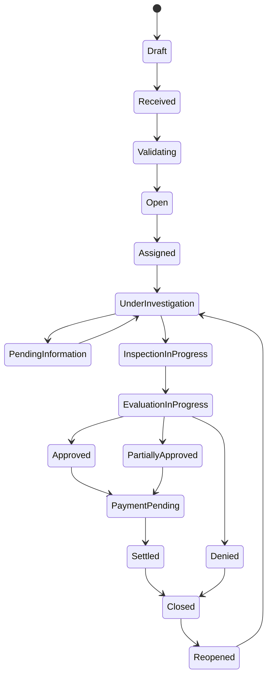

### 23.3 设计原则

- **守卫条件：** 关闭前 Reserve/Task；支付前 Authority；分派前执照  
- **触发：** 状态变→Task/Notification/审计  
- **为何单一 Status 不够：** Exposure、Inspection、Estimate、Payment、Invoice 各有生命周期；建议**正交状态**而非巨型枚举  

---

## 24. 四个端到端案例

### 案例 A：简单住宅水损

（与 §9.2 同构，摘要）  
**5Ws：** Who Ana Lopez；What 管道漏水；When 2026-03-12；Where Austin；Why 意外漏水；How 门户报案。  
**Actors：** Insured、Desk/Field Adjuster、Mitigation vendor、TPA Billing。  
**Coverage：** 意外漏水承保；ALE 不适用。  
**路径：** Triage→Assign→First Contact→Inspection→Estimate→Reserve→Payments→QA→Invoice→Close。  
**例外：** 隐藏潮湿→Reopen。  
**系统：** Intake API、Claim、Document Blob、Payment、Billing。  
**学习点：** ACV/RCV 节奏；Payment≠Invoice。

### 案例 B：大型商业火灾

**Who** 仓储公司 Risk Manager；**What** 夜班电气起火；**Where** 多栋仓库；**When** CAT-adjacent 旺季。  
**Policy：** Building + Contents + BI。  
**Triage：** Major/Complex → Complex Loss Team + 外聘专家。  
**Investigation：** 起因、公共消防报告、可能 Subrogation。  
**Estimate：** 多阶段 Interim Reports；BI 需月报表。  
**Reserve：** 高额，多级审批。  
**Payment：** 进度款 + 最终结算。  
**例外：** 诉讼、Invoice 争议、报表与 OLTP 时差。  
**学习点：** 多 Exposure、长周期、权限链、大文档。

### 案例 C：Auto Liability 事故

| 5Ws+How | 内容 |
|---------|------|
| Who | 被保险驾驶人；第三方 Claimant；Examiner |
| What | 路口未让行争议导致碰撞与人身伤害主张 |
| When | DOL 2026-03-09 |
| Where | 加州城市道路（示意） |
| Why | 过错与伤害程度争议 |
| How | FNOL → Liability 调查 → 比较过失（示意）→ BI/PD 处理 |

- **Policy/Coverage：** Auto Liability 限额 100/300（示意）。  
- **Intake：** 含警察报告号、双方联系方式。  
- **Triage：** 有 BI 迹象 → Examiner；拆 PD 与 BI Exposure。  
- **Investigation：** 笔录、现场照片、医疗账单（敏感）。  
- **Liability：** 示意 70/30（**管辖规则差异大，勿当作法律结论**）。  
- **Reserve：** BI 与 PD 分列。  
- **Payment：** PD 付给修理厂/Claimant；BI 和解并签 Release。  
- **Reporting：** 向 Carrier/Client 输出损失清单。  
- **例外：** 律师介入 → Litigation 模块与 privilege 管控。  
- **系统交互：** Party Role 模型、Release 文档、多收款人支付。  
- **学习点：** **Liability ≠ Coverage**；多 Claimant / 多 Exposure。

> **常见错误：** 把“看起来有过错”直接写成最终 Liability 结论而未留证据与保留措辞。

### 案例 D：WC 工作场所伤害

| 5Ws+How | 内容 |
|---------|------|
| Who | Injured Worker；雇主；WC Examiner；Nurse Case Manager |
| What | 搬货致腰痛主张 |
| When | DOL 2026-05-21 |
| Where | 某州仓库（管辖示意） |
| Why | 是否因工（Compensability）争议可能 |
| How | 雇主首报 → 补偿资格审查 → 医疗 + 收入替代 |

- **计划/保障：** 雇主法定 WC 保障（非 Property Policy 逻辑）。  
- **Intake：** First Report of Injury。  
- **Triage：** Medical-only vs Lost-time。  
- **Investigation：** Compensability 访谈；雇主是否知情。  
- **Medical：** Bill Review；按州要求 UR；药房。  
- **Benefits：** 基于 AWW 的 TTD；Modified Duty / RTW。  
- **Reserve：** Medical + Indemnity Case Reserve。  
- **Payment：** 医疗机构付款；工资替代日程支付。  
- **Reporting：** 管辖区 EDI/监管报送（概念示意）。  
- **例外：** 否认补偿资格 → 争议/听证路径。  
- **系统交互：** **PHI 隔离**、给付计算器、药房集成。  
- **学习点：** **禁止**把 Property Estimate 模块硬套 WC 给付。

> **项目会议问题：** “本州 EDI 格式、UR 强制点与 PHI 访问角色由谁配置？”

### 案例 B 补强：大型商业火灾（结构化）

| 5Ws+How | 内容 |
|---------|------|
| Who | 仓储公司 Risk Manager；Complex Loss Team；消防/起因专家 |
| What | 夜班电气起火，多栋受损并威胁 BI |
| When | 旺季夜间 |
| Where | 物流园区多楼栋 |
| Why | 重大物损与营业中断 |
| How | 紧急 Intake → Major Loss Triage → 多阶段 Interim → 进度付款 |

- **Coverage：** Building + Contents + BI；可能涉及保证金与共保。  
- **Reserve：** 高额多级审批；Expense（专家/律师）单列。  
- **Document：** 数千页图纸、视频、账册 → 走大文档策略。  
- **Recovery：** 可能对电气承包商 Subrogation。  
- **Invoice：** 长期 T&E 分期向 Client 出账。  
- **学习点：** 长周期、正交状态、权限链、Analytics as-of。

> **架构师视角：** Complex Loss 是检验“多 Exposure + 文档管道 + 审批编排”是否成体系的试金石。

---


## 25. 章节练习汇总

> 各章已含自测。本章提供综合练习包（初级×5 + 情景×3 + 架构×2）与答案要点。

### 25.1 综合初级题

1. Policy / Claim / Coverage 各回答什么问题？  
2. 写出 Incurred 公式。  
3. 列出三类 Inspection。  
4. TPA Invoice 付给谁、为了什么？  
5. Sedgwick 风格组织的典型角色是什么？

### 25.2 情景题

1. Policy 服务超时，业务要求“不能拒绝报案”。你如何设计？  
2. Adjuster 要把 Reserve 从 10k 调到 80k，但权限 25k。系统行为？  
3. Closed 后 Claimant 提交新损坏照片。路径？

### 25.3 架构题

1. 为何 Reserve 与 Payment 要用不同聚合/表？  
2. CAT 高峰如何保护 OLTP 与保证 FNOL 不丢？

### 25.4 答案要点

1. 承诺 / 事件记录 / 承诺是否适用。  
2. Paid + Outstanding Reserve。  
3. Field / Desk / Virtual。  
4. Client 付给 TPA，服务费。  
5. TPA/理赔管理合作方（非必然 Carrier）。  
情景1：接收 Intake，Coverage Pending，异步重试 Policy，审计降级。  
情景2：拒绝直接生效，创建审批，审计。  
情景3：Reopen + reason，新 Inspection。  
架构1：不同生命周期、审批、会计含义。  
架构2：队列削峰、扩缩、只写 Intake 最小集、异步创建。

### 25.5 Level 4–6 进阶自测

**Level 4：** Subrogation 何时启动？Maker-Checker 价值？Leakage 指什么？  
**Level 5：** 把“超权 Reserve”写成决策表；为 Close 写 Given/When/Then。  
**Level 6：** 画出 Financials 与 Billing 限界上下文反腐层；给出支付超时的幂等策略。

**答案要点：** 第三方过错迹象时；防职务舞弊；不当流失；输入权限与金额→升级；见 US6；Billing 不直接改 Indemnity 账；Idempotency-Key + 状态机查询。

---

## 26. 50词术语表

| # | 术语 | 简义 |
|---|------|------|
| 1 | Policy | 保单/承诺 |
| 2 | Claim | 理赔案件 |
| 3 | Coverage | 保险责任是否适用 |
| 4 | Liability | 法律责任 |
| 5 | FNOL | 出险首次通知 |
| 6 | Intake | 报案接入 |
| 7 | Triage | 分诊分级 |
| 8 | Assignment | 分派 |
| 9 | Adjuster | 理赔员 |
| 10 | Carrier | 保险公司 |
| 11 | TPA | 第三方管理人 |
| 12 | Client Instructions | 客户执行指令 |
| 13 | Delegated Authority | 授权额度 |
| 14 | Deductible | 免赔额 |
| 15 | Exclusion | 除外责任 |
| 16 | Endorsement | 批单 |
| 17 | Exposure | 子案/敞口 |
| 18 | Estimate | 估损 |
| 19 | Inspection | 查勘 |
| 20 | ACV | 实际现金价值 |
| 21 | RCV | 重置成本 |
| 22 | Depreciation | 折旧 |
| 23 | Reserve | 准备金 |
| 24 | Incurred | 已发生成本 |
| 25 | Paid | 已付 |
| 26 | Outstanding | 未决准备金 |
| 27 | Payment | 赔付/付款 |
| 28 | Invoice | （此课语境）TPA 服务发票 |
| 29 | Subrogation | 代位追偿 |
| 30 | Salvage | 残值回收 |
| 31 | Recovery | 追回类总称 |
| 32 | Adjudication | 理赔裁决 |
| 33 | Reservation of Rights | 权利保留 |
| 34 | SIU | 特殊调查/反欺诈单元 |
| 35 | Diary | 到期提醒 |
| 36 | Task | 任务 |
| 37 | Note | 案件笔记 |
| 38 | SLA | 服务水平协议 |
| 39 | QA | 质量保证 |
| 40 | ALE | 额外生活费用 |
| 41 | BI | 营业中断 |
| 42 | CAT | 巨灾 |
| 43 | Compensability | WC 补偿资格 |
| 44 | AWW | 平均周工资 |
| 45 | IBNR | 已发生未报案（概念） |
| 46 | SoR | 权威数据源系统 |
| 47 | PII | 个人身份信息 |
| 48 | PHI | 受保护健康信息 |
| 49 | RBAC/ABAC | 角色/属性访问控制 |
| 50 | Leakage | 赔案不当泄漏成本 |

---

## 27. 30题期末测评与答案

### 题目

1. Policy 的一句话定义？  
2. Claim Payment 与 TPA Invoice 区别？  
3. Incurred 公式？  
4. 列出 Claim Adjudication 十二问中任意四问。  
5. Public Adjuster 代表谁？  
6. Underwriter 主要在赔前还是赔后作业？  
7. Exposure 的用途？  
8. ACV 相对 RCV？  
9. Recoverable Depreciation 常见前提？  
10. Desk vs Field Inspection？  
11. Reporting 能否与主流程并行？  
12. Sedgwick 典型是 Carrier 吗？  
13. Client Instructions 控制什么？  
14. Delegated Authority 控制什么？  
15. ROR 含义？  
16. WC 与 Property 最大差异之一？  
17. 好的 Claim Note 三个特征？  
18. 为何业务规则要可配置？  
19. REST 适合同步查询吗？  
20. Service Bus 在示意架构中的作用？  
21. 领域事件 `PaymentIssued` 是否真实厂商名？  
22. 关闭 Claim 的典型守卫？  
23. Legal hold 对删除的影响？  
24. Maker-Checker 防什么？  
25. 大文档应元数据优先还是整包下载优先？  
26. Reserve Accuracy 衡量什么？  
27. Duplicate payment 关键预防？  
28. 状态机为何要拆分 Payment/Invoice 状态？  
29. Self-Insured Employer 的赔款资金常见归属？  
30. 分析库与 OLTP 数字不一致时先查什么？

### 答案

1. 定义保险承诺。  
2. 赔案出款 vs 服务费账单。  
3. Paid + Outstanding Reserve。  
4. 任答：有效损失、保单有效、标的、原因、除外、证据、责任、价值、免赔限额、收款人、权限、审批。  
5. Insured。  
6. 赔前（承保）。  
7. 按覆盖/当事人拆分管理与财务。  
8. ACV 通常扣折旧。  
9. RCV 条款且修复完成等条件。  
10. 远程材料 vs 赴现场。  
11. 能。  
12. 不必然；多为 TPA/合作方。  
13. TPA 如何处理委托。  
14. 可不报批的决策边界。  
15. 保留抗辩权利并继续处理/调查。  
16. Compensability/PHI/州法主导等。  
17. 客观、时间戳、可审计（或事实、简洁）。  
18. 多客户/多州组合爆炸。  
19. 是。  
20. 异步解耦与可靠投递。  
21. 否，示例名。  
22. 无 Open Task、Reserve 处理完毕、强制文档等。  
23. 抑制销毁直至解除。  
24. 单人超额舞弊/错误。  
25. 元数据优先。  
26. 初始储备相对最终结果。  
27. 幂等键 + 重复侦测。  
28. 生命周期与会计含义不同。  
29. Client 自有资金（常）。  
30. 刷新延迟/水位线/as-of 时间。

---

## 28. 五个工坊练习

### 工坊 1：词汇对齐会（90 分钟）

产出：团队对 Estimate/Reserve/Payment/Invoice 的统一定义海报；列出三个曾混淆的历史缺陷。

### 工坊 2：画你们的 Lifecycle（半日）

产出：基于本手册 Mermaid，标注贵司 Client 差异点与未知项清单（转为会议问题）。

### 工坊 3：Authority 决策表（半日）

产出：Reserve/Payment 决策表 + 异常路径 + 审计字段列表。

### 工坊 4：Property 端到端故事地图（一日）

产出：从 FNOL 到 Invoice 的用户故事地图（含 Reopen），至少 6 张 Given/When/Then。

### 工坊 5：示意架构评审（一日）

产出：能力图 + 序列图 + 事件目录 + NFR 验收指标；明确“非厂商机密示意”声明。

---

## 29. 两份 Checklist

### 29.1 加入 Claim 项目前我必须理解什么

- [ ] Policy ≠ Claim ≠ Coverage ≠ Liability  
- [ ] Estimate ≠ Reserve ≠ Payment ≠ Invoice  
- [ ] Claim Payment ≠ TPA Service Invoice  
- [ ] Carrier vs TPA vs Self-Insured  
- [ ] Staff / IA / Public Adjuster 利益方向  
- [ ] Lifecycle 主路径与并行能力  
- [ ] Delegated Authority 与审批升级  
- [ ] Client Instructions 可变且需版本化  
- [ ] 管辖区与执照约束  
- [ ] Notes 可审计标准  
- [ ] ACV/RCV/折旧支付节奏  
- [ ] WC/Disability 不能硬套 Property  
- [ ] 幂等、查重、关闭守卫  
- [ ] PII/PHI 与租户隔离  
- [ ] OLTP vs Analytics 时差  

### 29.2 第一次 Claim 项目会上该问的问题

- [ ] 我们的 Client 是 Carrier 还是 Self-Insured？资金如何流动？  
- [ ] Delegated Authority 矩阵在哪里？谁维护？  
- [ ] Client Instructions 的 SoR 与生效版本策略？  
- [ ] Coverage 决策最终 Accountable 是谁？  
- [ ] Exposure 如何拆分（尤其 Property）？  
- [ ] Reserve/Payment 审批阈值与 Maker-Checker？  
- [ ] 哪些状态正交（Claim/Exposure/Payment/Invoice）？  
- [ ] FNOL 渠道与幂等、查重规则？  
- [ ] 执照与州规则如何强制？  
- [ ] CAT 扩容与 FRM 策略？  
- [ ] 文档体量与大文件 NFR？  
- [ ] 报表 as-of 与对账频率？  
- [ ] QA/Billing 与 Close 的先后？  
- [ ] 审计留存与 Legal hold？  
- [ ] 哪些集成是 REST/队列/批/Webhook？  

---

## 30. 30/60/90 学习计划

### 前 30 天 — 打词汇与主路径

**聚焦：** 词汇、Claim Lifecycle、核心角色、Policy/Coverage、Adjuster 作业、一个简单 Property Claim。  

**可度量产出：**

- 默写心智模型九句；  
- 完成 §5 全部对照表闭卷回忆 ≥80%；  
- 跟一次（或录音研读）First Contact + Note 点评；  
- 用自己的话复讲 §9.2 案例。  

### 第 31–60 天 — 财务、作业与集成

**聚焦：** Reserve/Payment、Triage/Assignment、Inspection/Estimation、Client Instructions、工作流与状态、Reporting/SLA、API 与集成。  

**可度量产出：**

- 独立完成一套 Reserve→Payment 数值演练；  
- 编写 ≥3 条可配置决策表；  
- 草拟 Intake 与 Payment API 契约（含错误与幂等）；  
- 解释一组 KPI 的运营/财务/质量分类。  

### 第 61–90 天 — 架构专家

**聚焦：** DDD 限界上下文、事件驱动、安全审计、CAT 可扩展、多客户配置、财务对账、端到端平台设计。  

**可度量产出：**

- 提交示意架构包（能力图+组件+3序列+事件目录）；  
- 完成工坊 4–5；  
- 期末 30 题 ≥26 分；  
- 能在模拟项目会上流畅使用 §29.2 提问清单。  

---

## 附录 A：Level 地图速查

| Level | 终点能力 |
|-------|----------|
| 1 | 听懂会议术语，不张冠李戴角色 |
| 2 | 按 Lifecycle 提问与排障 |
| 3 | 理解 Adjuster 日程与 Notes 标准 |
| 4 | 财务与裁决控制设计 |
| 5 | 写出合格需求与 AC |
| 6 | 设计可审计、可配置、可扩缩平台 |

## 附录 B：再次免责声明

本文全部流程图、API、表名、事件名、金额与案例均为**教学示意**。实际以 Client 合同、Policy、管辖区法规与经批准的内部实现为准。Sedgwick 通常作为 **TPA / 理赔管理合作方**参与，不必然是 Insurance Carrier。

---

*课程结束。建议立即使用 §29 Checklist 启动你的第一个 Claim 项目准备。*

