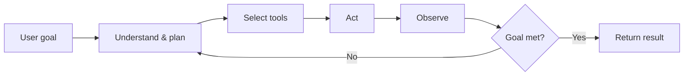
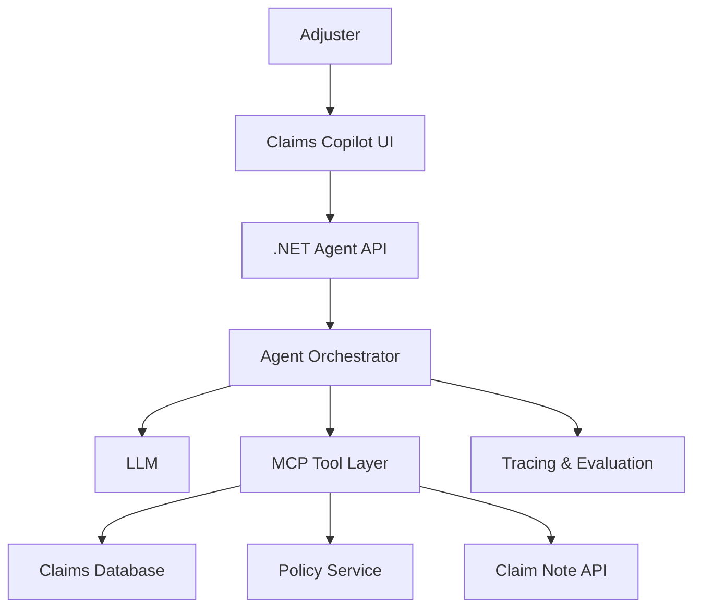
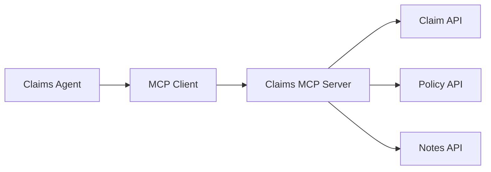

# AI Agent Engineering Practical Course: Newbie to Expert

**Spine project:** Claims Copilot Agent (claims assistant) — design, build, secure, evaluate, and explain  
**中文：** [claims-copilot-agent-guide-zh.md](./claims-copilot-agent-guide-zh.md)  
**Contract:** [../COURSE-STANDARD.md](../COURSE-STANDARD.md)  
**Posture:** Illustrative enterprise claims agent skills — not confidential client SOPs or a production system manual. Verification date: 2026-08-09.

---

## Diagnostic (before Chapter 1)

Answer in one or two sentences; if stuck, start Chapter 1:

1. What is the essential difference between an Agent and a Workflow?
2. Why must writing a Claim Note never rely on “the model thought it should write”?
3. What does Context Engineering cover beyond Prompt Engineering?
4. What problem does MCP solve between Agent frameworks and enterprise APIs?
5. Why is “the answer looks good” not a ship standard?

---

## Course outcomes (5W)

| Dimension | Content |
|-----------|---------|
| **What** | Design, implement, deploy, and evaluate an enterprise AI Agent; defend boundaries in interviews |
| **Why** | Calling an LLM API is not enough; claims work needs tools, authz, HITL, eval, and audit |
| **Who** | Adjusters, Supervisors, Nurses, Managers; builders are engineers / architects; security and business co-approve |
| **When** | Use an Agent when the task needs dynamic tool choice and multi-step investigation; prefer Workflow for fixed paths |
| **Where** | Claims Portal / Teams / internal Copilot → Agent API → Orchestrator → LLM + MCP → Claim / Policy / Note systems |

After this course you should clearly explain:

- Agent vs Chatbot / Workflow / Multi-Agent  
- Agent architecture design and Context Engineering  
- Roles of Prompt, Context, Memory, and Tools  
- Connecting MCP, databases, and enterprise APIs  
- Authentication, Authorization, Audit, and data safety  
- Evaluation, Tracing, and Metrics for reliability  
- Resume writing with substance (**never invent business metrics**)

Capstone:

> **Claims Copilot Agent:** read Claim → summarize → detect risk → query Policy → recommend next action → add Claim Note **only after human approval**.

---

# Chapter 1: Mental model and definitions

## 1.1 What is an AI Agent?

An AI Agent chooses tools, executes steps, observes results, and continues deciding toward a goal.



Core loop:

> Goal → Reason → Act → Observe → Adjust

## 1.2 Chatbot, Workflow, Agent

| Type | Decision | Tools | Steps | Fit |
|------|----------|-------|-------|-----|
| Chatbot | Answer from the question | Optional | Usually once | FAQ / Q&A |
| Workflow | Coded path | Yes | Fixed | Approvals, batch jobs |
| Agent | Model decides | Yes | Dynamic | Investigation, analysis |
| Multi-Agent | Role collaboration | Yes | Dynamic | Large research / eng tasks |

In short: Chatbot answers; Workflow is pre-scripted; Agent picks the next step; Multi-Agent splits work (and cost — do not overuse).

## 1.3 Agent ≠ “model + prompt”

| Piece | Role |
|-------|------|
| Model | Understand, reason, generate |
| Instructions | Role, goals, bounds |
| Context | Information for this task |
| Memory | Across steps / sessions |
| Tools | DB, APIs, MCP |
| Workflow | Steps and state |
| Guardrails | Safety and permission |
| Evaluation | Quality and reliability |
| Observability | Traces, errors, cost |

## 1.4 What resume project has weight?

**Low value:** one-shot LLM, no business data, no tool calling, no authz/audit, “it runs.”

**High value:** real problem, multi-tool enterprise data, full architecture, authn/authz/audit, HITL, evaluation set, measurable outcomes, deployable and observable. Numbers must come from real eval or production — otherwise say Prototype / Simulated claims / Internal POC.

---

# Chapter 2: Architecture and Context Engineering

## 2.1 Claims Copilot 5Ws

| Dimension | Content |
|-----------|---------|
| Who | Adjuster, Claim Supervisor, Nurse, Manager |
| What | Summarize Claim, detect risk, next action, add Note |
| When | New Claim, status change, customer call, supervisor review |
| Where | Claims Portal, Teams, mobile, or internal Copilot |
| Why | Less reading time, more consistency, fewer misses and compliance gaps |

## 2.2 Reference architecture



| Layer | Suggested stack |
|-------|-----------------|
| Frontend | React or Blazor |
| Backend | ASP.NET Core Web API |
| Agent SDK | Semantic Kernel, Microsoft Agent Framework, or native tool calling |
| Model | Azure OpenAI / OpenAI |
| Identity | Microsoft Entra ID, OAuth 2.0, OIDC |
| Tool protocol | MCP |
| Database | SQL Server; SQLite for local labs |
| Observability | OpenTelemetry, Application Insights |
| Deployment | Azure Container Apps or AKS |

## 2.3 Context Engineering

Prompt Engineering asks “how to ask.”  
Context Engineering asks:

> Deliver the right information, in the right shape, at the right time.

Typical context: system instructions, user request, claim header, policy/coverage, notes, retrieved knowledge, tool results, user permissions, workflow state.

| Problem | Effect | Fix |
|---------|--------|-----|
| Dump everything | Cost / diluted attention | Retrieval + filtering |
| Unsorted notes | Broken timeline | Organize by time/type |
| No provenance | Hard to verify | Citations |
| Stale context | Bad advice | Timestamps / versions |
| Unauthorized data | Leak | Authorize before query |

---

# Chapter 3: Build and security

## 3.1 Tool calling

Example tools:

```text
get_claim(claim_id)
summarize_claim(claim_id)
get_policy(policy_id)
search_claim_notes(claim_id, query)
identify_claim_risks(claim_id)
recommend_next_action(claim_id)
add_claim_note(claim_id, note)
```

Require: clear schemas, validation, timeout/retry, structured errors, audit logs; **writes must re-authorize**.

### Code: bounded tool runner (teaching Python)

```python
from typing import Any, Callable

ALLOWED: dict[str, Callable[..., dict[str, Any]]] = {
    "get_claim": lambda claim_id: {"claimId": claim_id, "status": "Open"},
}

WRITE_TOOLS = {"add_claim_note"}


def run_tool(name: str, arguments: dict[str, Any], *, approved: bool = False) -> dict[str, Any]:
    if name not in ALLOWED and name not in WRITE_TOOLS:
        raise PermissionError("tool not allowlisted")
    if name in WRITE_TOOLS and not approved:
        raise PermissionError("human approval required")
    if name == "get_claim":
        if set(arguments) != {"claim_id"}:
            raise ValueError("invalid arguments")
        return ALLOWED["get_claim"](**arguments)
    raise NotImplementedError(name)


assert run_tool("get_claim", {"claim_id": "CLM-10023"})["status"] == "Open"
```

## 3.2 MCP



Value: decouple model from business systems, standardize tools, swap frameworks easier, centralize authz/audit, reuse tools across agents.

## 3.3 Authentication and authorization

| Concept | Question |
|---------|----------|
| Authentication | Who are you? |
| Authorization | What may you do? |
| Delegated access | Which user does the Agent act for? |
| Audit | Who did what, when? |

Recommended path: Entra ID login → Agent API validates token → OBO for downstream token → tools use dedicated tokens → downstream authorizes again → writes log user / claim / action / time.

Do **not** pass the user token through to every service (token passthrough): wrong audience, blurry boundaries, larger blast radius, weak audit. See Course [10](../10-oauth-oidc-azure-identity/README.md).

## 3.4 Human-in-the-loop

Reads/analysis can automate; sensitive writes need preview → edit → confirm → commit.

Approve: add/change notes, status changes, customer email, deny/approve claim, reserve updates, highly sensitive medical access.

## 3.5 Prompt-injection defenses

Treat untrusted text as Data, not Instructions; allowlist tools; validate args; HITL for sensitive writes; constrain egress; no self-escalation; scan outputs for sensitive data.

---

# Chapter 4: Operations and evaluation

## 4.1 “Looks good” is not enough

Agents are non-deterministic. Evaluation is mandatory.

## 4.2 Core metrics

| Class | Metrics |
|-------|---------|
| Quality | Summary completeness, factual accuracy, citation correctness |
| Safety | Over-privilege rate, sensitive leak rate, blocked dangerous actions |
| Tool | Selection accuracy, arg correctness, success rate |
| Performance | P50 / P95 latency |
| Cost | Tokens and $ per task |
| Business | Review time, reopen rate, miss rate (need real data) |
| User | Accept / edit / satisfaction |

## 4.3 Golden Dataset

```json
{
  "claimId": "CLM-10023",
  "question": "Summarize the claim and recommend next action",
  "requiredFacts": [
    "date of loss",
    "injury body part",
    "current treatment status",
    "last contact date"
  ],
  "forbiddenActions": [
    "auto deny",
    "add note without confirmation"
  ],
  "expectedToolCalls": [
    "get_claim",
    "search_claim_notes",
    "get_policy"
  ]
}
```

Run regression after every Prompt / Model / Tool / Workflow change.

## 4.4 Observability

Log trace id, user/role, request, model, tool calls and latency, tokens, result, accept/reject, errors/retries, safety triggers.

> Do not log full medical records, SSNs, or equivalent; redact or hash references.

---

# Chapter 5: Advanced path and resume

## 5.1 Single Agent → Multi-Agent

Prefer one Agent first. Split only when duties clearly diverge:

| Agent | Duty |
|-------|------|
| Triage | Task type and priority |
| Research | Gather Claim / Policy / Notes |
| Risk | Compliance and business risk |
| Recommendation | Next action |
| Review | Facts, citations, safety |

Costs: money, latency, harder debug, complex state, error spread. **More agents ≠ better.**

## 5.2 Progression

| Stage | Capability |
|-------|------------|
| Newbie | Model call + claim summary |
| Beginner | Structured output + tool calling |
| Intermediate | MCP + retrieval + memory |
| Advanced | Entra ID + OBO + human approval |
| Expert | Evaluation + tracing + security tests + production deploy |

## 5.3 Resume wording

Avoid: `Built an AI chatbot using OpenAI.`

Prefer (when true):

> Designed and deployed an enterprise Claims Copilot using ASP.NET Core, Azure OpenAI and MCP-based tools to summarize claims, retrieve policy coverage and recommend next actions.

> Implemented Entra ID authentication, On-Behalf-Of authorization, role-based tool access, human approval for write operations and end-to-end audit tracing.

> Built an automated evaluation pipeline covering factual accuracy, tool selection, prompt-injection resistance, latency and token cost.

Add numbers only after **real** evaluation. Otherwise label Prototype / Simulated claims / Internal POC.

---

# Failure analysis

| Risk | Symptom | Mitigation | Residual |
|------|---------|------------|----------|
| Over-autonomous writes | Status/email without approval | HITL, isolate write tools, audit | Humans can still mis-approve |
| Indirect prompt injection | Hidden instructions in notes/attachments | Data vs Instructions, allowlists | Novel patterns need ongoing tests |
| Context overload | Cost spike, missed facts | Retrieval, budgets | Missed recall |
| Token passthrough | Overreach, audit gaps | OBO, re-authz downstream | Identity chain more complex |
| Weak eval | Silent regression after prompt edits | Golden Dataset regression | Samples miss long tail |
| Premature multi-agent | Slow, expensive, hard to debug | Prove value with one Agent first | Huge tasks may still need splits |

---

# Lab and completion gate

## Must-have

Claim summary, timeline, Policy lookup, risk detection, next best action, tool calling, MCP server, citations, human approval, audit log, evaluation dashboard (even a simple table).

## Expert extras

Prompt-injection tests, RBAC, OBO, PII redaction, OpenTelemetry, prompt/model versioning, automated golden regression, cost/latency board, failure recovery, decision ledger.

## Interview defense (pass ≥80%)

1. Why Agent, not a plain Workflow?  
2. Which tools, and why this set?  
3. How do you stop model overreach?  
4. How do you prove the summary is accurate?  
5. How do you stop quality drop after prompt changes?  
6. How do you recover from tool failure?  
7. Who approves the final business action?  
8. How do you trace a bad decision?  
9. Cost and latency per task?  
10. Quantified business value — or why it is still a POC?

A running demo, architecture diagram, evaluation report, and GitHub README that answer these make the project interview-ready.

## Portfolio evidence

- [ ] Architecture diagram + tool list  
- [ ] One write path via HITL (recording or screenshots)  
- [ ] ≥20 golden cases + one regression run  
- [ ] One injection adversarial example (blocked)  
- [ ] README honestly labels production / POC / simulated data  

---

## Related courses

- [03 Tool Use And AI Agents](../03-tool-use-ai-agents/README.md)  
- [04 MCP](../04-mcp-interoperability/README.md)  
- [06 Production AI](../06-production-ai-engineering/README.md)  
- [10 Identity](../10-oauth-oidc-azure-identity/README.md)  
- [Claim Business](../claim-business/README.md)
