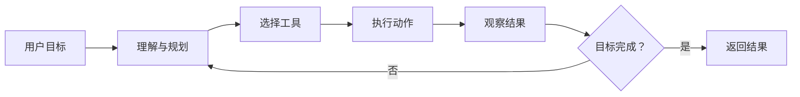
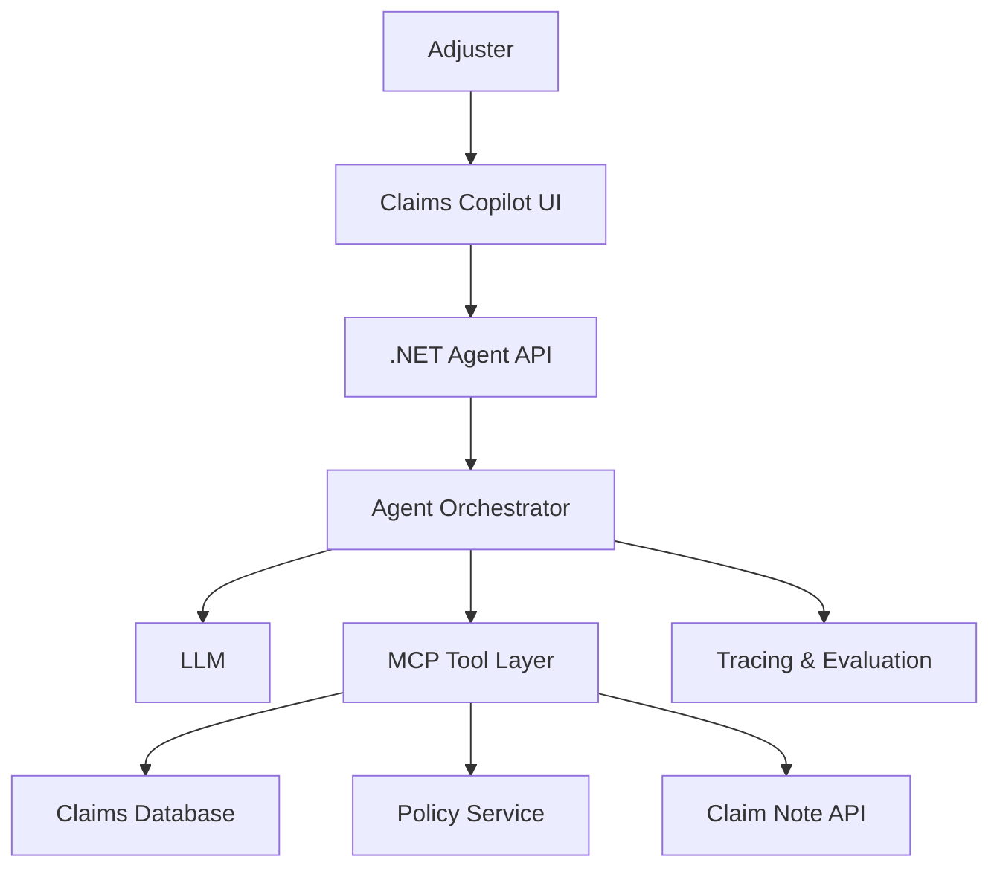
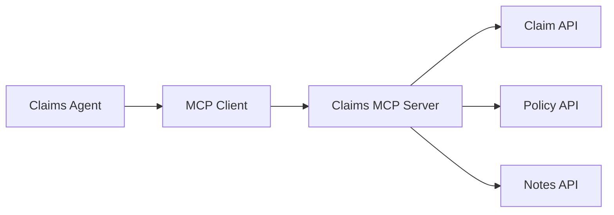

# AI Agent 工程实战课：从新手到专家

**副题：** 以 Claims Copilot Agent（理赔智能助理）贯穿设计、开发、安全、评估与简历表达  
**English：** [claims-copilot-agent-guide-en.md](./claims-copilot-agent-guide-en.md)  
**课程契约：** [../COURSE-STANDARD.zh.md](../COURSE-STANDARD.zh.md)  
**发布姿态：** 示意企业理赔 Agent 能力；非客户保密流程或生产系统说明书。验证日：2026-08-09。

---

## 诊断（开课前）

用一两句话回答；写不出就先学第 1 章：

1. Agent 与 Workflow 的本质差别是什么？
2. 为什么写 Claim Note 不能仅靠模型“觉得该写”？
3. Context Engineering 比 Prompt Engineering 多管了什么？
4. MCP 解决了 Agent Framework 与企业 API 之间的什么问题？
5. “回答看起来不错”为什么不能当作上线标准？

---

## 课程目标（5W）

| 维度 | 内容 |
|------|------|
| **What** | 能设计、实现、部署并评估企业级 AI Agent；能向面试官讲清边界与取舍 |
| **Why** | 仅会调 API 不够；理赔场景要求工具、权限、HITL、评测与可审计 |
| **Who** | Adjuster、Supervisor、Nurse、Manager；建设方为工程师 / 架构师；安全与业务共同审批 |
| **When** | 任务需要动态选工具与多步调查时用 Agent；路径固定时优先 Workflow |
| **Where** | Claims Portal / Teams / 内部 Copilot → Agent API → Orchestrator → LLM + MCP → Claim / Policy / Note 系统 |

完成课后你应能清晰说明：

- Agent 与 Chatbot、Workflow、Multi-Agent 的区别  
- Agent Architecture Design 与 Context Engineering  
- Prompt、Context、Memory、Tools 的分工  
- MCP、数据库与企业 API 的连接方式  
- Authentication、Authorization、Audit 与数据安全  
- Evaluation、Tracing、Metrics 如何证明可靠  
- 如何把项目写成有含金量的简历经历（**禁止编造业务指标**）

贯穿项目：

> **Claims Copilot Agent**：读取 Claim → 摘要 → 识别风险 → 查询 Policy → 建议下一步 → **人工批准后**添加 Claim Note。

---

# 第1章：认知破局与标准定义

## 1.1 什么是 AI Agent？

AI Agent 是一个能够根据目标，自主选择工具、执行步骤、观察结果并继续决策的系统。



核心循环：

> Goal → Reason → Act → Observe → Adjust

## 1.2 Chatbot、Workflow 与 Agent

| 类型 | 决策方式 | 工具 | 步骤 | 适用场景 |
|------|----------|------|------|----------|
| Chatbot | 按问题生成回答 | 可选 | 通常一次 | FAQ、知识问答 |
| Workflow | 程序预定义 | 是 | 固定 | 审批、批处理 |
| Agent | 模型动态判断 | 是 | 动态 | 调查、分析、复杂任务 |
| Multi-Agent | 多角色协作 | 是 | 动态协作 | 大型研究、软件工程 |

一句话：

- Chatbot：你问，它答  
- Workflow：开发人员决定每一步  
- Agent：系统根据当前情况决定下一步  
- Multi-Agent：多个专业 Agent 分工（有成本，别滥用）

## 1.3 Agent ≠「大模型 + Prompt」

| 组成 | 作用 |
|------|------|
| Model | 理解、推理、生成 |
| Instructions | 角色、目标、边界 |
| Context | 当前任务所需信息 |
| Memory | 跨步骤 / 跨会话信息 |
| Tools | 数据库、API、MCP |
| Workflow | 步骤与状态 |
| Guardrails | 安全与权限 |
| Evaluation | 质量与可靠性 |
| Observability | Trace、错误、成本 |

## 1.4 什么样的项目给简历加分？

**低价值：** 单次 LLM、无业务数据、无 Tool Calling、无权限审计、只“能跑”。

**高价值：** 真实业务问题、多工具与企业数据、完整架构、认证授权审计、HITL、Evaluation Dataset、可量化效果、可部署可观测。量化数字必须来自真实评测或生产——没有就写 Prototype / Simulated claims / Internal POC。

---

# 第2章：架构设计与上下文工程

## 2.1 Claims Copilot 的 5Ws

| 维度 | 内容 |
|------|------|
| Who | Adjuster、Claim Supervisor、Nurse、Manager |
| What | 摘要 Claim、识别风险、建议下一步、添加 Note |
| When | 新 Claim、状态变化、客户来电、主管审核 |
| Where | Claims Portal、Teams、移动端或内部 Copilot |
| Why | 减少阅读时间，提高一致性，降低遗漏与合规风险 |

## 2.2 参考架构



| 层级 | 推荐技术 |
|------|----------|
| Frontend | React 或 Blazor |
| Backend | ASP.NET Core Web API |
| Agent SDK | Semantic Kernel、Microsoft Agent Framework 或原生 Tool Calling |
| Model | Azure OpenAI / OpenAI |
| Identity | Microsoft Entra ID、OAuth 2.0、OIDC |
| Tool Protocol | MCP |
| Database | SQL Server；本地可用 SQLite |
| Observability | OpenTelemetry、Application Insights |
| Deployment | Azure Container Apps 或 AKS |

## 2.3 Context Engineering

Prompt Engineering 关注「怎么问」。  
Context Engineering 关注：

> 在正确的时间，把正确的信息，以正确的结构交给模型。

典型上下文：System Instructions、用户请求、Claim 基本资料、Policy / Coverage、Claim Notes、检索知识、Tool 结果、用户权限、Workflow State。

| 问题 | 后果 | 改进 |
|------|------|------|
| 一次塞入全部数据 | 成本高、注意力散 | Retrieval + Filtering |
| Note 未排序 | 时间线错乱 | 按时间与类型组织 |
| 无来源 | 难验证 | Citation |
| Context 过期 | 建议不可靠 | 时间戳与版本 |
| 混入无权限数据 | 泄露 | 查询前授权 |

---

# 第3章：工程落地与安全协同

## 3.1 Tool Calling

示例工具：

```text
get_claim(claim_id)
summarize_claim(claim_id)
get_policy(policy_id)
search_claim_notes(claim_id, query)
identify_claim_risks(claim_id)
recommend_next_action(claim_id)
add_claim_note(claim_id, note)
```

要求：明确 Schema、参数校验、Timeout / Retry、结构化错误、Audit Log；**写操作必须二次鉴权**。

### 代码：受约束的工具调用（Python 教学版）

```python
from typing import Any, Callable

ALLOWED: dict[str, Callable[..., dict[str, Any]]] = {
    "get_claim": lambda claim_id: {"claimId": claim_id, "status": "Open"},
}

WRITE_TOOLS = {"add_claim_note"}


def run_tool(name: str, arguments: dict[str, Any], *, approved: bool = False) -> dict[str, Any]:
    if name not in ALLOWED and name not in WRITE_TOOLS:
        raise PermissionError("tool not allowlisted")
    if name in WRITE_TOOLS and not approved:
        raise PermissionError("human approval required")
    if name == "get_claim":
        if set(arguments) != {"claim_id"}:
            raise ValueError("invalid arguments")
        return ALLOWED["get_claim"](**arguments)
    raise NotImplementedError(name)


assert run_tool("get_claim", {"claim_id": "CLM-10023"})["status"] == "Open"
```

## 3.2 MCP



价值：模型与业务解耦、工具接口标准化、易换 Framework、集中权限与审计、多 Agent 复用同一工具层。

## 3.3 身份认证与授权

| 概念 | 问题 |
|------|------|
| Authentication | 你是谁？ |
| Authorization | 你可以做什么？ |
| Delegated Access | Agent 代表哪个用户？ |
| Audit | 谁在何时做了什么？ |

推荐：Entra ID 登录 → Agent API 验 Token → OBO 取下游 Token → Tool 用专用 Token → 下游再鉴权 → 写操作记用户 / Claim / 动作 / 时间。

**不要**把用户 Token 原样传给所有服务（Token Passthrough）：Audience 错乱、边界模糊、泄露面放大、审计困难。详见课程 [10](../10-oauth-oidc-azure-identity/README.zh.md)。

## 3.4 Human-in-the-loop

读与分析可自动；敏感写操作要预览 → 修改 → 确认 → 写入。

适合人工批准：添加 / 修改 Note、改 Status、发客户邮件、拒赔 / 批准、更新 Reserve、访问高度敏感医疗信息。

## 3.5 Prompt Injection 防护

外部内容当 Data，不当 Instructions；工具白名单；参数校验；敏感写 HITL；限制外发网络；禁止模型自提权；输出做敏感信息检查。

---

# 第4章：线上运维与量化评估

## 4.1 为什么“看起来不错”不够？

Agent 非确定性：同一问题可产生不同路径与答案，必须有 Evaluation。

## 4.2 核心指标

| 类别 | 指标 |
|------|------|
| Quality | 摘要完整率、事实准确率、Citation 正确率 |
| Safety | 越权率、敏感泄露率、危险操作拦截率 |
| Tool | 选型准确率、参数正确率、成功率 |
| Performance | P50 / P95 Latency |
| Cost | 每任务 Token 与美元成本 |
| Business | 阅读时间、重开率、遗漏率（需真实数据） |
| User | 接受率、修改率、满意度 |

## 4.3 Golden Dataset

```json
{
  "claimId": "CLM-10023",
  "question": "总结案件并建议下一步",
  "requiredFacts": [
    "事故发生日期",
    "受伤部位",
    "当前治疗状态",
    "最后一次联系日期"
  ],
  "forbiddenActions": [
    "自动拒赔",
    "未经确认添加Note"
  ],
  "expectedToolCalls": [
    "get_claim",
    "search_claim_notes",
    "get_policy"
  ]
}
```

每次改 Prompt / Model / Tool / Workflow 后跑回归。

## 4.4 Observability

记录 Trace ID、用户与角色、请求、Model、Tool Calls 与延迟、Token、结果、是否接受、错误 / 重试、安全规则是否触发。

> 日志不要直接落完整病历、SSN 等敏感字段；需要时做脱敏或哈希引用。

---

# 第5章：全栈进阶与简历跃迁

## 5.1 单 Agent → Multi-Agent

初期优先单 Agent。职责明显分离再拆：

| Agent | 职责 |
|-------|------|
| Triage | 任务类型与优先级 |
| Research | 收集 Claim / Policy / Notes |
| Risk | 合规与业务风险 |
| Recommendation | 下一步建议 |
| Review | 事实、Citation、安全复核 |

代价：成本、延迟、调试难度、状态复杂、错误传播。**不是越多越好。**

## 5.2 进阶路线

| 阶段 | 能力 |
|------|------|
| Newbie | 调模型完成 Claim 摘要 |
| Beginner | Structured Output + Tool Calling |
| Intermediate | MCP + Retrieval + Memory |
| Advanced | Entra ID + OBO + Human Approval |
| Expert | Evaluation + Tracing + 安全测试 + 生产部署 |

## 5.3 简历写法

不要写：`Built an AI chatbot using OpenAI.`

可以写（有真实实现时）：

> Designed and deployed an enterprise Claims Copilot using ASP.NET Core, Azure OpenAI and MCP-based tools to summarize claims, retrieve policy coverage and recommend next actions.

> Implemented Entra ID authentication, On-Behalf-Of authorization, role-based tool access, human approval for write operations and end-to-end audit tracing.

> Built an automated evaluation pipeline covering factual accuracy, tool selection, prompt-injection resistance, latency and token cost.

有**真实**评测后再写数字。没有就标明 Prototype / Simulated claims / Internal POC。

---

# 失败分析（Failure Analysis）

| 风险 | 表现 | 缓解 | 残余风险 |
|------|------|------|----------|
| 过度自主写操作 | 未审批就改 Status / 发邮件 | HITL、写工具隔离、审计 | 人仍可能误批 |
| 间接 Prompt Injection | Note / 附件中的隐藏指令 | 内容当 Data、白名单工具 | 新型注入需持续测 |
| Context 塞爆 | 成本飙升、漏看关键事实 | 检索与过滤、预算 | 检索漏召回 |
| Token Passthrough | 越权、审计断层 | OBO、下游再鉴权 | 身份链路更复杂 |
| 评测不足 | 改 Prompt 后静默退化 | Golden Dataset 回归 | 样本不代表长尾 |
| Multi-Agent 过早 | 慢且贵、难排错 | 先单 Agent 证明价值 | 超大任务仍可能要拆 |

---

# 实战作业与验收门

## 必做

Claim 摘要、时间线、Policy 查询、Risk Detection、Next Best Action、Tool Calling、MCP Server、Citation、Human Approval、Audit Log、Evaluation Dashboard（可为简易表）。

## 专家加分

Prompt Injection 测试、RBAC、OBO、PII Redaction、OpenTelemetry、Prompt / Model 版本、Golden Dataset 自动回归、Cost / Latency 看板、Failure Recovery、Agent Decision Ledger。

## 面试答辩 10 问（≥80% 通过）

1. 为什么要 Agent 而不是普通 Workflow？  
2. 可调用哪些工具？为什么是这套？  
3. 如何防止模型越权？  
4. 如何证明摘要准确？  
5. Prompt 变更后如何防质量下跌？  
6. Tool 失败如何恢复？  
7. 谁批准最终业务动作？  
8. 如何追踪一次错误决策？  
9. 每次任务成本与延迟？  
10. 业务可量化价值是什么（或为何仍是 POC）？

能用运行中的 Demo、架构图、Evaluation Report 与 GitHub README 回答上述问题，项目才算具备竞争力。

## 完成证据（作品集）

- [ ] Architecture 图与工具清单  
- [ ] 至少一个写操作走 HITL 演示录像或截图  
- [ ] ≥20 条 Golden Dataset 及一次回归结果  
- [ ] 一次注入对抗样例（拦截记录）  
- [ ] README 中诚实标注生产 / POC / 模拟数据  

---

## 相关课程

- [03 Tool Use And AI Agents](../03-tool-use-ai-agents/README.zh.md)  
- [04 MCP](../04-mcp-interoperability/README.zh.md)  
- [06 Production AI](../06-production-ai-engineering/README.zh.md)  
- [10 Identity](../10-oauth-oidc-azure-identity/README.zh.md)  
- [Claim Business](../claim-business/README.zh.md)
