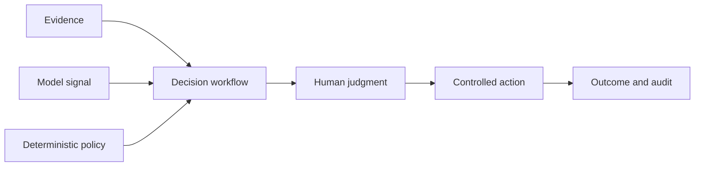

# 01: Enterprise AI Foundations

Chinese: [README.zh.md](README.zh.md) | Lab: [lab.md](lab.md)

## 5W + How

- **What:** an enterprise AI system combines deterministic software, probabilistic models, data, policy, humans, and operations.
- **Why:** separating responsibilities prevents model capability from silently becoming business authority.
- **Who:** domain owner, product, engineering, platform, security, privacy, legal, risk, SRE, support, and approvers.
- **When:** establish boundaries before choosing a model or framework; stop when no measurable decision improves.
- **Where:** models propose inside controlled workflows; policy authorizes; humans remain accountable for high-impact outcomes.
- **How:** map outcome, evidence, actors, authority, risks, controls, SLOs, and retirement criteria.



## Code

```python
from xingai_enterprise_poc.models import Actor

actor = Actor("user-1", "tenant-a", frozenset({"adjuster"}), frozenset({"knowledge:read"}))
assert actor.tenant_id == "tenant-a"
```

Read `models.py` and `workflow.py`. Identify which fields are evidence, authority, recommendation, state, and audit correlation.

## Failure And Interview Gate

Failure modes: chatbot-first design, no accountable owner, undefined outcome, model output treated as authorization, and missing retirement criteria. Explain the architecture to a beginner, then defend why the model cannot execute a payment to an architecture review board.

