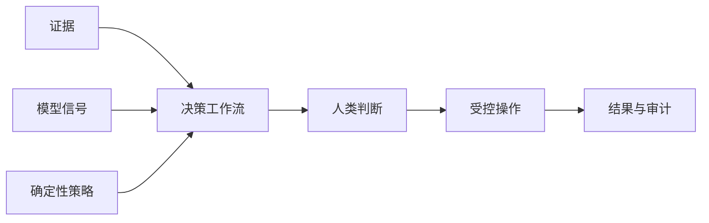

# 01：企业 AI 基础

English: [README.md](README.md) | 实验：[lab.zh.md](lab.zh.md)

## 5W + How

- **What：** 企业 AI 系统组合确定性软件、概率模型、数据、策略、人类与运营。
- **Why：** 分离职责可以防止模型能力静默变成业务权限。
- **Who：** 领域 Owner、产品、工程、平台、安全、隐私、法务、风险、SRE、客服与审批者。
- **When：** 选择模型或 Framework 前先建立边界；没有可度量决策改善时应停止。
- **Where：** 模型在受控工作流内提出建议；策略负责授权；高影响结果仍由人类负责。
- **How：** 映射结果、证据、参与者、权限、风险、控制、SLO 与退役标准。



## 代码

```python
from xingai_enterprise_poc.models import Actor

actor = Actor("user-1", "tenant-a", frozenset({"adjuster"}), frozenset({"knowledge:read"}))
assert actor.tenant_id == "tenant-a"
```

阅读 `models.py` 与 `workflow.py`，指出 Evidence、Authority、Recommendation、State 与 Audit Correlation 字段。

## 故障与面试门槛

典型故障：Chatbot-first、无责任 Owner、结果未定义、把模型输出当授权、无退役标准。先向初学者讲解架构，再向架构评审委员会答辩为什么模型不能直接执行付款。

