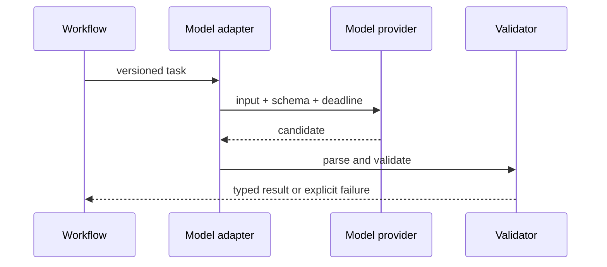

# 02: Production LLM Application Engineering

Chinese: [README.zh.md](README.zh.md) | Lab: [lab.md](lab.md)

## 5W + How

- **What:** a model adapter converts a versioned task contract into validated candidate output.
- **Why:** schemas, timeouts, retries, versioning, and evals make provider behavior operable.
- **Who:** application engineers own integration; product owns task success; risk owns prohibited outcomes.
- **When:** use models for language/multimodal judgment, not exact authorization or arithmetic.
- **Where:** behind a typed service boundary and outside irreversible transactions.
- **How:** baseline, schema, model selection by eval, validation, bounded retry, fallback, trace, release gate.



## Code

```python
class ModelAdapter:
    def next_action(self, *, goal: str, observations: tuple[dict, ...]) -> dict:
        return {"type": "final", "answer": f"candidate:{goal}"}

assert ModelAdapter().next_action(goal="claim-7", observations=())["type"] == "final"
```

The adapter is a port, not business logic. Provider-specific features remain behind it and are evaluated before promotion.

## Failure And Interview Gate

Test malformed output, timeout, rate limit, model upgrade, PII logging, and fallback divergence. Design a model gateway at 1,000 requests/second, then explain unit economics and vendor exit criteria to a CTO.

