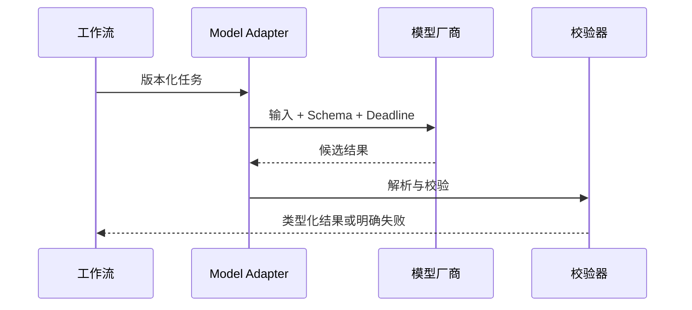

# 02：生产级 LLM 应用工程

English: [README.md](README.md) | 实验：[lab.zh.md](lab.zh.md)

## 5W + How

- **What：** Model Adapter 把版本化任务契约转换成已校验候选结果。
- **Why：** Schema、超时、重试、版本和评估让厂商行为可运营。
- **Who：** 应用工程师负责集成；产品负责任务成功；风险团队负责禁止结果。
- **When：** 语言/多模态判断使用模型；精确授权或计算不要使用模型。
- **Where：** 位于类型化服务边界之后，并置于不可逆事务之外。
- **How：** Baseline、Schema、以评估选模型、校验、有限重试、Fallback、Trace 与发布门禁。



## 代码

```python
class ModelAdapter:
    def next_action(self, *, goal: str, observations: tuple[dict, ...]) -> dict:
        return {"type": "final", "answer": f"candidate:{goal}"}

assert ModelAdapter().next_action(goal="claim-7", observations=())["type"] == "final"
```

Adapter 是 Port，不是业务逻辑。厂商特性保留在 Adapter 后，并在推广前完成评估。

## 故障与面试门槛

测试畸形输出、超时、限流、模型升级、PII 日志与 Fallback 行为分歧。设计每秒 1,000 请求的 Model Gateway，再向 CTO 解释单位经济性和厂商退出标准。

