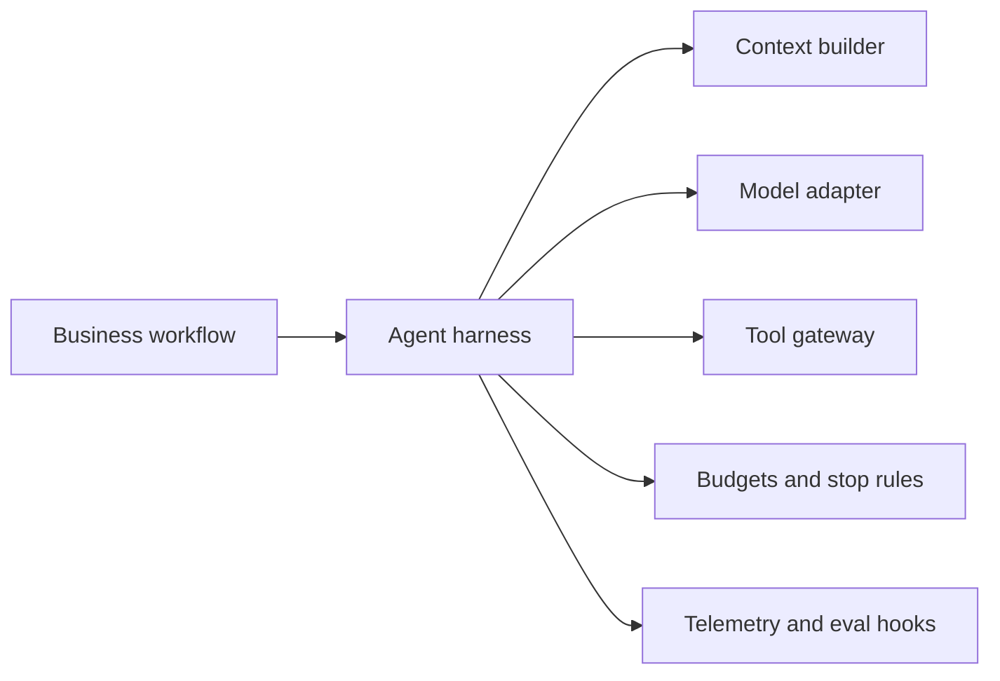

# 03: Context And Harness Engineering

Chinese: [README.zh.md](README.zh.md) | Lab: [lab.md](lab.md)

## 5W + How

- **What:** the harness assembles context and controls model execution, tools, budgets, validation, telemetry, and termination.
- **Why:** prompts alone cannot enforce authority, cost, or reliable stopping.
- **Who:** platform owns the harness; domain teams supply task contracts; security supplies policy; operations owns limits.
- **When:** introduce a harness when model work uses tools, state, retries, or consequential data.
- **Where:** between workflow and model/tool adapters; it does not own business sequencing.
- **How:** construct minimal context, allowlist tools, enforce deadlines and budgets, validate actions, trace, stop safely.



## Code

```python
from xingai_enterprise_poc.harness import HarnessBudget

budget = HarnessBudget(max_steps=5, max_tool_calls=3)
assert budget.max_tool_calls < budget.max_steps
```

Study `harness.py`: deadlines are checked at every step, tools are policy-gated, and unsupported actions fail closed.

## Failure And Interview Gate

Threats: context poisoning, excessive context, hidden tool authority, recursive loops, budget bypass, and trace leakage. Explain why the harness controls execution while the orchestrator controls the business process.

