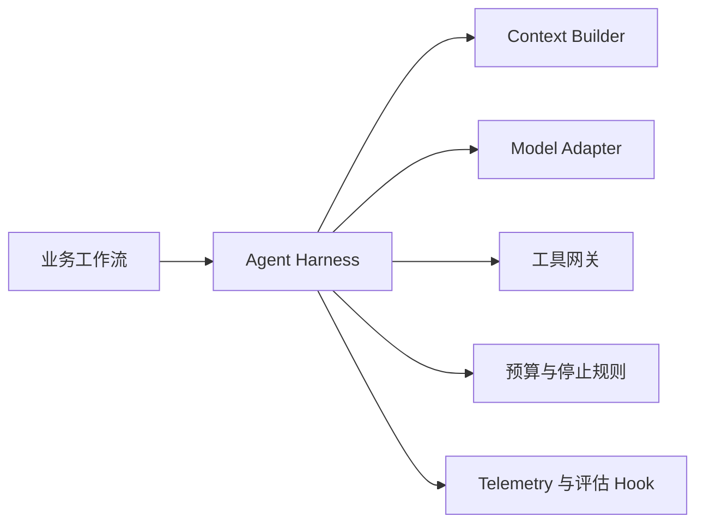

# 03：Context 与 Harness Engineering

English: [README.md](README.md) | 实验：[lab.zh.md](lab.zh.md)

## 5W + How

- **What：** Harness 组装 Context，并控制模型执行、工具、预算、校验、Telemetry 与终止。
- **Why：** Prompt 无法单独执行权限、成本或可靠停止。
- **Who：** 平台团队负责 Harness；领域团队提供任务契约；安全团队提供策略；运营团队负责限制。
- **When：** 模型工作涉及工具、状态、重试或高影响数据时引入 Harness。
- **Where：** 位于 Workflow 与 Model/Tool Adapter 之间；不负责业务顺序。
- **How：** 构造最小 Context，Allowlist 工具，执行 Deadline 与预算，校验 Action，Trace，并安全停止。



## 代码

```python
from xingai_enterprise_poc.harness import HarnessBudget

budget = HarnessBudget(max_steps=5, max_tool_calls=3)
assert budget.max_tool_calls < budget.max_steps
```

阅读 `harness.py`：每一步检查 Deadline，工具经过策略 Gate，不支持的 Action 默认失败。

## 故障与面试门槛

威胁包括 Context 投毒、上下文过量、隐藏工具权限、递归 Loop、预算绕过和 Trace 泄露。解释为什么 Harness 控制执行，而 Orchestrator 控制业务流程。

