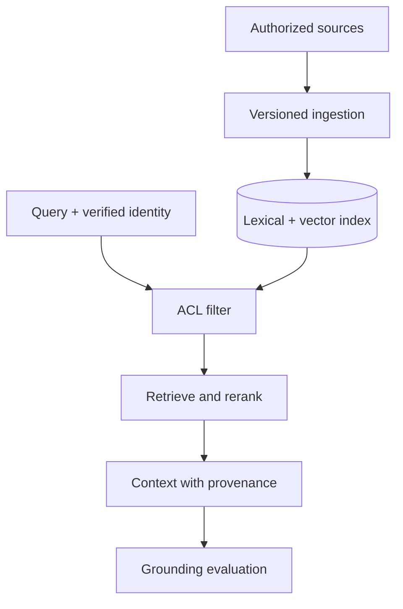

# 04: Enterprise RAG

Chinese: [README.zh.md](README.zh.md) | Lab: [lab.md](lab.md)

## 5W + How

- **What:** enterprise RAG is a governed ingestion and retrieval system that returns authorized, versioned evidence for generation or decisions.
- **Why:** grounding and freshness require provenance, ACLs, deletion, and stage-level evaluation, not only vector similarity.
- **Who:** content owners govern sources; identity/policy controls access; platform owns indexing; product owns answer outcomes.
- **When:** use for changing/private knowledge; use databases for exact records and fine-tuning for behavior.
- **Where:** ingestion is asynchronous; authorization precedes ranking in the online path.
- **How:** parse, classify, version, chunk, index, filter, retrieve, rerank, cite, evaluate, delete, and reindex.



## Code

```python
results = retriever.retrieve("claim policy", context)
assert all(item.document_id for item in results)
assert all(item.version >= 1 for item in results)
```

`rag.py` intentionally uses a lexical baseline. Replace ranking only after ACL and provenance tests remain green.

## Failure And Interview Gate

Test cross-tenant leakage, stale versions, deletion failure, poisoned documents, OCR corruption, unsupported citations, low recall, and overstuffed context. Defend hybrid retrieval, reranking, and evaluation choices.

