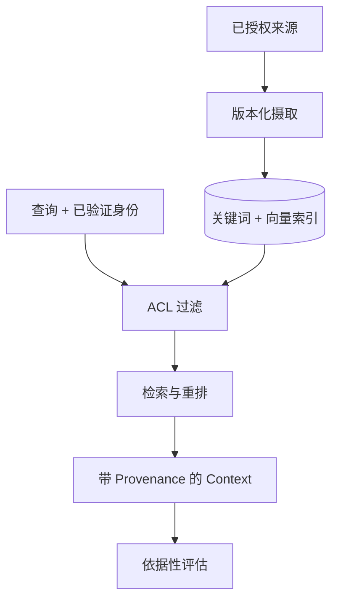

# 04：企业 RAG

English: [README.md](README.md) | 实验：[lab.zh.md](lab.zh.md)

## 5W + How

- **What：** 企业 RAG 是受治理的摄取与检索系统，为生成或决策返回有权限、带版本的证据。
- **Why：** Grounding 与新鲜度需要 Provenance、ACL、删除和分阶段评估，而不只是向量相似度。
- **Who：** 内容 Owner 治理来源；身份/策略控制访问；平台负责索引；产品负责答案结果。
- **When：** 变化/私有知识使用 RAG；精确记录用数据库，行为调整用 Fine-tuning。
- **Where：** 摄取异步执行；在线路径在排序前授权。
- **How：** 解析、分类、版本化、切块、索引、过滤、检索、重排、引用、评估、删除和重建索引。



## 代码

```python
results = retriever.retrieve("claim policy", context)
assert all(item.document_id for item in results)
assert all(item.version >= 1 for item in results)
```

`rag.py` 有意使用关键词 Baseline。只有 ACL 和 Provenance 测试保持通过后，才替换 Ranking。

## 故障与面试门槛

测试跨 Tenant 泄露、旧版本、删除失败、文档投毒、OCR 损坏、无依据引用、低 Recall 与 Context 过载。答辩混合检索、Reranker 与评估选择。

