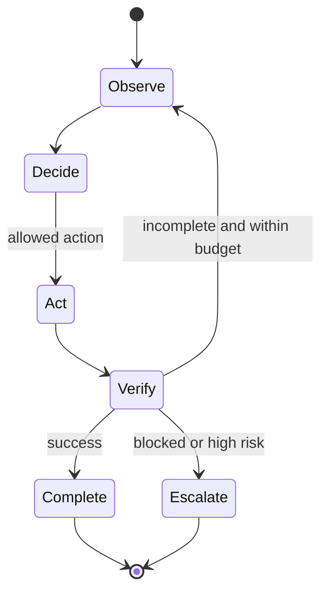

# 05: Loop Engineering

Chinese: [README.zh.md](README.zh.md) | Lab: [lab.md](lab.md)

## 5W + How

- **What:** a loop repeats observe, decide, act, and verify until a declared terminal condition.
- **Why:** explicit loops make progress, limits, interruption, recovery, and accountability testable.
- **Who:** workflow owners define state; platform enforces budgets; domain reviewers define verification and escalation.
- **When:** use for iterative work with measurable progress; avoid loops when one deterministic call suffices.
- **Where:** state transitions belong in the orchestrator; model iteration belongs inside the harness.
- **How:** define entry, state, actions, invariant, progress, budget, stop, escalation, checkpoint, and replay.



## Code

```python
from xingai_enterprise_poc.loops import LoopState, WorkflowState

state = LoopState()
state.transition(WorkflowState.RESEARCH)
assert state.revision == 1
```

## Failure And Interview Gate

Prevent no-progress loops, cyclic delegation, repeated writes, stale observations, retry storms, and unbounded proactive work. Compare turn, goal, event, time, approval-interrupted, verification, and recovery loops; explain their stop evidence.

