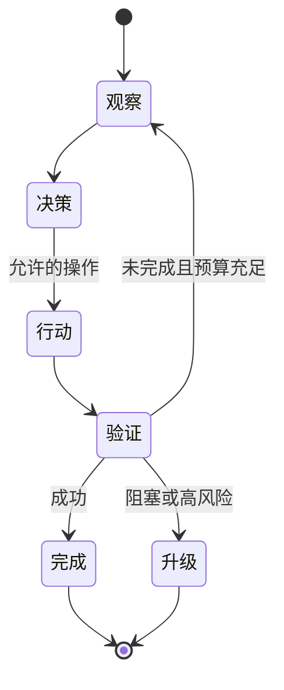

# 05：Loop Engineering

English: [README.md](README.md) | 实验：[lab.zh.md](lab.zh.md)

## 5W + How

- **What：** Loop 重复 Observe、Decide、Act、Verify，直到声明的终止条件成立。
- **Why：** 显式 Loop 让进度、限制、中断、恢复与责任可测试。
- **Who：** Workflow Owner 定义状态；平台执行预算；领域评审者定义验证与升级。
- **When：** 有可度量进度的迭代任务使用 Loop；一次确定性调用足够时不要使用。
- **Where：** 状态转换属于 Orchestrator；模型迭代属于 Harness。
- **How：** 定义入口、状态、Action、不变量、进度、预算、停止、升级、Checkpoint 与 Replay。



## 代码

```python
from xingai_enterprise_poc.loops import LoopState, WorkflowState

state = LoopState()
state.transition(WorkflowState.RESEARCH)
assert state.revision == 1
```

## 故障与面试门槛

防止无进度循环、循环委派、重复写入、过期观察、Retry Storm 与无边界 Proactive Work。比较 Turn、Goal、Event、Time、审批中断、验证与恢复 Loop，并说明各自停止证据。

