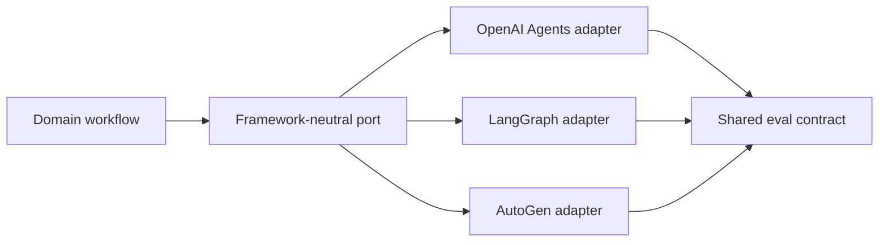

# 06: Agent Framework Engineering

Chinese: [README.zh.md](README.zh.md) | Lab: [lab.md](lab.md)

## 5W + How

- **What:** agent frameworks package model calls, tools, state, handoffs, guardrails, and traces; they do not own domain accountability.
- **Why:** frameworks accelerate implementation but can hide control flow and create lock-in.
- **Who:** platform engineers own adapters and upgrades; domain teams own task contracts; security reviews framework behavior.
- **When:** adopt after a framework-free baseline reveals a durable need.
- **Where:** behind `ModelAdapter`/runtime ports, outside core domain schemas and policy.
- **How:** compare OpenAI Agents SDK, LangGraph, AutoGen, and framework-free execution using one eval set.



## Code

```python
from typing import Protocol

class AgentRuntime(Protocol):
    def run(self, goal: str, context: object) -> dict: ...
```

## Failure And Interview Gate

Evaluate hidden retries, state ownership, serialization, trace portability, provider coupling, concurrency, sandboxing, and upgrade risk. The interview answer must select a framework from requirements, not popularity.

## Sources

[OpenAI Agents](https://developers.openai.com/api/docs/guides/agents-sdk) · [LangGraph](https://docs.langchain.com/oss/python/langgraph/overview) · [AutoGen](https://microsoft.github.io/autogen/stable/)

