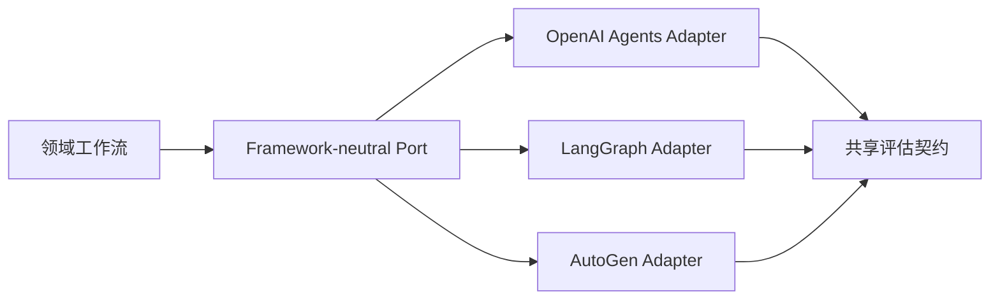

# 06：Agent Framework Engineering

English: [README.md](README.md) | 实验：[lab.zh.md](lab.zh.md)

## 5W + How

- **What：** Agent Framework 封装模型调用、工具、状态、Handoff、Guardrail 与 Trace；不承担领域责任。
- **Why：** Framework 加快实现，但可能隐藏控制流并造成 Lock-in。
- **Who：** 平台工程师负责 Adapter 与升级；领域团队负责任务契约；安全团队评审 Framework 行为。
- **When：** Framework-free Baseline 证明有持久需求后再采用。
- **Where：** 位于 `ModelAdapter`/Runtime Port 之后，不进入领域 Schema 与策略核心。
- **How：** 用同一评估集比较 OpenAI Agents SDK、LangGraph、AutoGen 与 Framework-free 执行。



## 代码

```python
from typing import Protocol

class AgentRuntime(Protocol):
    def run(self, goal: str, context: object) -> dict: ...
```

## 故障与面试门槛

评估隐藏重试、状态所有权、序列化、Trace 可迁移性、厂商耦合、并发、Sandbox 与升级风险。面试答案必须从需求选择 Framework，而不是从流行度选择。

## 参考资料

[OpenAI Agents](https://developers.openai.com/api/docs/guides/agents-sdk) · [LangGraph](https://docs.langchain.com/oss/python/langgraph/overview) · [AutoGen](https://microsoft.github.io/autogen/stable/)

