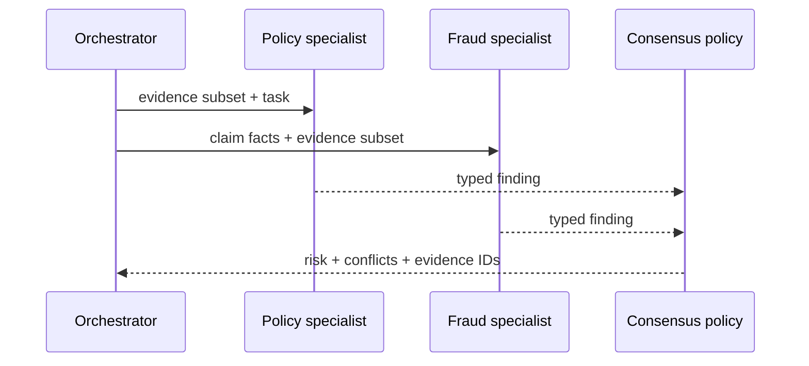

# 07: Controlled Multi-Agent Systems

Chinese: [README.zh.md](README.zh.md) | Lab: [lab.md](lab.md)

## 5W + How

- **What:** multiple bounded specialists produce typed findings that an accountable workflow combines.
- **Why:** specialization, trust separation, and parallel evidence review can help; conversation alone does not.
- **Who:** each specialist has an owner, inputs, output schema, authority, budget, and escalation path.
- **When:** use only when separation creates measurable value over one workflow or model call.
- **Where:** specialists sit behind the orchestrator; shared evidence and decisions remain durable system records.
- **How:** route typed tasks, minimize shared context, validate handoffs, reconcile conflicts deterministically, trace, and stop.



## Code

```python
from xingai_enterprise_poc.agents import consensus, SpecialistResult
from xingai_enterprise_poc.models import Risk

result = SpecialistResult("fraud", "review", Risk.HIGH, ("doc-1",))
assert consensus((result,)) == Risk.HIGH
```

## Failure And Interview Gate

Test cyclic delegation, conflicting findings, stale evidence, duplicated specialists, shared-memory poisoning, partial completion, and no accountable outcome owner. Defend multi-agent versus parallel deterministic checks.

