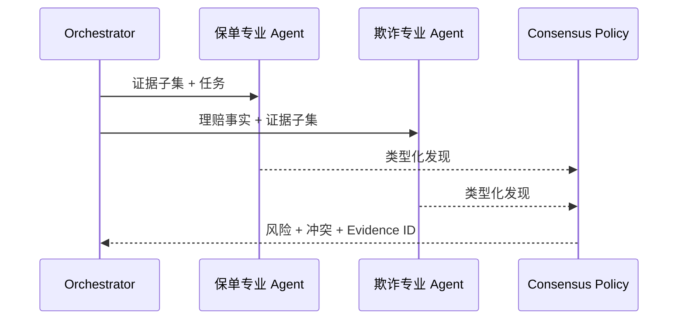

# 07：受控多 Agent 系统

English: [README.md](README.md) | 实验：[lab.zh.md](lab.zh.md)

## 5W + How

- **What：** 多个边界明确的专业 Agent 生成类型化发现，由有责任的 Workflow 组合。
- **Why：** 专业化、信任隔离和平行证据评审可能有价值；仅增加对话没有价值。
- **Who：** 每个专业 Agent 都有 Owner、输入、输出 Schema、权限、预算与升级路径。
- **When：** 只有相比单工作流或单模型调用产生可度量价值时使用。
- **Where：** 专业 Agent 位于 Orchestrator 后；共享证据与决策保留为 Durable Record。
- **How：** 路由类型化任务，最小化共享 Context，校验 Handoff，以确定性规则解决冲突，Trace 并停止。



## 代码

```python
from xingai_enterprise_poc.agents import consensus, SpecialistResult
from xingai_enterprise_poc.models import Risk

result = SpecialistResult("fraud", "review", Risk.HIGH, ("doc-1",))
assert consensus((result,)) == Risk.HIGH
```

## 故障与面试门槛

测试循环委派、发现冲突、过期证据、重复专业 Agent、共享记忆投毒、部分完成与无结果 Owner。答辩多 Agent 与并行确定性检查的选择。

