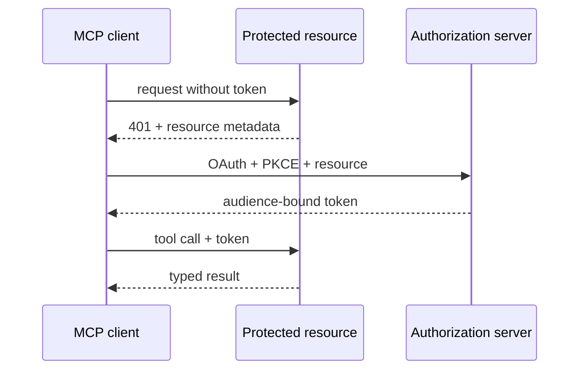

# 08: Enterprise MCP Engineering

Chinese: [README.zh.md](README.zh.md) | Lab: [lab.md](lab.md)

## 5W + How

- **What:** MCP standardizes client/server discovery and invocation of tools, resources, and prompts.
- **Why:** shared protocol contracts reduce bespoke model integrations while retaining capability and trust boundaries.
- **Who:** host, client, server, authorization server, resource owner, security reviewer, and consenting user.
- **When:** use when compatible hosts need governed capabilities; keep a direct API for one tightly controlled integration when simpler.
- **Where:** at the model integration edge, not as business orchestrator, policy engine, or domain API replacement.
- **How:** initialize, negotiate, discover, validate, authenticate, authorize for resource/audience/scope, execute, trace, and audit.



## Code

```python
definitions = mcp_server.list_tools()
assert all(item.input_schema["additionalProperties"] is False for item in definitions)
```

## Failure And Interview Gate

Test token passthrough, wrong audience, missing resource indicator, scope escalation, SSRF, tool-description poisoning, server replacement, consent mismatch, and write-tool approval. Explain MCP versus API gateway, orchestrator, and A2A.

## Source

[MCP specification](https://modelcontextprotocol.io/specification) · [Authorization](https://modelcontextprotocol.io/specification/2025-11-25/basic/authorization)

