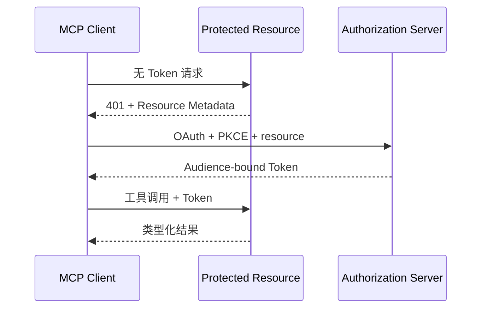

# 08：企业 MCP 工程

English: [README.md](README.md) | 实验：[lab.zh.md](lab.zh.md)

## 5W + How

- **What：** MCP 标准化 Client/Server 对工具、资源和 Prompt 的发现与调用。
- **Why：** 共享协议契约减少定制模型集成，同时保留能力与信任边界。
- **Who：** Host、Client、Server、Authorization Server、Resource Owner、安全评审者与授权用户。
- **When：** 兼容 Host 需要受治理能力时使用；单一严格受控集成在直接 API 更简单时保留 API。
- **Where：** 位于模型集成边缘，不替代业务 Orchestrator、Policy Engine 或领域 API。
- **How：** 初始化、协商、发现、校验、认证、按 Resource/Audience/Scope 授权、执行、Trace 与审计。



## 代码

```python
definitions = mcp_server.list_tools()
assert all(item.input_schema["additionalProperties"] is False for item in definitions)
```

## 故障与面试门槛

测试 Token 透传、错误 Audience、缺少 Resource Indicator、Scope 提权、SSRF、工具描述投毒、Server 替换、Consent 不一致与写工具审批。解释 MCP 与 API Gateway、Orchestrator、A2A 的区别。

## 参考资料

[MCP Specification](https://modelcontextprotocol.io/specification) · [Authorization](https://modelcontextprotocol.io/specification/2025-11-25/basic/authorization)

