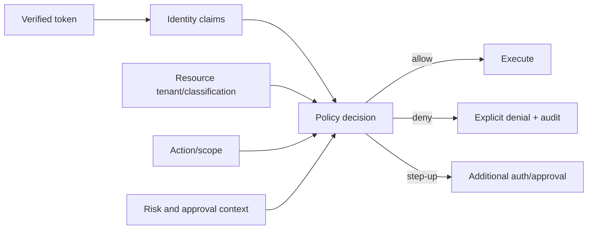

# 09: Authentication And Authorization

Chinese: [README.zh.md](README.zh.md) | Lab: [lab.md](lab.md)

## 5W + How

- **What:** authentication establishes actor identity; authorization decides whether that actor may perform an action on a resource in context.
- **Why:** model intent, UI visibility, and successful authentication never imply business authority.
- **Who:** identity provider, client, resource server, policy owner, resource owner, approver, workload identity, and auditor.
- **When:** authenticate every boundary and authorize every protected read/write; require step-up for added authority.
- **Where:** token verification occurs at the resource boundary; policy uses verified identity plus resource/action/context.
- **How:** OIDC/OAuth, PKCE, issuer/signature/expiry/audience validation, tenant binding, RBAC, ABAC, scopes, approval, deny by default.



## Code

```python
request = AuthorizationRequest(actor, "document.read", "tenant-a", "knowledge:read")
PolicyEngine().authorize(request)  # returns only by allowing; otherwise raises
```

## Failure And Interview Gate

Test expired/wrong-audience tokens, cross-tenant access, missing scope, confused deputy, service/user identity mix-up, privilege drift, and TOCTOU between approval and execution. Design RBAC + ABAC without encoding policy in prompts.

Full specialization: [Course 10 — OAuth, OIDC, Azure Identity & API Security](../../courses/10-oauth-oidc-azure-identity/README.md).

