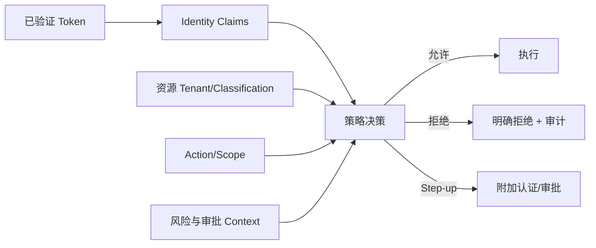

# 09：认证与授权

English: [README.md](README.md) | 实验：[lab.zh.md](lab.zh.md)

## 5W + How

- **What：** Authentication 建立 Actor 身份；Authorization 决定该 Actor 在上下文中是否可对资源执行 Action。
- **Why：** 模型意图、UI 可见性与认证成功都不代表业务权限。
- **Who：** Identity Provider、Client、Resource Server、Policy Owner、Resource Owner、审批者、Workload Identity 与审计者。
- **When：** 每个边界认证，每个受保护读写授权；增加权限时要求 Step-up。
- **Where：** Token 校验发生在资源边界；Policy 使用已验证身份和 Resource/Action/Context。
- **How：** OIDC/OAuth、PKCE、Issuer/Signature/Expiry/Audience 校验、Tenant Binding、RBAC、ABAC、Scope、审批与默认拒绝。



## 代码

```python
request = AuthorizationRequest(actor, "document.read", "tenant-a", "knowledge:read")
PolicyEngine().authorize(request)  # 允许时返回，否则抛出异常
```

## 故障与面试门槛

测试过期/错误 Audience Token、跨 Tenant、缺 Scope、Confused Deputy、Service/User 身份混淆、权限漂移及审批到执行之间的 TOCTOU。设计 RBAC + ABAC，不得把策略编码在 Prompt 中。

完整专项：[课程 10 — OAuth、OIDC、Azure 身份与 API 安全](../../courses/10-oauth-oidc-azure-identity/README.zh.md)。

