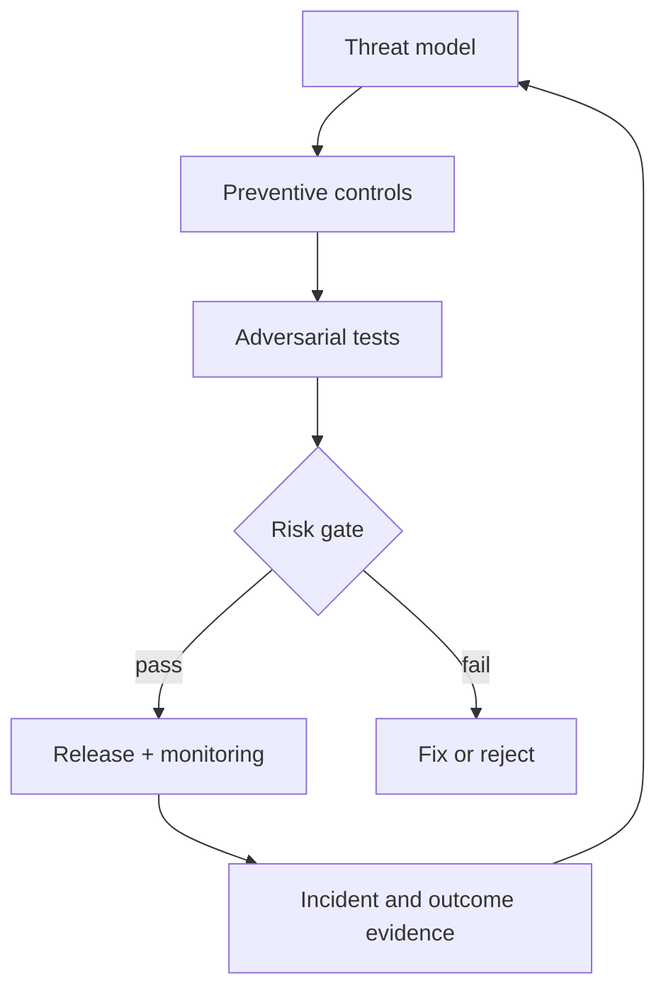

# 10: AI Security And Governance

Chinese: [README.zh.md](README.zh.md) | Lab: [lab.md](lab.md)

## 5W + How

- **What:** security prevents unauthorized harm; governance assigns outcomes, evidence, review, risk tolerance, and change authority across the lifecycle.
- **Why:** probabilistic behavior and tool access add threats beyond ordinary application security.
- **Who:** domain owner, security, privacy, legal, model risk, platform, red team, approvers, incident command, and affected users.
- **When:** threat-model before design; red-team before release and after material model/data/tool/policy changes.
- **Where:** controls span input, retrieval, context, model, tools, identity, runtime, UI, infrastructure, and people.
- **How:** Govern, Map, Measure, Manage; classify risks; reduce authority; layer controls; test; accept residual risk explicitly; monitor and retire.



## Code

```python
if tool.write and not approved:
    raise PermissionError("write tool requires explicit approval")
```

## Failure And Interview Gate

Cover direct/indirect prompt injection, data exfiltration, excessive agency, insecure output handling, SSRF, supply-chain risk, model denial of service, sensitive disclosure, automation bias, and insecure plugin/MCP trust. Present residual risk, not “secure by prompt.”

## Sources

[NIST AI RMF](https://www.nist.gov/itl/ai-risk-management-framework) · [NIST GenAI Profile](https://nvlpubs.nist.gov/nistpubs/ai/NIST.AI.600-1.pdf) · [OWASP GenAI](https://genai.owasp.org/)

