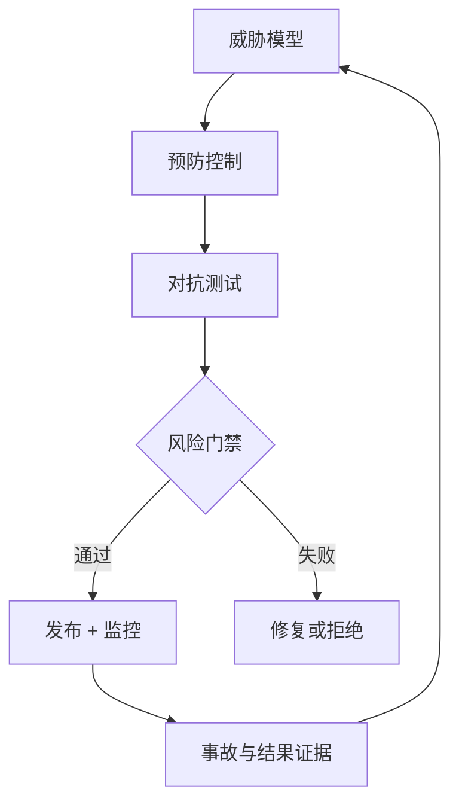

# 10：AI 安全与治理

English: [README.md](README.md) | 实验：[lab.zh.md](lab.zh.md)

## 5W + How

- **What：** 安全防止未授权伤害；治理在全生命周期分配结果责任、证据、评审、风险容忍与变更权限。
- **Why：** 概率行为和工具访问带来超出普通应用安全的威胁。
- **Who：** 领域 Owner、安全、隐私、法务、模型风险、平台、红队、审批者、Incident Command 与受影响用户。
- **When：** 设计前做 Threat Model；发布前及模型/数据/工具/策略重大变更后做红队。
- **Where：** 控制覆盖输入、检索、Context、模型、工具、身份、Runtime、UI、基础设施与人员。
- **How：** Govern、Map、Measure、Manage；风险分类；缩小权限；分层控制；测试；显式接受剩余风险；监控与退役。



## 代码

```python
if tool.write and not approved:
    raise PermissionError("write tool requires explicit approval")
```

## 故障与面试门槛

覆盖直接/间接 Prompt Injection、数据外泄、Excessive Agency、不安全输出处理、SSRF、供应链风险、Model DoS、敏感信息披露、Automation Bias 与不安全 Plugin/MCP 信任。应展示剩余风险，而不是“用 Prompt 保证安全”。

## 参考资料

[NIST AI RMF](https://www.nist.gov/itl/ai-risk-management-framework) · [NIST GenAI Profile](https://nvlpubs.nist.gov/nistpubs/ai/NIST.AI.600-1.pdf) · [OWASP GenAI](https://genai.owasp.org/)

