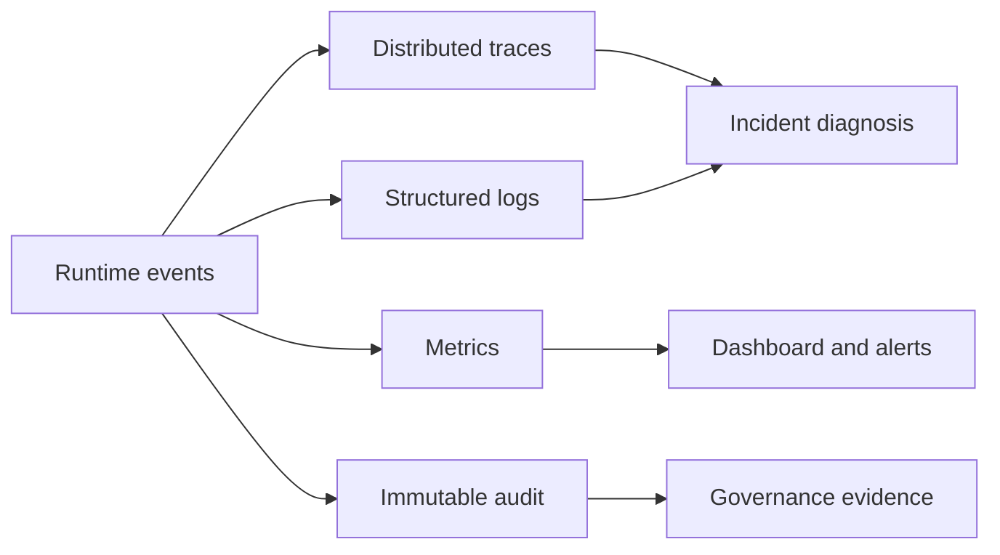

# 11: Monitoring, Logging, Tracing, And Audit

Chinese: [README.zh.md](README.zh.md) | Lab: [lab.md](lab.md)

## 5W + How

- **What:** metrics detect trends, logs diagnose events, traces reconstruct executions, and audit proves accountable actions.
- **Why:** AI quality, authority, cost, and business outcomes fail differently and require different evidence.
- **Who:** SRE owns health, engineering diagnoses, security investigates, auditors verify, product owns outcome metrics.
- **When:** instrument before testing; define alerts before launch; preserve audit according to policy.
- **Where:** propagate one correlation ID across workflow, retrieval, model, agent, MCP, policy, approval, and execution.
- **How:** define semantic events, redact, emit metrics/spans/logs, append audit, build SLOs/dashboards, alert, replay, retain, delete.



## Code

```python
with telemetry.trace("claim.propose", context.correlation_id):
    decision = workflow.propose("claim-7", 1000, context)
assert telemetry.spans[-1].success
```

## Failure And Interview Gate

Avoid secrets/PII in telemetry, unbounded cardinality, missing trace propagation, mutable audit, local timestamps without ordering, audit-as-debug-log, and alerts without owners. Explain why a successful trace is not proof of a correct business outcome.

