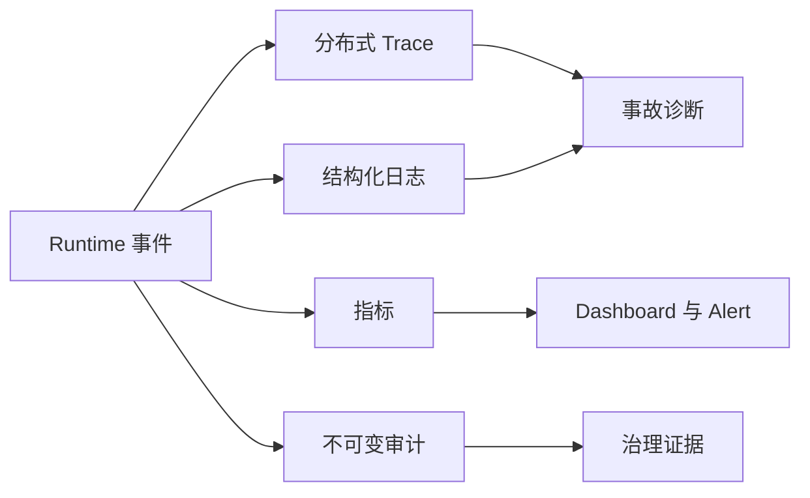

# 11：监控、日志、Trace 与审计

English: [README.md](README.md) | 实验：[lab.zh.md](lab.zh.md)

## 5W + How

- **What：** Metrics 发现趋势，Logs 诊断事件，Traces 重建执行，Audit 证明可问责操作。
- **Why：** AI 质量、权限、成本与业务结果的失败方式不同，需要不同证据。
- **Who：** SRE 负责健康，工程团队诊断，安全团队调查，审计验证，产品负责结果指标。
- **When：** 测试前埋点；上线前定义 Alert；按策略保留 Audit。
- **Where：** 在 Workflow、Retrieval、Model、Agent、MCP、Policy、Approval 与 Execution 间传播同一 Correlation ID。
- **How：** 定义语义事件、脱敏、发送 Metric/Span/Log、追加 Audit、建立 SLO/Dashboard、Alert、Replay、保留与删除。



## 代码

```python
with telemetry.trace("claim.propose", context.correlation_id):
    decision = workflow.propose("claim-7", 1000, context)
assert telemetry.spans[-1].success
```

## 故障与面试门槛

避免 Telemetry 中的 Secret/PII、无界 Cardinality、Trace 传播缺失、可修改 Audit、只有本地时间无排序、把 Audit 当 Debug Log，以及无人负责的 Alert。解释为什么成功 Trace 不能证明业务结果正确。

