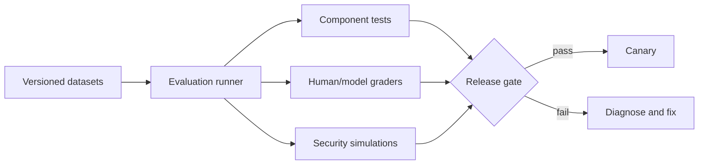

# 12: Evaluation, Testing, And Agent Harness Validation

Chinese: [README.zh.md](README.zh.md) | Lab: [lab.md](lab.md)

## 5W + How

- **What:** evaluation measures probabilistic behavior; tests verify deterministic contracts; simulation and replay examine complete trajectories.
- **Why:** task success alone can hide leakage, unsafe actions, cost, brittle retrieval, and regressions.
- **Who:** domain experts label outcomes; engineers build runners; security owns adversarial suites; release owners enforce gates.
- **When:** create the baseline before implementation, run on every material change, and monitor outcome drift after release.
- **Where:** separate model, retrieval, tool, trajectory, policy, security, operational, and business-outcome layers.
- **How:** define datasets and slices, deterministic fixtures, graders, human calibration, thresholds, uncertainty, regression reports, and promotion gates.



## Code

```python
def release_allowed(success: float, unsafe: float, p95_ms: float) -> bool:
    return success >= 0.90 and unsafe == 0 and p95_ms <= 2500

assert release_allowed(0.92, 0, 1800)
```

## Failure And Interview Gate

Guard against test leakage, nonrepresentative data, judge bias, metric gaming, unstable cases, average-only reporting, and changing multiple variables at once. Explain confidence intervals, slice analysis, disagreements, and why zero observed incidents is not proof of zero risk.

## Source

[OpenAI evals](https://developers.openai.com/api/docs/guides/evals)

