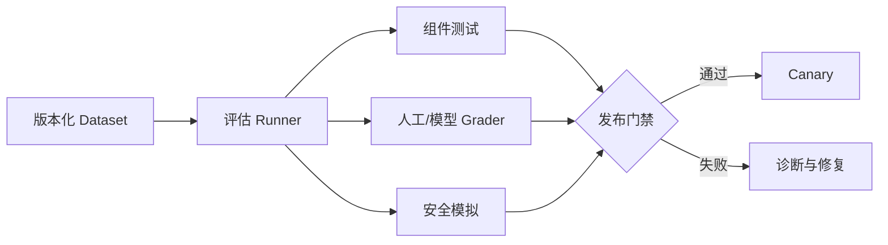

# 12：评估、测试与 Agent Harness 验证

English: [README.md](README.md) | 实验：[lab.zh.md](lab.zh.md)

## 5W + How

- **What：** Evaluation 度量概率行为；Tests 验证确定性契约；Simulation 与 Replay 检查完整 Trajectory。
- **Why：** 仅看任务成功会隐藏泄露、不安全操作、成本、脆弱检索与回归。
- **Who：** 领域专家标注结果；工程团队构建 Runner；安全团队负责对抗 Suite；发布 Owner 执行 Gate。
- **When：** 实现前建立 Baseline，每次重大变更运行，发布后监控 Outcome Drift。
- **Where：** 分离 Model、Retrieval、Tool、Trajectory、Policy、Security、Operations 与 Business Outcome 层。
- **How：** 定义 Dataset 与 Slice、确定性 Fixture、Grader、人工校准、Threshold、不确定性、回归报告与 Promotion Gate。



## 代码

```python
def release_allowed(success: float, unsafe: float, p95_ms: float) -> bool:
    return success >= 0.90 and unsafe == 0 and p95_ms <= 2500

assert release_allowed(0.92, 0, 1800)
```

## 故障与面试门槛

防止测试泄露、数据不具代表性、Judge 偏差、Metric Gaming、不稳定案例、只报告平均值与同时改变多个变量。解释置信区间、Slice Analysis、分歧，以及为什么零观测事故不能证明零风险。

## 参考资料

[OpenAI Evals](https://developers.openai.com/api/docs/guides/evals)

