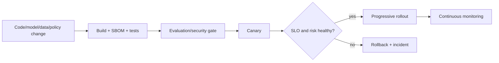

# 13: Production Operations And Reliability

Chinese: [README.zh.md](README.zh.md) | Lab: [lab.md](lab.md)

## 5W + How

- **What:** production operations keep AI services available, safe, recoverable, cost-bounded, and change-controlled.
- **Why:** model quality is irrelevant when queues stall, writes duplicate, secrets leak, or rollback cannot restore behavior.
- **Who:** service owner, SRE, platform, security, data owner, model owner, incident commander, support, and change approver.
- **When:** define SLOs/runbooks before launch; rehearse recovery; canary every material model, prompt, data, policy, or tool change.
- **Where:** controls span CI/CD, artifacts, identity, secrets, network, compute, queues, storage, telemetry, dependencies, and support.
- **How:** capacity model, idempotency, backpressure, timeout, retry, circuit breaker, backup/restore, canary, rollback, incident, postmortem.



## Code

```yaml
securityContext:
  allowPrivilegeEscalation: false
  readOnlyRootFilesystem: true
  runAsNonRoot: true
```

See `enterprise-poc/Dockerfile`, `compose.yaml`, and `deploy/k8s/reference-poc.yaml`.

## Failure And Interview Gate

Inject dependency timeout, queue overload, duplicate event, stale checkpoint, broken index, expired identity metadata, model degradation, and region loss. Define RTO/RPO, SLO/error budget, escalation, degraded behavior, rollback evidence, and accountable owner.

