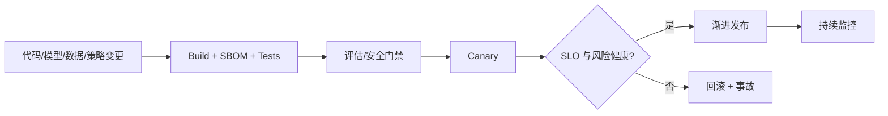

# 13：生产运营与可靠性

English: [README.md](README.md) | 实验：[lab.zh.md](lab.zh.md)

## 5W + How

- **What：** 生产运营让 AI 服务保持可用、安全、可恢复、成本有界且变更受控。
- **Why：** 队列阻塞、重复写入、Secret 泄露或无法回滚时，模型质量没有意义。
- **Who：** Service Owner、SRE、平台、安全、Data Owner、Model Owner、Incident Commander、客服与变更审批者。
- **When：** 上线前定义 SLO/Runbook；演练恢复；模型、Prompt、数据、策略或工具重大变更都进行 Canary。
- **Where：** 控制覆盖 CI/CD、Artifact、身份、Secret、网络、计算、队列、存储、Telemetry、依赖与客服。
- **How：** Capacity Model、幂等、Backpressure、Timeout、Retry、Circuit Breaker、Backup/Restore、Canary、Rollback、Incident 与 Postmortem。



## 代码

```yaml
securityContext:
  allowPrivilegeEscalation: false
  readOnlyRootFilesystem: true
  runAsNonRoot: true
```

参见 `enterprise-poc/Dockerfile`、`compose.yaml` 与 `deploy/k8s/reference-poc.yaml`。

## 故障与面试门槛

注入依赖超时、队列过载、重复事件、过期 Checkpoint、索引损坏、身份 Metadata 过期、模型退化与 Region 丢失。定义 RTO/RPO、SLO/Error Budget、升级、降级行为、回滚证据与责任 Owner。

