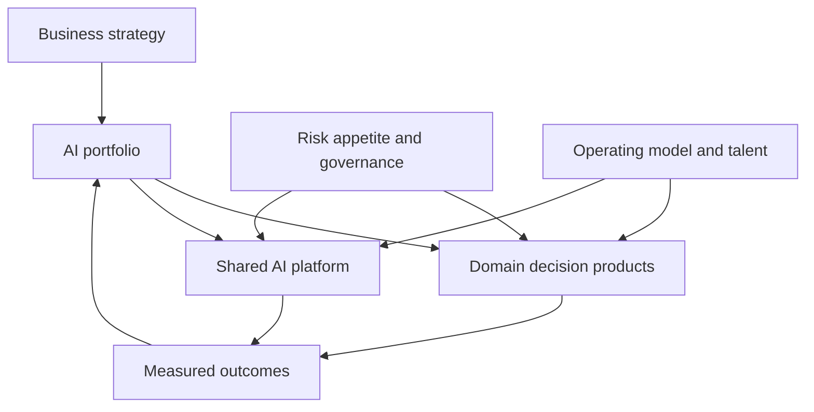

# 14: Enterprise Architecture And CTO Strategy

Chinese: [README.zh.md](README.zh.md) | Lab: [lab.md](lab.md)

## 5W + How

- **What:** enterprise AI architecture aligns domain decisions, shared platform capabilities, governance, economics, talent, and change.
- **Why:** sustainable advantage comes from improved outcomes and organizational learning, not demo volume or one vendor.
- **Who:** board sets risk appetite; CEO owns enterprise results; CTO owns technical strategy; domain leaders own adoption; control functions govern.
- **When:** invest when outcome, data, owner, adoption path, operating capability, and kill criteria exist.
- **Where:** centralize reusable controls/platform; keep domain decision ownership near the business; federate governance.
- **How:** portfolio map, risk/value/readiness scoring, build/buy/partner, reference architecture, operating model, economics, roadmap, review, stop.



## Code

```python
def portfolio_score(value: float, feasibility: float, readiness: float, risk: float) -> float:
    return round(.4 * value + .25 * feasibility + .2 * readiness - .15 * risk, 2)

assert portfolio_score(5, 4, 3, 2) == 3.3
```

Scores support accountable judgment; sensitivity-test weights and preserve dissent.

## Failure And Interview Gate

Avoid strategy by demo count, platform bottlenecks, shadow AI, ROI without baselines, governance detached from delivery, and lock-in without exit. Defend the reference POC, three-year portfolio, budget, operating model, incident response, regulatory change, and 40% budget reduction before a simulated board.

