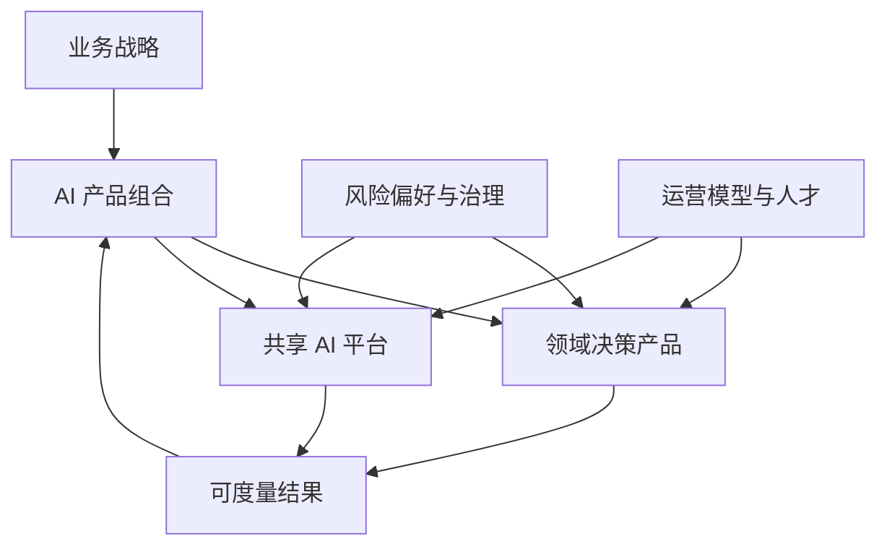

# 14：企业架构与 CTO 战略

English: [README.md](README.md) | 实验：[lab.zh.md](lab.zh.md)

## 5W + How

- **What：** 企业 AI 架构对齐领域决策、共享平台能力、治理、经济性、人才与变革。
- **Why：** 可持续优势来自结果改善与组织学习，而不是 Demo 数量或单一厂商。
- **Who：** 董事会设定风险偏好；CEO 负责企业结果；CTO 负责技术战略；领域负责人负责采用；控制职能负责治理。
- **When：** 结果、数据、Owner、采用路径、运营能力与终止标准齐备时投资。
- **Where：** 集中可复用控制/平台；领域决策责任靠近业务；治理采用联邦模式。
- **How：** Portfolio Map、Risk/Value/Readiness 评分、Build/Buy/Partner、参考架构、运营模型、经济性、路线图、评审与停止。



## 代码

```python
def portfolio_score(value: float, feasibility: float, readiness: float, risk: float) -> float:
    return round(.4 * value + .25 * feasibility + .2 * readiness - .15 * risk, 2)

assert portfolio_score(5, 4, 3, 2) == 3.3
```

分数用于支持有责任主体的判断；需要对权重做敏感性分析并保留不同意见。

## 故障与面试门槛

避免以 Demo 数量代替战略、平台成为瓶颈、Shadow AI、无 Baseline ROI、治理脱离交付及无退出方案 Lock-in。向模拟董事会答辩参考 POC、三年 Portfolio、预算、运营模型、事故响应、监管变化与预算削减 40%。

