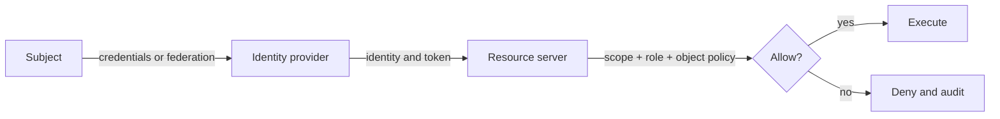

# 01: Identity Foundations

Chinese: [01-identity-foundations.zh.md](01-identity-foundations.zh.md)

## 5W + How
- **What:** authentication proves an identity; authorization decides an allowed action.
- **Why:** conflating them turns any valid account into excessive privilege.
- **Who:** human users, workloads, clients, resource servers, and policy owners.
- **When:** at sign-in and again for every protected operation.
- **Where:** identity provider authenticates; the resource enforces authorization.
- **How:** establish identity, validate context, evaluate policy, then record the decision.



```python
def decide(subject: dict, action: str, claim: dict) -> bool:
    authenticated = bool(subject.get("sub"))
    owns_object = subject.get("tenant_id") == claim.get("tenant_id")
    return authenticated and action in subject.get("actions", []) and owns_object
```

## Failure And Interview Gate
Reject “the user logged in” as an authorization argument. Explain OAuth 2.0 (delegated access), OIDC (identity over OAuth), and why the API owns the final decision.

