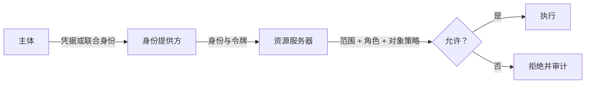

# 01：身份基础

English: [01-identity-foundations.md](01-identity-foundations.md)

## 5W + How
- **What（什么）：** 认证证明身份；授权决定某项操作是否允许。
- **Why（为什么）：** 混淆两者会把任意有效账户变成过度权限。
- **Who（谁）：** 用户、工作负载、客户端、资源服务器和策略负责人。
- **When（何时）：** 登录时执行认证，每次受保护操作都再次授权。
- **Where（哪里）：** 身份提供方认证；资源服务器执行授权。
- **How（如何）：** 建立身份、校验上下文、评估策略并记录决策。



```python
def decide(subject: dict, action: str, claim: dict) -> bool:
    authenticated = bool(subject.get("sub"))
    owns_object = subject.get("tenant_id") == claim.get("tenant_id")
    return authenticated and action in subject.get("actions", []) and owns_object
```

## 故障与面试门槛
不能把“用户已登录”当作授权依据。说明 OAuth 2.0（委托访问）、OIDC（基于 OAuth 的身份层），以及为何 API 必须拥有最终决策权。

