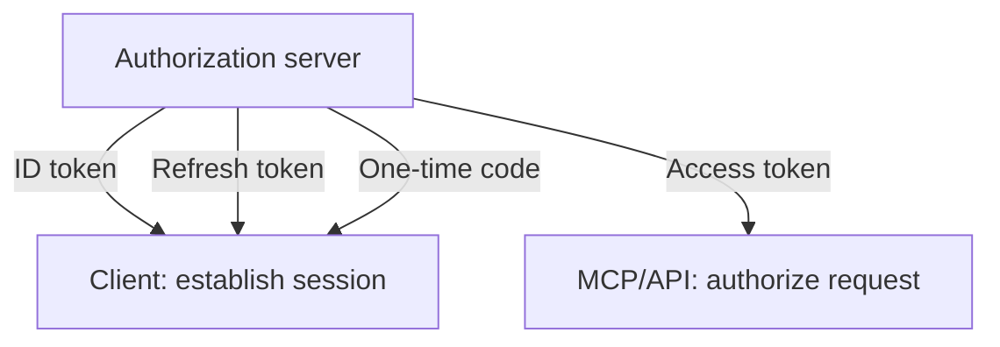

# 02: Tokens and Validation

Chinese: [02-tokens-and-validation.zh.md](02-tokens-and-validation.zh.md)

## 5W + How
- **What:** ID, access, refresh, and authorization-code artifacts have different consumers and lifetimes.
- **Why:** accepting the wrong artifact enables impersonation or confused-deputy attacks.
- **Who:** client consumes ID token; resource server consumes access token; authorization server consumes code and refresh token.
- **When:** validate before using any claims or calling business logic.
- **Where:** gateway and resource server, with defense in depth.
- **How:** verify signature, issuer, audience, time, tenant, token type, and required permission.



```python
def validate_access_token(payload: dict, expected: dict) -> None:
    assert payload["iss"] == expected["issuer"]
    assert payload["aud"] == expected["audience"]
    assert payload["exp"] > expected["now"]
    assert payload.get("typ", "at+jwt") in {"JWT", "at+jwt"}
```

JWT is a format, bearer is a presentation rule, and opaque is another token format. Sender-constrained tokens reduce replay risk but do not replace authorization.

## Failure And Interview Gate
Test wrong audience, issuer confusion, expired/not-yet-valid tokens, key rotation, opaque-token handling, and accidental ID-token acceptance. Never log raw tokens.

