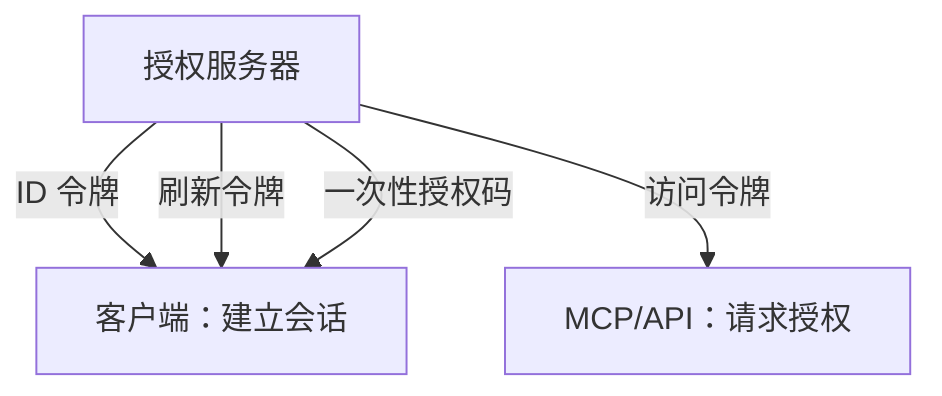

# 02：令牌与验证

English: [02-tokens-and-validation.md](02-tokens-and-validation.md)

## 5W + How
- **What（什么）：** ID、访问、刷新令牌与授权码拥有不同使用方和生命周期。
- **Why（为什么）：** 接受错误凭据会导致冒充或 confused deputy 攻击。
- **Who（谁）：** 客户端消费 ID 令牌；资源服务器消费访问令牌；授权服务器消费授权码和刷新令牌。
- **When（何时）：** 使用声明或进入业务逻辑前。
- **Where（哪里）：** 网关和资源服务器纵深校验。
- **How（如何）：** 校验签名、签发者、受众、时间、租户、令牌类型与权限。



```python
def validate_access_token(payload: dict, expected: dict) -> None:
    assert payload["iss"] == expected["issuer"]
    assert payload["aud"] == expected["audience"]
    assert payload["exp"] > expected["now"]
    assert payload.get("typ", "at+jwt") in {"JWT", "at+jwt"}
```

JWT 是格式，Bearer 是呈现规则，opaque 是另一种令牌格式。发送方约束令牌降低重放风险，但不能替代授权。

## 故障与面试门槛
测试错误受众、签发者混淆、过期/尚未生效、密钥轮换、opaque 令牌处理，以及误收 ID 令牌。绝不记录原始令牌。

