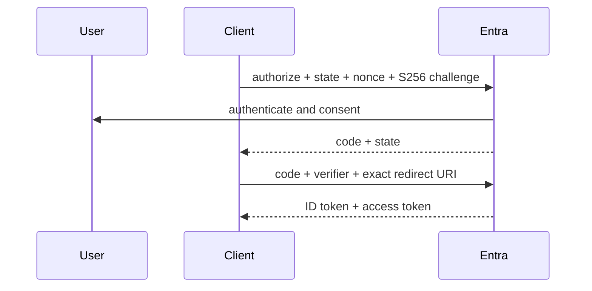

# 03: Authorization Code Flow with PKCE

Chinese: [03-authorization-code-pkce.zh.md](03-authorization-code-pkce.zh.md)

## 5W + How
- **What:** a browser-mediated login returns a one-time code that the client exchanges with a PKCE verifier.
- **Why:** tokens avoid front-channel exposure and intercepted codes cannot be redeemed without the verifier.
- **Who:** user, client, browser, Entra authorization endpoint, and token endpoint.
- **When:** interactive web, desktop, mobile, and SPA sign-in.
- **Where:** authorize in the browser; exchange at the token endpoint.
- **How:** generate state, nonce, verifier/challenge; authorize; verify response; exchange exact redirect URI; validate tokens.



```python
import base64, hashlib, secrets

verifier = secrets.token_urlsafe(64)
challenge = base64.urlsafe_b64encode(
    hashlib.sha256(verifier.encode()).digest()
).rstrip(b"=").decode()
state, nonce = secrets.token_urlsafe(32), secrets.token_urlsafe(32)
```

Prefer a supported Microsoft authentication library. Public clients cannot safely hold a secret; confidential clients should prefer certificate credentials over shared secrets where supported.

## Failure And Interview Gate
Test missing/mismatched state, nonce reuse, verifier mismatch, redirect URI mismatch, code replay, open redirect, and login CSRF. Explain what each control prevents.

