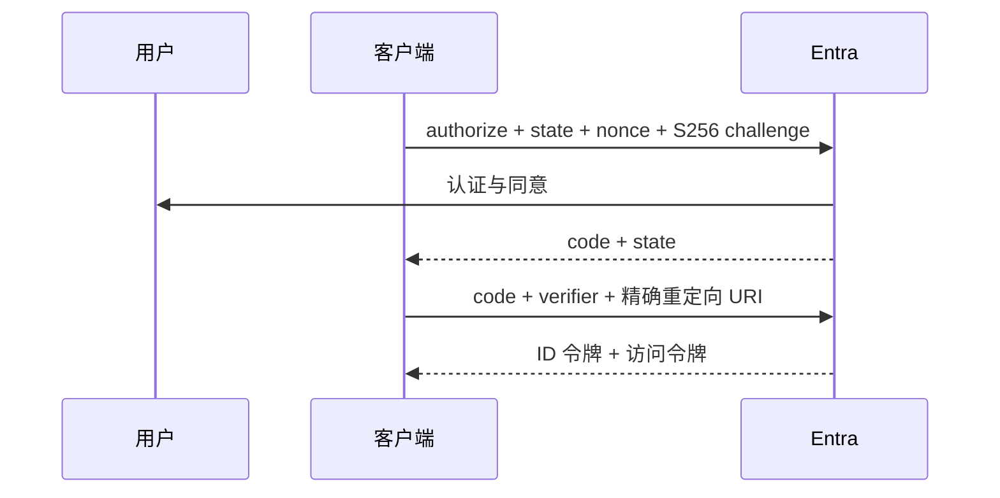

# 03：授权码流程与 PKCE

English: [03-authorization-code-pkce.md](03-authorization-code-pkce.md)

## 5W + How
- **What（什么）：** 浏览器登录返回一次性授权码，客户端用 PKCE verifier 兑换令牌。
- **Why（为什么）：** 令牌不暴露在前通道，截获的授权码也无法脱离 verifier 使用。
- **Who（谁）：** 用户、客户端、浏览器、Entra 授权端点和令牌端点。
- **When（何时）：** Web、桌面、移动端和 SPA 的交互登录。
- **Where（哪里）：** 浏览器中授权；令牌端点兑换。
- **How（如何）：** 生成 state、nonce、verifier/challenge；授权；校验响应；用完全一致的重定向 URI 兑换并校验令牌。



```python
import base64, hashlib, secrets

verifier = secrets.token_urlsafe(64)
challenge = base64.urlsafe_b64encode(
    hashlib.sha256(verifier.encode()).digest()
).rstrip(b"=").decode()
state, nonce = secrets.token_urlsafe(32), secrets.token_urlsafe(32)
```

优先使用 Microsoft 支持的认证库。公共客户端不能安全保存 secret；机密客户端在支持时应优先使用证书凭据。

## 故障与面试门槛
测试 state 缺失/不匹配、nonce 重用、verifier 不匹配、重定向 URI 不一致、授权码重放、开放重定向和登录 CSRF，并说明每项控制的威胁。

