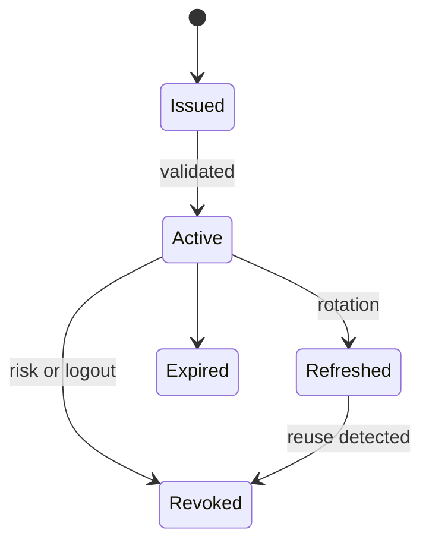

# 04: Token Lifecycle and Hardening

Chinese: [04-token-lifecycle-hardening.zh.md](04-token-lifecycle-hardening.zh.md)

## 5W + How
- **What:** state, nonce, PKCE, expiry, refresh rotation, revocation, and sender constraints protect different lifecycle stages.
- **Why:** a valid stolen bearer token remains usable until expiry or revocation.
- **Who:** client protects browser/session artifacts; issuer governs tokens; resource rejects unsafe tokens.
- **When:** issue, store, present, refresh, revoke, and sign out.
- **Where:** encrypted client storage, authorization server, gateway, and API.
- **How:** minimize lifetime and scope, rotate refresh tokens, bind audience/resource, detect reuse, and revoke sessions.



```python
def rotate_refresh(record: dict, presented_hash: str) -> str:
    if record["used"] or presented_hash != record["hash"]:
        raise PermissionError("refresh token reuse")
    record["used"] = True
    return "new-one-time-refresh-token"
```

## Failure And Interview Gate
Model browser XSS, device theft, token replay, clock skew, stale sessions, signing-key rotation, and emergency revocation. Do not place access or refresh tokens in URLs or logs.

